# Orchestration with Grounding Capabilities in SAP AI Core
<!-- description --> This tutorial provides a step-by-step guide to setting up document grounding, creating pipelines, and utilizing vector APIs for facility management. In our use case, we use facility management emails uploaded to Microsoft SharePoint as grounding documents. This enables precise retrieval of relevant information, supporting efficient query resolution and service request handling. Follow this guide to streamline facility-related insights and response processes.

## You will learn
- How to set up orchestration pipelines, enable document grounding, and perform vector retrieval using SAP AI Core's grounding capabilities

## Prerequisites  
1. **BTP Account**  
   Set up your SAP Business Technology Platform (BTP) account.  
   [Create a BTP Account](https://developers.sap.com/group.btp-setup.html)
2. **For SAP Developers or Employees**  
   Internal SAP stakeholders should refer to the following documentation: [How to create BTP Account For Internal SAP Employee](https://me.sap.com/notes/3493139), [SAP AI Core Internal Documentation](https://help.sap.com/docs/sap-ai-core)
3. **For External Developers, Customers, or Partners**  
   Follow this tutorial to set up your environment and entitlements: [External Developer Setup Tutorial](https://developers.sap.com/tutorials/btp-cockpit-entitlements.html), [SAP AI Core External Documentation](https://help.sap.com/docs/sap-ai-core?version=CLOUD)
4. **Create BTP Instance and Service Key for SAP AI Core**  
   Follow the steps to create an instance and generate a service key for SAP AI Core:  
   [Create Service Key and Instance](https://help.sap.com/docs/sap-ai-core/sap-ai-core-service-guide/create-service-key?version=CLOUD)
5. **AI Core Setup Guide**  
   Step-by-step guide to set up and get started with SAP AI Core:  
   [AI Core Setup Tutorial](https://developers.sap.com/tutorials/ai-core-setup.html)
6. An Extended SAP AI Core service plan is required, as the Generative AI Hub is not available in the Free or Standard tiers. For more details, refer to 
[SAP AI Core Service Plans](https://help.sap.com/docs/sap-ai-core/sap-ai-core-service-guide/service-plans?version=CLOUD)
7. Access to Microsoft SharePoint for grounding capabilities.

### Pre-read

In this tutorial, we explore how to extend orchestration capabilities in SAP AI Core by incorporating **grounding**—the process of enriching GenAI outputs with **enterprise-specific or domain-relevant context** to ensure accurate and reliable responses.

**Grounding** addresses key challenges such as hallucinations and lack of specificity by connecting the model to external knowledge sources during inference.

In the Generative AI Hub orchestration workflow, **templating** and **model configuration** are mandatory. In this tutorial, we are focusing on the **grounding** module usage, but in our orchestration consumption request you will also find optional modules such as **data masking** and **content filtering**. In general this tutorial covers the usage of all orchestration modules.

In this tutorial we are covering:

- How to create the Data Injestion Pipeline(pipeline API and vectore API options). You can choose either of these options based on the requirements 
- How to use **Amazon S3** or **Microsoft SharePoint** as document repository.
- How to retrieve and verify the content dynamically from uploaded documents.
- How to configure and use grounding in orchestration 

> **Use Case:** In our scenario, we use **facility management emails** uploaded to **Microsoft SharePoint** and **Amazon S3** as grounding documents. The orchestration pipeline retrieves relevant content from these documents and enables **context-aware question answering** using retrieval-augmented generation (RAG).

For additional context, refer to:  
🔗 [Grounding in SAP AI Core (Help Portal)](https://help.sap.com/docs/sap-ai-core/sap-ai-core-service-guide/grounding?version=CLOUD)

By the end of this tutorial, you will:

- Understand how to use grounding module in Orchestration and apply it to practical, enterprise-relevant use cases.
- Learn how to use the solution using **SAP AI Launchpad**, **Python SDK**, **Java**, **JavaScript**, and **API(Bruno Client)**.

### 1. Create service key for AI Core instance

[OPTION BEGIN [Bruno]]

This step enables the foundational setup of the AI Core instance by creating a service key, which is crucial for accessing and managing the AI Core services in the development environment.

•	You can follow steps in https://help.sap.com/docs/sap-ai-core/sap-ai-core-service-guide/enabling-service-in-cloud-foundry?locale=en-US to create an AI Core instance and service key in development environment

#### Download and import Bruno collection

This step prepares the workspace by importing pre-configured requests for easy interaction with AI Core services using Bruno collections.

•	Download [Bruno_config.json](img/Bruno_config.json)

•	Navigate to Bruno Collections and upload the .json file to import collections


#### Set env variables

Environment variables centralize configuration settings required for seamless integration between your service key and the imported collection.

• Select the getToken query in the imported collection, click on **No Environment**, and configure the environment as canary-test.

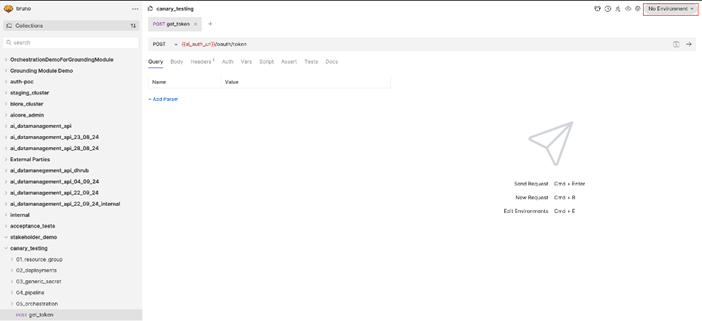


•	Set the values inside environment canary-test

-	Populate values from the service key into the following variables:
    - **ai_auth_url**
    - **ai_api_url**
    - **client_id**
    - **client_secret**

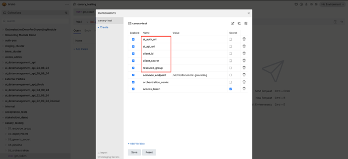

•	Add a resource group name at **resource_group**

•	Save the configuration and set the active environment to canary-test.

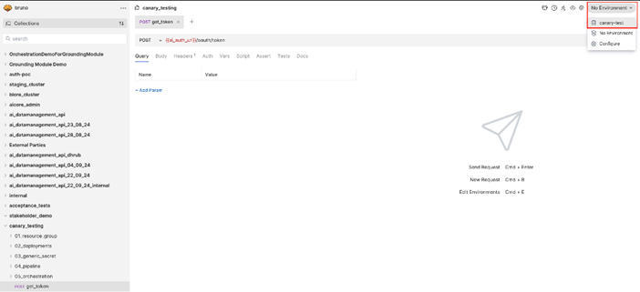

[OPTION END]

[OPTION BEGIN [JavaScript SDK]]

To interact with SAP AI Core using SAP Cloud SDK, you first need to create a service key that grants secure access to your AI Core instance. Follow the step **Set Up Your Environment and Configure Access** in the [tutorial](https://developers.sap.com/tutorials/ai-core-orchestration-consumption.html) to establish your connection.

[OPTION END]

[OPTION BEGIN [Java SDK]]

To interact with SAP AI Core using the [Java SDK](https://sap.github.io/ai-sdk/docs/java/overview-cloud-sdk-for-ai-java), you first need to create a service key that grants secure access to your AI Core instance. Follow the step **Set Up Your Environment and Configure Access** in the [tutorial](https://developers.sap.com/tutorials/ai-core-orchestration-consumption.html) to establish your connection.

[OPTION END]

[OPTION BEGIN [Python SDK]]

To interact with SAP AI Core using the python Gen AI SDK, you first need to create a service key that grants secure access to your AI Core instance. 

•  Configure proxy modules by setting up environment variables for AI Core credentials.

•  Replace placeholder values in ~/.aicore/config.json with AI Core service keys from BTP.

•  Optionally, set the AICORE_HOME environment variable to override the default config path.


[OPTION END]

### 2. Generate token

[OPTION BEGIN [Bruno]]

- This step generates an access token, required for authenticating API requests during the process.
    - Select the get_token request and execute it.
    - **Note**: Regenerate the token if it expires during execution.

[OPTION END]

[OPTION BEGIN [JavaScript SDK]]

As the access token is automatically initially requested and sent with every request to the server, this step is not necessary for the Javascript SDK.

[OPTION END]

[OPTION BEGIN [Java SDK]]

As the access token is automatically initially requested and sent with every request to the server, this step is not necessary for the Java SDK.

[OPTION END]

[OPTION BEGIN [Python SDK]]

As the access token is automatically initially requested and sent with every request to the server, this step is not necessary for the python SDK.

[OPTION END]

### 3. Create resource group 

[OPTION BEGIN [Bruno]]

- Resource groups segment workloads and manage resources for specific AI Core services.
    - Expand **01_resource_group** and execute the create request to create a resource group.


• Verify the group status using the **get_by_id** request to ensure it is **PROVISIONED**.


[OPTION END]

[OPTION BEGIN [AI Launchpad]]

•  In the **Workspaces** app, choose the **AI API connection**.

•  Open the **SAP AI Core Administration** app and choose **Resource Groups**.

•  The **Resource Groups** screen appears with a tile for each existing **resource group**.

•  Choose Create  to create reference details for a new resource group.

•  Complete the fields in the Create **Resource Group** dialog box.


• Enter a **resource group ID**.

**Note:** Ensure that the resource group ID is unique. If the ID is not unique and is currently in use, then the new resource group and its details will overwrite the existing resource group.

• Choose the **subaccount_id** label key and enter a value.

• Choose the **zone_id** label key and enter a value.

• Choose the **instance_id** label key and enter a value.

• Enter the **document-grounding** label key and enter the value true.

• If additional labels are required, enter their keys and corresponding values.

• Choose **Create** to create the **resource group**.

• The All Resource Groups screen appears and shows the **new resource group**.

[OPTION END]

[OPTION BEGIN [JavaScript SDK]]

In this step, we will create a resource group in SAP AI Core using the [`@sap-ai-sdk/ai-api`](https://github.com/SAP/ai-sdk-js/tree/main/packages/ai-api) package of the SAP Cloud SDK for AI (JavaScript). For more information, refer to the official [documentation](https://sap.github.io/ai-sdk/docs/js/ai-core/ai-api).

**NOTE**: In order to use the document grounding service, the resource group must be created with the document grounding label set to `true`. Therefore, existing resource groups without the label will not work for document grounding.

• To start, install the dependency in your project.

```
npm install @sap-ai-sdk/ai-api
```

• Add the following code to your project to create a resource group.

```javascript

import { ResourceGroupApi } from '@sap-ai-sdk/ai-api';

const RESOURCE_GROUP = 'YourResourceGroupId' // Please change to your desired ID

// Create resource group using ResourceGroupApi
async function createResourceGroup() {
    try {
      const response = await ResourceGroupApi.
        kubesubmitV4ResourcegroupsCreate({
            resourceGroupId: RESOURCE_GROUP,
            labels: [
                {
                key: 'ext.ai.sap.com/document-grounding',
                value: 'true',
                }
            ]
        }).execute();
        return response;
    } catch (error: any) {
      console.error('Error while creating Resource Group:', error.stack);
    }
}

const resourceGroup = await createResourceGroup();
console.log("Created Resource Group with ID: ", resourceGroup?.resourceGroupId)

```

[OPTION END]

[OPTION BEGIN [Java SDK]]

Create a resource group in SAP AI Core. Please note that for using the document grounding service, your request must contain the document grounding **label** set to **true**. Therefore, existing resource groups without the label won't work. 

```java
// Your resource group ID, please change to your desired ID
var RESOURCE_GROUP = "YourResourceGroupId"; 

// Request to create the resource group
var resourceGroupRequest = BckndResourceGroupsPostRequest.create()
    .resourceGroupId(RESOURCE_GROUP)
    .addLabelsItem(BckndResourceGroupLabel.create()
        .key("ext.ai.sap.com/document-grounding")
        .value("true")
    );

// Create resource group
var resourceGroup = new ResourceGroupApi().create(resourceGroupRequest);

System.out.println("Created Resource Group with ID: " + resourceGroup.getResourceGroupId());

```

[OPTION END]

[OPTION BEGIN [Python SDK]]


[OPTION END]

### 4. Create generic secret

[OPTION BEGIN [Bruno]]

#### **Generic secret for sharepoint (option-1)**

Generic secrets securely store SharePoint credentials required for document access

•	Expand **03_generic_secret** and select create request

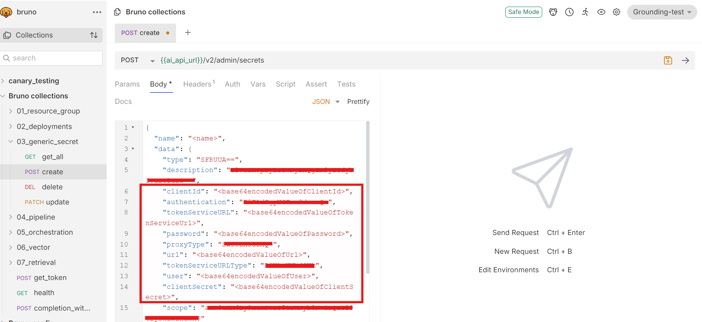

•	Please refer to point 2 under https://help.sap.com/docs/joule/integrating-joule-with-sap/configure-access-from-sap-btp?locale=en-US for reference values of MS SharePoint credentials

•	Update **clientId**, **tokenServiceURL**, **password**, **url**, **user** and **clientSecret** according MS SharePoint credentials

•	To prepare your own SharePoint  Create SharePoint Site (optional, you can re-use an existing site if you have one) 

  1.	Create a Group and a Technical User (optional, existing can be reused)
  2.	Register an Application, Generate a Client Secret, & Expose the application using web API
  3.	Validate the SharePoint access with the Technical User

•	All values needs to be provided as base 64 encoded values

#### **Generic secret for AWS S3 (option-2)**

Generic secrets securely store AWS S3 credentials required for document access

•	Expand **03_generic_secret** and select create request

Use the below payload to create a secret for AWS S3 with NoAuthentication as authentication type.

```CODE

{
  "name": "<generic secret name>",                        // Name of the generic secret to be created
  "data": {
    "url": "<url>",                                       // Base64 encoded value of url
    "authentication": "Tm9BdXRoZW50aWNhdGlvbg=",          // Base64 encoded value for NoAuthentication
    "description": "<description of generic secret>",     // Base64 encoded description of the secret
    "access_key_id": "<access key id>",                   // Base64 encoded value of access key id
    "bucket": "<bucket>",                                 // Base64 encoded value of bucket name
    "host": "<host>",                                     // Base64 encoded value of host
    "region": "<region>",                                 // Base64 encoded value of region
    "secret_access_key": "<secret access key>",           // Base64 encoded value of secret access key
    "username": "<username>",                             // Base64 encoded value of username
    "type": "SFRUUA==",                                   // [Optional] Base64 encoded value for HTTP
    "proxyType": "SW50ZXJuZXQ=",                          // [Optional] Base64 encoded value for Internet
  },
  "labels": [
    {
      "key": "ext.ai.sap.com/document-grounding",         // Label for Document Grounding feature
      "value": "true"
    },
    {
      "key": "ext.ai.sap.com/documentRepositoryType",     // Label for Document Repository Type
      "value": "S3"
    }
  ]
}

```

•Ensure that all values in the data dictionary are Base64-encoded as per AWS S3 credential requirements.

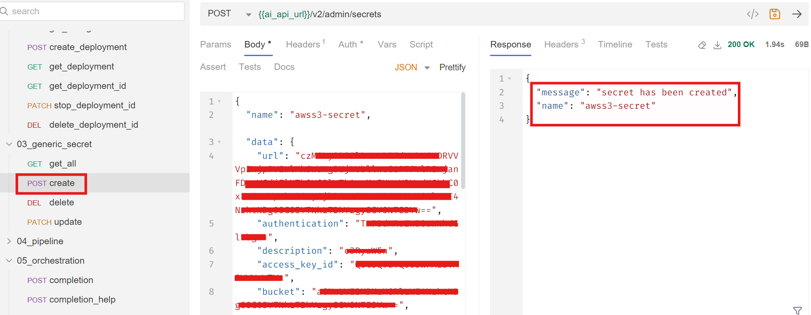

[OPTION END]

[OPTION BEGIN [AI Launchpad]]

1. In the **Workspaces** app, choose the AI API connection.

2. If you want to add your secret at the resource group level, choose the resource group. Alternatively you can use the toggles in the header or dialog box, where you will be prompted to specify a resource group.

3. Open the **SAP AI Core Administration app** and choose **Generic Secrets**. The Generic Secrets screen appears with a tile for each existing secret.

4. Choose **Add** to enter reference details for a new secret.

5. Complete the fields in the Add Generic Secret dialog box as follows:

    - Switch between tenant-level secrets and resource-group-level secrets

    - If your secret is at the resource-group level: confirm the resource group. To change the resource group, choose  (Change Value). Enter a name for the secret. Secret names must comply with the following criteria:

        - Contain only lowercase alphanumeric characters, hyphens (-), or numbers

        - Do not start or end with a hyphen (-)

    

    • Enter the secret in JSON format. For example:

    ```CODE
      {

      "type": "SFRUUA==",

      "description": "<description of generic secret>",

      "clientId": "<client id>",

      "authentication": "<AUTHENTICATION>",

      "tokenServiceURL": "<token service url>",

      "password": "<password>",

      "proxyType": "<PROXY>",

      "url": "<URL>",

      "tokenServiceURLType": "<TOKENSERVICE URL>",

      "user": "<user>",

      "clientSecret": "<client secret>",

      "scope": "SCOPE",

      }

    ```

    For the label option **ext.ai.sap.com** select **document-grounding** and **true**.

[OPTION END]

[OPTION BEGIN [JavaScript SDK]]

In this step, we will create a generic secret in SAP AI Core using the [`@sap-ai-sdk/ai-api`](https://github.com/SAP/ai-sdk-js/tree/main/packages/ai-api) package of the SAP Cloud SDK for AI (JavaScript). For more information, refer to the official [documentation](https://sap.github.io/ai-sdk/docs/js/ai-core/ai-api).

Generic secrets securely store SharePoint credentials required for document access. Please change the values to your SharePoint credentials.

```javascript

import { SecretApi } from from '@sap-ai-sdk/ai-api';

// Create Secret using SecretApi
async function createGenericSecret() {
    try {
        const response = await SecretApi.kubesubmitV4GenericSecretsCreate({
          name: 'canary-rg1-secret',
          data: {
            type: 'SFRUUA==',
            description: '<DESCRIPTION_OF_GENERIC_SECRET>',
            clientId: '<CLIENT_ID>',
            authentication: '<AUTHENTICATION>',
            tokenServiceURL: '<TOKEN_SERVICE_URL>',
            password: '<PASSWORD>',
            proxyType: '<PROXY>',
            url: '<URL>',
            tokenServiceURLType: '<TOKEN_SERVICE_URL_TYPE>',
            user: '<USER>',
            clientSecret: '<CLIENT_SECRET>',
            scope: '<SCOPE>'
          },
          labels: [
            {
              key: 'ext.ai.sap.com/document-grounding',
              value: 'true',
            },
          ],
        }).execute();
        return response;
    } catch (error: any) {
        console.error('Error while creating Resource Group:', error.stack);
    }
}

const secret = await createGenericSecret();
console.log(secret?.message)

```

[OPTION END]

[OPTION BEGIN [Java SDK]]

Generic secrets securely store SharePoint credentials required for document access. Please change the values to your SharePoint credentials. 

```java
// Request to create the secret
var secretRequest = BckndGenericSecretPostBody.create()
    .name("canary-rg1-secret")
    .data(Map.ofEntries(
        Map.entry("type", "SFRUUA=="),
        Map.entry("description", "<description of generic secret>"),
        Map.entry("clientId", "<client id>"),
        Map.entry("authentication", "<AUTHENTICATION>"),
        Map.entry("tokenServiceUrl", "<token service url>"),
        Map.entry("password", "<password>"),
        Map.entry("proxyType", "<PROXY>"),
        Map.entry("url", "<URL>"),
        Map.entry("tokenServiceURLType", "<TOKEN SERVICE URL TYPE>"),
        Map.entry("user", "<user>"),
        Map.entry("clientSecret", "<clientSecret>"),
        Map.entry("scope", "<SCOPE>")
    ))
    .addLabelsItem(BckndGenericSecretLabel.create()
        .key("ext.ai.sap.com/document-grounding")
        .value("true")
    );

// Create secret
var secret = new SecretApi().create(secretRequest);

System.out.println(secret.getMessage());

```

[OPTION END]

### 5. Prepare knowledge base (data repository) and verification

[OPTION BEGIN [Bruno]]

#### 5.a Using Pipeline API [Option-1]
 
#### Create Pipeline

- Pipelines define the process for grounding and retrieving content from SharePoint and AWS S3 repositories.

In this use case, we have added facility management emails as grounding documents, uploading them to the designated SharePoint folder. I’m attaching the sample email folder [sample_emails.zip] (img/sample_emails.zip) used in this scenario. For practice, you can also use these emails if needed.

#### **Pipeline for MSSharePoint (Option-1)**

•	**Expand 04_pipeline** and select **create_pipeline** request

•	Replace value **generic_secret_name** with generic secret name created in step 6.

•	Replace value **sharepoint_site_name** with site name of MS SharePoint.

•	Replace value **folder_name** with the name of the folder from which the documents have to be taken.Multiple folder names can be specified.


#### **Pipeline for AWS S3 (Option-2)**

**Download and install AWS CLI from the AWS CLI official page.**

Open Command Prompt and configure AWS CLI with your credentials:

Enter your Access Key, Secret Key, Region, and Output Format when prompted.

```COPY

aws configure

```


**Upload a Grounding Document to AWS S3**

To upload a grounding document to an S3 bucket, use:

```CODE

aws s3 cp <local-file-path> s3://<bucket-name>/<folder-name>/

```

**Verify File Upload**

To check if the file is uploaded successfully, list the contents of the folder:

```CODE

aws s3 ls s3://<bucket-name>/<folder-name>/

```
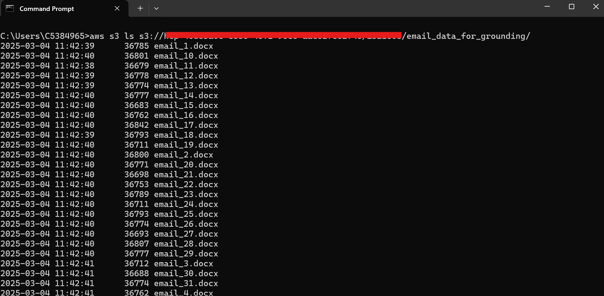

**Create an AWS S3 Pipeline**

**Expand 04_pipeline** and select **create_pipeline** request

Use the below payload to create a pipeline for AWS S3.

```CODE 

{
  "type": "S3",
  "configuration": {
    "destination": "<generic secret name>"  // Name of the generic secret created for S3
  },
  "metadata": {                             // [Optional]
    "destination": "<generic secret name>", // Name of the generic secret created for S3 MetaData Server
  }
}

```
•	Replace value **generic_secret_name** with generic secret name created in step 8.

**Note:**'metadata' is an optional field which takes the destination name created for the s3 metadata server.

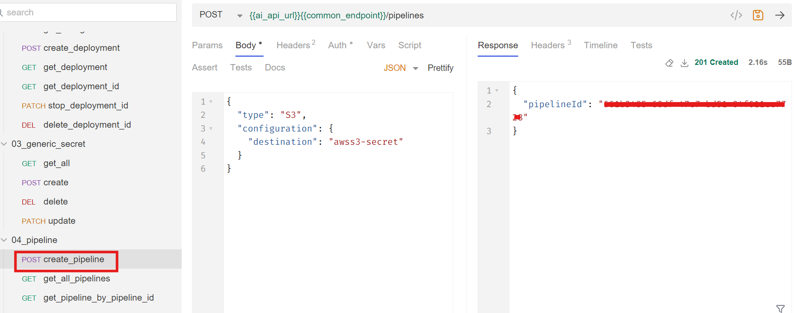

#### Get All Pipelines

This request retrieves a list of all existing pipelines within the resource group. It helps in managing and monitoring available pipelines for orchestration.

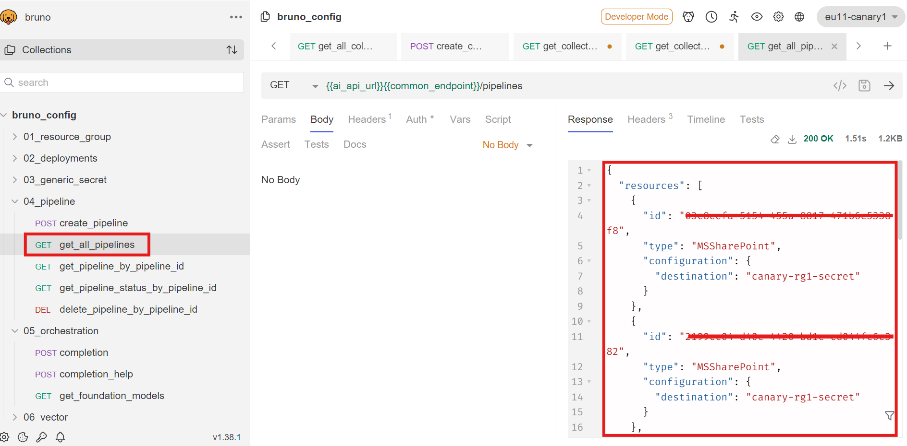

#### Get Pipeline by Pipeline ID

This request fetches details of a specific pipeline using its unique ID. It is useful for verifying the configuration and settings of a particular pipeline.

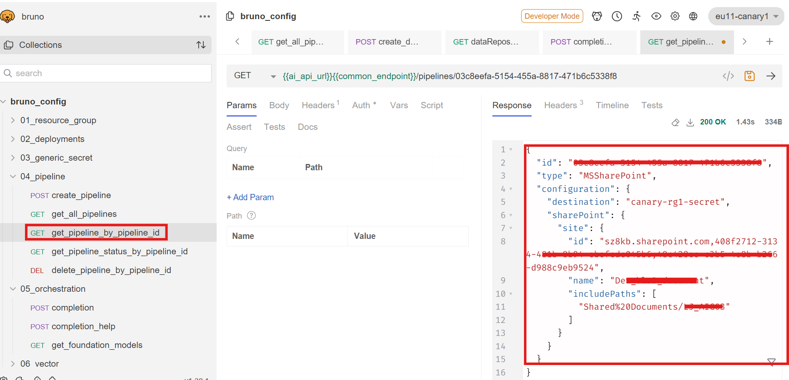

#### Get Pipeline Status by Pipeline ID

This request checks the current status of a specific pipeline, such as whether it is running, completed, or failed. It helps in tracking the execution progress.


 
Once the pipeline is successfully created, documents uploaded in SharePoint are converted into vectors via APIs. The conversion process can be validated upon successful pipeline execution.

#### 5.b Using Vector API [Option-2]

#### Create collection

• Expand 06_vector and select create_collections request.

• Replace value <collection_name> with the required collection name.

• The metadata can be an array of key-value pairs to have some additional information.

**Note:** Currently supported modelName is only text-embedding-ada-002-v2.

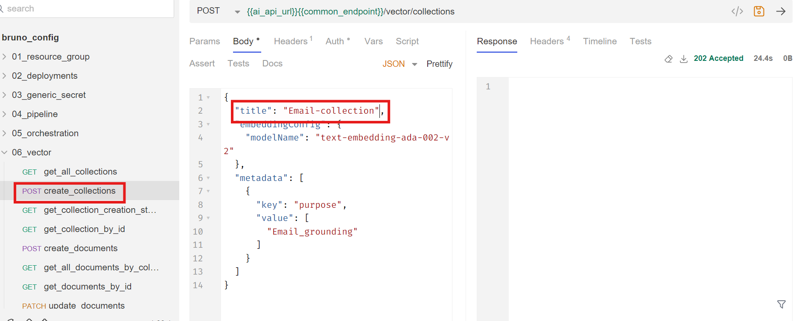

#### Create documents

• Click on the create_document request and replace the path parameter with the valid collection ID.

• Replace value <metadata_key> with the required key of metadata and put corresponding values to it.  Multiple metadata can be specified here.

• Replace values <chunk_1>, <chunk_2> with the required chunk of the documents. Add multiple chunks   based on the requirement. The metadata can also be specified for each chunk.

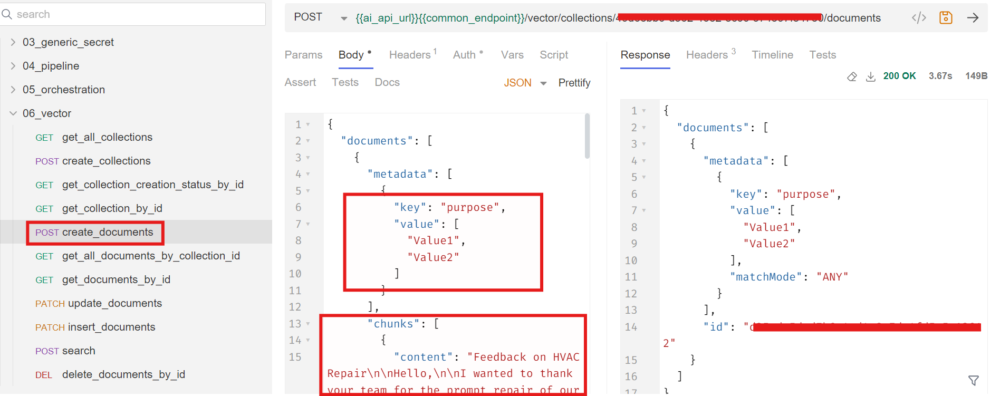

#### Verifying Vector Processing (Optional)

These steps help inspect vector collections and documents to confirm successful processing.

 • **get_all_collections** – Lists all existing vector collections for validation.

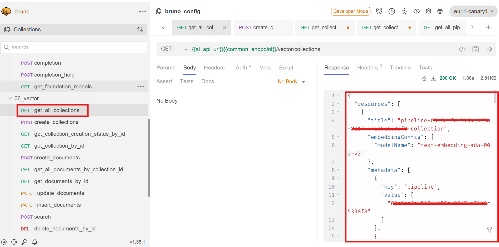

 • **get_collection_creation_status_by_id** – Checks whether the collection was created successfully.

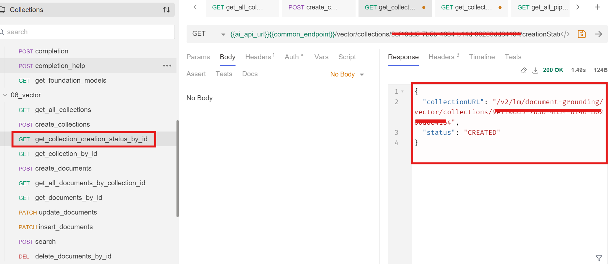

 • **get_collection_by_id** – Retrieves detailed information about a specific collection


 • **get_all_documents_by_collection_id** – Lists all stored documents to ensure correct ingestion.


 • **get_documents_by_id** – Fetches specific documents within a collection for debugging


 • **get_collection_deletion_status_by_id** – Confirms successful deletion of a collection if needed.


 • **dataRepositories** - List all the collection of Data repositories 

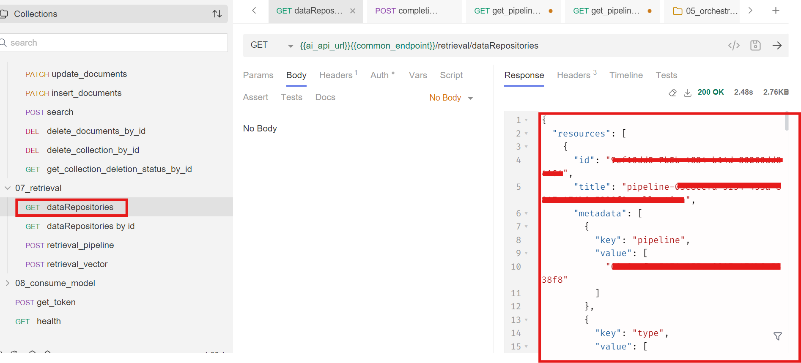

 • **dataRepositories by id** – Fetches details of a specific repository for targeted debugging.


[OPTION END]

[OPTION BEGIN [Java SDK]]

We are creating a document-grounding pipeline using SAP AI Core. The pipeline is configured to integrate with Microsoft SharePoint as a data source, enabling AI-driven document processing. This setup allows seamless ingestion of documents from a specified SharePoint site, ensuring efficient data retrieval and processing.

**Note:** For this step, we are using the [document grounding module](https://sap.github.io/ai-sdk/docs/java/guides/document-grounding) of the SDK so make sure to add the dependency to your project. 

```java
// Request to create the pipeline
var pipelineRequest = PipelinePostRequst.create()
    .type("MSSharePoint")
    ._configuration(PipelinePostRequstConfiguration.create()
        .destination("<generic secret name>")
        .sharePoint(PipelinePostRequstConfigurationSharePoint.create()
            .site(PipelinePostRequstConfigurationSharePointSite.create()
                .name("<sharepoint site name>")
                .addIncludePathsItem("/<folder name>")
            )
        )
    );

// Create the pipeline
var pipeline = new GroundingClient().pipelines().createPipeline(
    RESOURCE_GROUP,
    pipelineRequest
);

System.out.println("Created Pipeline with ID: " + pipeline.getPipelineId());

```

[OPTION END]

### 6. Ensuring Accurate Responses with Grounding

In the previous steps, we have completed the data preparation for grounding. Before initiating model inference or orchestration, ensure that there is an active orchestration deployment (**scenario ID: orchestration**). To verify the available orchestration deployments and their status, use the **get_deployment** API under the **"Deployments"** section in the **Bruno collection**. Additionally, update the **orchestration_service_url** in the environment. 

**NOTE:** If no deployments are found, please refer to this tutorial for guidance [tutorial] (https://developers.sap.com/tutorials/ai-core-orchestration-consumption.html).

[OPTION BEGIN [Bruno]] 

#### Data Retrieval via Orchestration service [Option-1]

This step uses the orchestration service to query grounded documents and retrieve content based on a specified prompt and grounding query. It integrates document grounding configurations and filters to provide precise results.

•	Expand **05_orchestration** and select **completion request**

**Note:** Refer to the screenshots below for guidance on configuring the prompt and grounding query.


#### Data Retrieval using Vector APIs [Option-2]

• Expand the 07_retrieval Click on the retrieval_vector request.

• Replace value <query> with the required query to which the vector search has to be done.

• Replace value <data_repository_id1> with the id of the data repository using which the vector  search has to be performed. Multiple data repository ids can be specified here.


#### Responses Without External Knowledge Base


[OPTION END]

[OPTION BEGIN [AI Launchpad]]

Grounding is a crucial step in orchestration that ensures responses are enriched with relevant and accurate data from predefined sources. This section explains how grounding works in the AI Launchpad.

**Input Variables**

Input variables are parameters sent to the grounding service to facilitate data retrieval. These variables can be referenced in the template definition, allowing dynamic data incorporation based on user inputs.

**Output Variable**

The output variable holds the retrieved data from the grounding service. This data can then be utilized in the template definition to generate contextual and informed responses.

**Selected Sources**

You can specify the repositories from which the grounding module retrieves information. If no specific repositories are selected, grounding will include all available sources by default. Selecting relevant sources ensures precise and domain-specific data retrieval for improved orchestration outcomes.

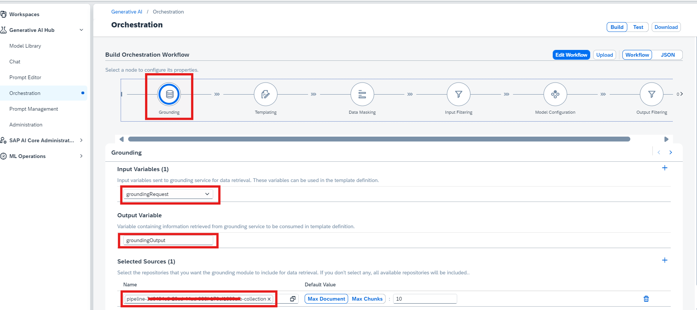

**Templating**

Templating enables you to define structured prompts and system messages for the generative AI model. Using placeholders like {{?groundingRequest}} and {{?groundingOutput}}, you can dynamically customize inputs for grounding-based data retrieval. These placeholders must follow naming rules and can have default values for testing. If no default value is set, the workflow prompts for input during execution.


**Model configuration**

Model configuration allows you to select the AI model for your workflow. If no model is selected, the default model is used. You can specify additional parameters in JSON format, such as setting the n parameter to receive multiple responses. You can see which models are available within an orchestration deployment by selecting the deployment ID.

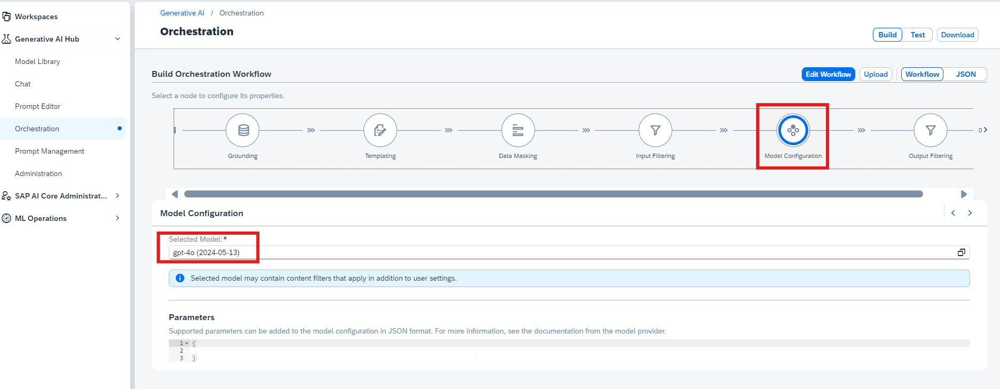

**Orchestration Workflow**

After you have built your orchestration workflow, you can test it to generate output from your chosen model.

1. Change the mode from Build to Test.

2. Check the orchestration deployment and change it if necessary.

3. If you have included placeholders in the template, enter the values that you want to be passed to the model.

4. Optional: As the context, give the model additional instructions to further refine the output.You can also provide sample queries and responses here. Choose **Run**.


[OPTION END]

[OPTION BEGIN [Java SDK]]

We are configuring an AI Orchestration Pipeline using SAP AI Core. The pipeline integrates multiple AI modules to process and refine inputs efficiently. This setup enables **document grounding, LLM processing, templating, and content filtering**, ensuring accurate and safe AI-generated responses.

The configuration defines a document grounding module that retrieves relevant context from a vector-based repository, a GPT-4o model for response generation, a templating module to structure responses, and Azure Content Safety filters to ensure compliance and content moderation. This orchestration streamlines AI-driven summarization while maintaining reliability and security.

```java
// Create a database filter used for the grounding configuration
var dataBaseFilter = DocumentGroundingFilter.create()
    .dataRepositoryType(DataRepositoryType.VECTOR)
    .id("filter1")
    .addDataRepositoriesItem("23c**********************5ed6")	//Replace with the value of your data repository ID
    .searchConfig(GroundingFilterSearchConfiguration.create().maxChunkCount(10));

// Create a grounding configuration with the database filter
var groundingConfig = Grounding.create()
    .filters(dataBaseFilter);

// Create a grounding prompt which will combine the provided user message with the grounding output
var groundingPrompt = groundingConfig.createGroundingPrompt("Is there any complaint?");

// Create an input content filter 
var inputFilter = new AzureContentFilter()
    .hate(ALLOW_SAFE_LOW)
    .selfHarm(ALLOW_SAFE_LOW)
    .sexual(ALLOW_SAFE_LOW)
    .violence(ALLOW_SAFE_LOW);

// Create an output content filter 
var outputFilter = new AzureContentFilter()
    .hate(ALLOW_SAFE_LOW)
    .selfHarm(ALLOW_SAFE_LOW)
    .sexual(ALLOW_SAFE_LOW)
    .violence(ALLOW_SAFE_LOW);

// Create an orchestration module config for the model gpt-4o with grounding and filtering
var orchestrationModuleConfig = new OrchestrationModuleConfig()
    .withLlmConfig(OrchestrationAiModel.GPT_4O)
    .withGrounding(groundingConfig)
    .withInputFiltering(inputFilter)
    .withOutputFiltering(outputFilter);

// Prompt LLM with created grounding prompt and orchestration module configuration
var response = client.chatCompletion(groundingPrompt, orchestrationModuleConfig);

System.out.println(response.getContent());

``` 

[OPTION END]

[OPTION BEGIN [ Python SDK]]

We are configuring an AI Orchestration Pipeline using SAP AI Core. The pipeline integrates multiple AI modules to process and refine inputs efficiently. This setup enables **document grounding, LLM processing, templating, and content filtering**, ensuring accurate and safe AI-generated responses.

The configuration defines a document grounding module that retrieves relevant context from a vector-based repository, a GPT-4o model for response generation, a templating module to structure responses, and Azure Content Safety filters to ensure compliance and content moderation. This orchestration streamlines AI-driven summarization while maintaining reliability and security.

``` python

# Import libraries
from gen_ai_hub.proxy import get_proxy_client
from gen_ai_hub.orchestration.models.config import OrchestrationConfig
from gen_ai_hub.orchestration.models.document_grounding import (GroundingModule, DocumentGrounding, GroundingFilterSearch,DataRepositoryType, DocumentGroundingFilter)
from gen_ai_hub.orchestration.models.llm import LLM
from gen_ai_hub.orchestration.models.message import SystemMessage, UserMessage
from gen_ai_hub.orchestration.models.template import Template, TemplateValue
from gen_ai_hub.orchestration.service import OrchestrationService

orchestration_service_url = "https://api.**********.hana.ondemand.com/v2/inference/deployments/d6**********98"

# Set up the Orchestration Service
aicore_client = get_proxy_client().ai_core_client
orchestration_service = OrchestrationService(api_url=orchestration_service_url)
llm = LLM(
    name="gpt-4o",
    parameters={
        'temperature': 0.0,
    }
)
template = Template(
            messages=[
                SystemMessage("""Facility Solutions Company provides services to luxury residential complexes, apartments,
                individual homes, and commercial properties such as office buildings, retail spaces, industrial facilities, and educational institutions.
                Customers are encouraged to reach out with maintenance requests, service deficiencies, follow-ups, or any issues they need by email.
                """),
                UserMessage("""You are a helpful assistant for any queries for answering questions.
                Answer the request by providing relevant answers that fit to the request.
                Request: {{ ?user_query }}
                Context:{{ ?grounding_response }}
                """),
            ]
        )

# Set up Document Grounding
filters = [DocumentGroundingFilter(id="vector",
                                   data_repositories=["69*************f9"], # Replace with data repository ID
                                   search_config=GroundingFilterSearch(max_chunk_count=15),
                                   data_repository_type=DataRepositoryType.VECTOR.value
                                   )
]

grounding_config = GroundingModule(
            type="document_grounding_service",
            config=DocumentGrounding(input_params=["user_query"], output_param="grounding_response", filters=filters)
        )

config = OrchestrationConfig(
    template=template,
    llm=llm,
    grounding=grounding_config
)

response = orchestration_service.run(config=config,
                            template_values=[
                                TemplateValue("user_query", "Is there any complaint?"),
                            ])
print(response.orchestration_result.choices[0].message.content)

```
**Sample Response 1:**
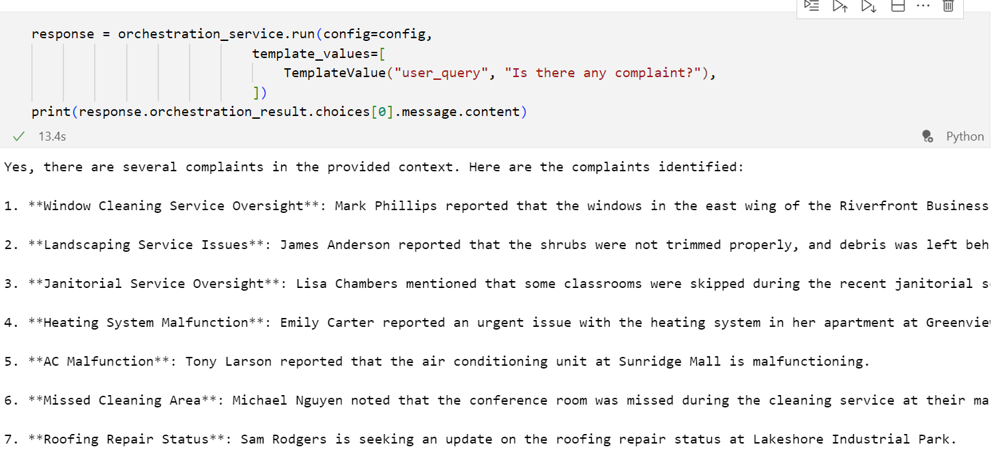

**Sample Response 2:**


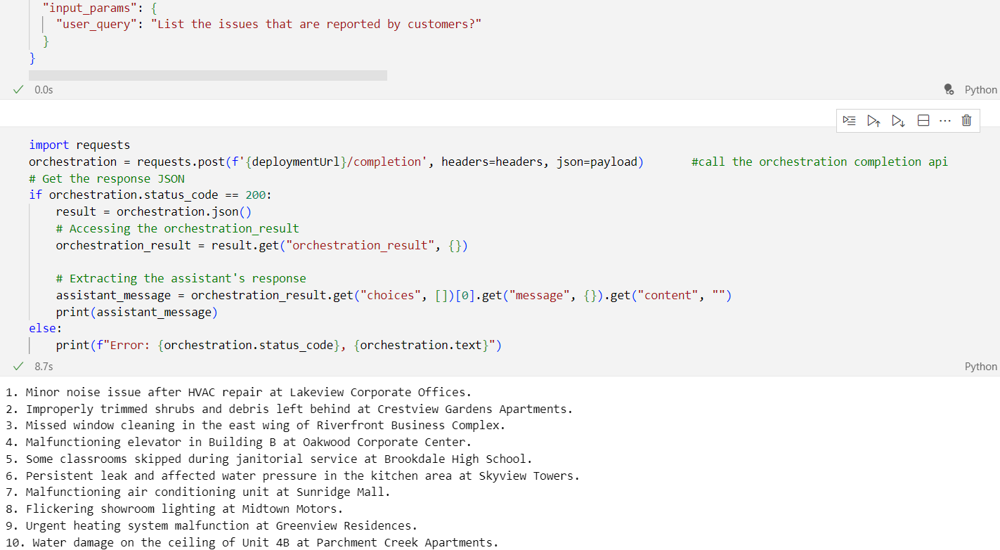

[OPTION END]

### Conclusion

Adding Grounding significantly enhances the model's ability to provide Accurate and Context-specific responses. Without Grounding, the model generates generic replies, while with grounding, it retrieves precise information from the uploaded document. Screenshots showcasing both responses are provided for comparison.


