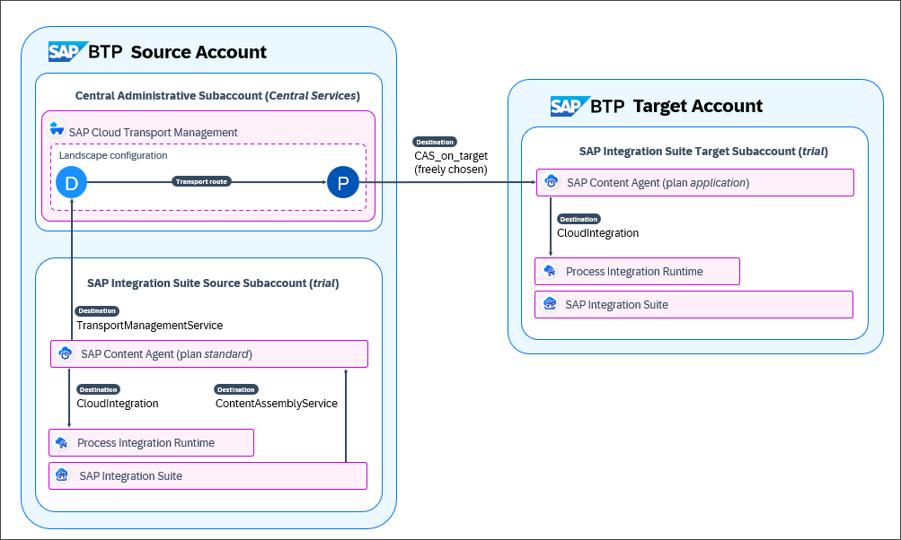

# Transport SAP Integration Suite Content using SAP Cloud Transport Management Service and SAP Content Agent Service 
<!-- description --> Learn how to configure the transport scenario: Transport SAP Integration Suite content using SAP Cloud Transport Management and SAP Content Agent services. 

## Prerequisites
 - You have an SAP BTP account. If you don't have one, you can create a trial account following the tutorial [Get an Account on SAP BTP Trial](hcp-create-trial-account). This will serve as the source (development) environment. You will need two subaccounts in the source SAP BTP account: one for SAP Integration Suite and SAP Content Agent and one central administrative subaccount for SAP Cloud Transport Management.  
 - You've set up SAP Cloud Transport Management service in the central administrative subaccount of the source SAP BTP account. If you haven't done that, follow the tutorial [Get Started with SAP Cloud Transport Management](btp-transport-management-getting-started).
    If you've set up the SAP Cloud Transport Management in a SAP BTP Trial account as described in that tutorial, you can exactly follow the steps of the current tutorial, since it builds upon that setup.  
 - You have a second subaccount that serves as the transport target. If you run the tutorial in an SAP BTP trial, you need a second trial account because each trial account only allows one entitlement for SAP Integration Suite, SAP Content Agent, and SAP Cloud Transport Management service. For example, ask a colleague to also create an SAP BTP trial account and perform all required configuration steps there. Your colleague will need to follow the steps described in tutorial [Set Up the SAP BTP Target Account](btp-transport-management-cpi-03-set-up-target-account).   
    **Background**: Since transporting always involves at least a source and a target, it's required that you involve a second person, if you want to follow the tutorial on SAP BTP Trial.  

## You will learn
   - The concept how SAP Integration Suite, SAP Content Agent, and SAP Cloud Transport Management can work together
   - All configuration steps required to transport integration content from a source subaccount to a target subaccount
   

## Scenario Overview

This tutorial covers all configuration activities required to transport SAP Integration Suite content from a source subaccount to a target subaccount using SAP Cloud Transport Management service and SAP Content Agent. On the source subaccount, SAP Content Agent acts as the agent assembling the integration content and exporting it to SAP Cloud Transport Management service. On the target subaccount, SAP Content Agent takes care of the deployment of the integration content. SAP Cloud Transport Management service is used to model the transport landscape and to run the transport.

In this tutorial, you'll set up your SAP BTP source and target accounts, and you'll connect them by configuring the required destinations. You'll configure a transport landscape in SAP Cloud Transport Management service, enable the transport in SAP Integration Suite, and run a test transport to verify a successful configuration.

This tutorial shows the configuration required to start the transport of the integration content in the SAP Integration Suite UI in the source subaccount, and to import the content using the SAP Cloud Transport Management UI in the central administrative subaccount. We recommend that you use this setup, when you transport one content type only, here, integration content, that you don't need to synchronize with the transport of other content types. When you transport content of multiple applications or services together, you can streamline the transport by using the SAP Content Agent UI to start the transport for multiple content types. The option to use the SAP Content Agent UI is described in an additional tutorial [Use the SAP Content Agent Service UI to Start the Transport](btp-transport-management-cpi-08-cas-ui). 

>The tutorial shows the steps in SAP BTP trial. If you have an existing SAP Integration Suite subscription in an enterprise account, you can still follow the tutorial. It's possible that you can omit some of the steps. You can subscribe to SAP Content Agent in your existing source and target subaccounts, and create a separate administrative subaccount for SAP Cloud Transport Management service and subscribe to the service using the **free** plan.

   

>A staged development process typically involves three subaccounts: development, testing, and production. For simplicity, this tutorial scenario uses just one source subaccount for development and one target subaccount. There's also a central administrative subaccount for SAP Cloud Transport Management service. If you want to configure an additional target subaccount, you need to repeat the steps described for setting up the SAP BTP target subaccount. 

