# Set Up the SAP Integration Suite Target Subaccount 
<!-- description --> Perform all required configuration tasks in the SAP Integration Suite target subaccount to configure the transport scenario: "Transport SAP Integration Suite content using SAP Cloud Transport Management service and SAP Content Agent service". 

## Prerequisites

   - You've completed tutorial [Set Up the SAP Integration Suite Source Subaccount](btp-transport-management-cpi-02-set-up-source-account).
   - You have a second SAP BTP Trial account that serves as a transport target. For example, ask a colleague to collaborate with you on this tutorial by running the following steps in their SAP BTP Trial account that serves as the transport target. 
   **Background**: Since transporting always involves at least a source and a target, it's required that you involve a second person, if you want to follow the tutorial on SAP BTP Trial. 

## You will learn

   - How to set up SAP Integration Suite in the target subaccount (subscribe to SAP Integration Suite, activate its capabilities, and assign roles required for SAP Integration Suite, as well as create a service instance and key for SAP Process Integration Runtime)
   - How to create a service instance and a service key to access the APIs of SAP Content Agent service in the target subaccount
   - How to create the transport destination required for the transport scenario in the target subaccount

## Scenario Overview

In this tutorial, you or your colleague subscribe to SAP Integration Suite in the **trial** subaccount of the SAP BTP target account. You create service instances for **SAP Content Agent** service and **Process Integration Runtime** to get API access to the services. You create **service keys** required to connect the SAP BTP source account with the SAP BTP target account (using a destination to SAP Content Agent service in the target account) and for the SAP Cloud Integration destination **CloudIntegration**, based on the data from the service keys. 

   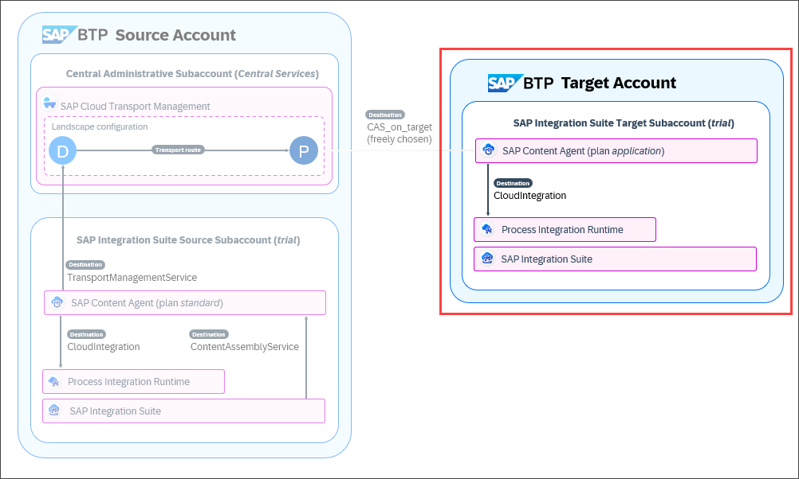

---

### Open the SAP BTP Cockpit

>This step assumes that you're running the tutorial in an SAP BTP Trial target account. If you have an enterprise account, open SAP BTP Cockpit of the enterprise account that you want to use as the **target** account.  

1. You or your colleague: To access the SAP BTP Cockpit of the target BTP Trial, go to the [SAP BTP Trial landing page](https://account.hanatrial.ondemand.com/trial/#/home/trial) and choose **Go To Your Trial Account**. (The name of the button may vary.)    

    The default **trial** subaccount can be used as the SAP Integration Suite target subaccount.

    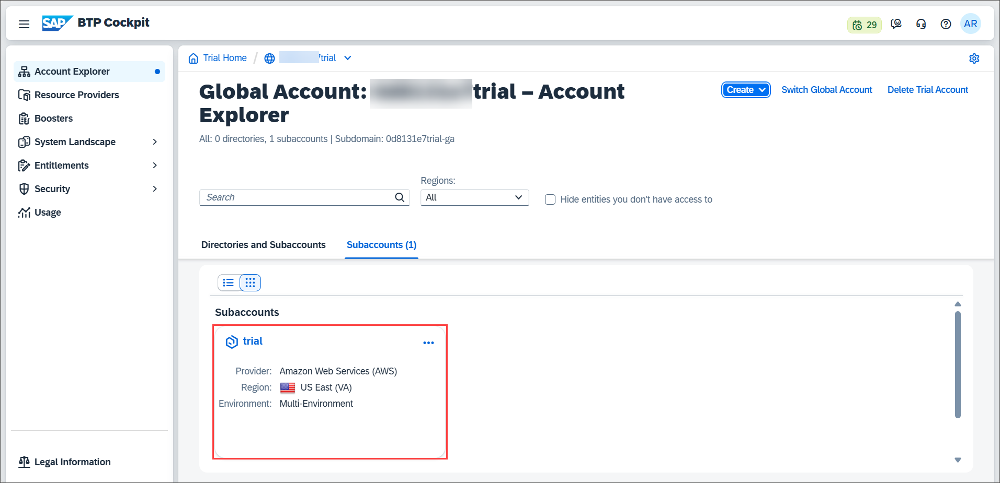

### Set Up SAP Integration Suite

Set up SAP Integration Suite in the **trial** subaccount of the target SAP BTP account the same way as you've done in the course of the previous tutorial [Set Up the SAP Integration Suite Source Subaccount](btp-transport-management-cpi-02-set-up-source-account). Proceed as described in [Set Up Integration Suite Trial](cp-starter-isuite-onboard-subscribe). 

Keep these points in mind:

- Subscribe to SAP Integration Suite in the **trial** subaccount. 

- Make sure that you assign the `Integration_Provisioner` role to your user as mentioned in *Step 2: Subscribe to the service* of that tutorial. 

- Make sure you activate the capabilities of SAP Integration Suite.

- If you use the **Enable Integration Suite** booster to assign roles and create service instances for SAP Process Integration Runtime, you'll only need to update the `api` instance in step 3 of the current tutorial, and you can skip step 4 since the service key was automatically created.  

- If you **don't** use the **Enable Integration Suite** booster to assign roles and create service instances, additionally assign the `PI_Read_Only`, `PI_Integration_Developer`, and `PI_Administrator` role collections to your user. You'll need them towards the end of the tutorial group when you run the test transport. 

### Create a Service Instance for SAP Process Integration Runtime

For the transport scenario, API access to SAP Process Integration Runtime is required also on the target subaccount. First create a service instance.

>Creating a new instance is only required, if you **haven't** used the **Enable Integration Suite** booster to assign roles and create service instances. If you've used the booster, update the `api` instance that was created as part of the booster with the `WorkspacePackagesTransport`, `WorkspacePackagesRead`, and `WorkspacePackagesEdit` roles.   

1. Make sure your user has the `Integration_Provisioner` role collection assigned as mentioned in the previous step.  
   
    To check this, choose **Security > Users** from the navigation on the left. To display the details of your user, click on it, and find the `Integration_Provisioner` role collection. 

1. To create an instance for SAP Process Integration Runtime, choose **Services > Service Marketplace** (1), and filter for *Process Integration Runtime* in the search field (2). On the **SAP Process Integration Runtime** tile, select the three dots **...**, and choose **Create** (3).

    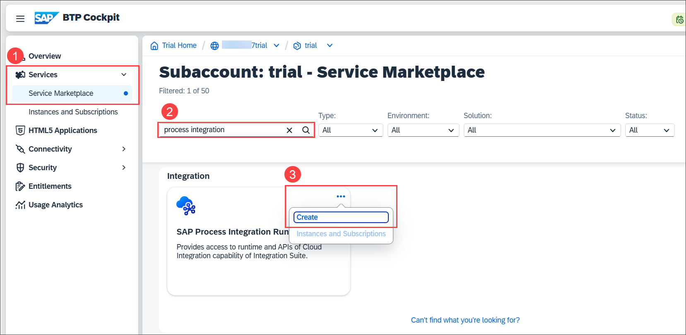

2. Select the **api** plan from the **Plan** dropdown menu of the SAP Process Integration Runtime service (1). You can leave the values for **Runtime Environment** and **Space** unchanged. Enter an **Instance Name**, for example `pi-prod` (2), and choose **Next** (3).

    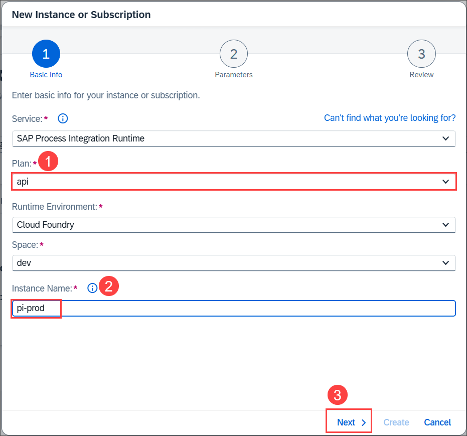

3. The following roles are required for the instance: `WorkspacePackagesTransport`, `WorkspacePackagesRead`, and `WorkspacePackagesEdit`. Select them from the **Roles** dropdown menu (1), and choose **Create** (2). 

    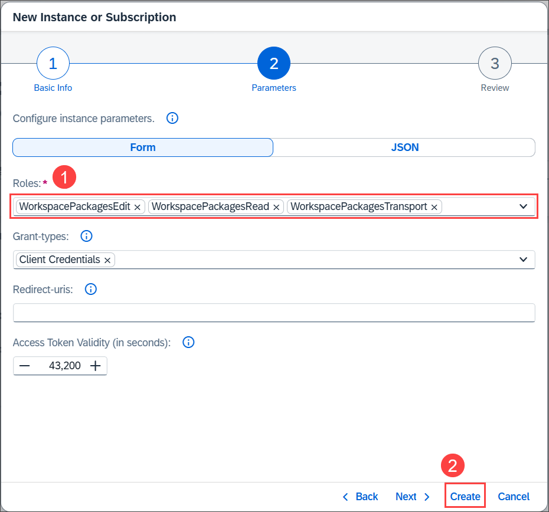

4. The SAP Process Integration Runtime instance was created.

    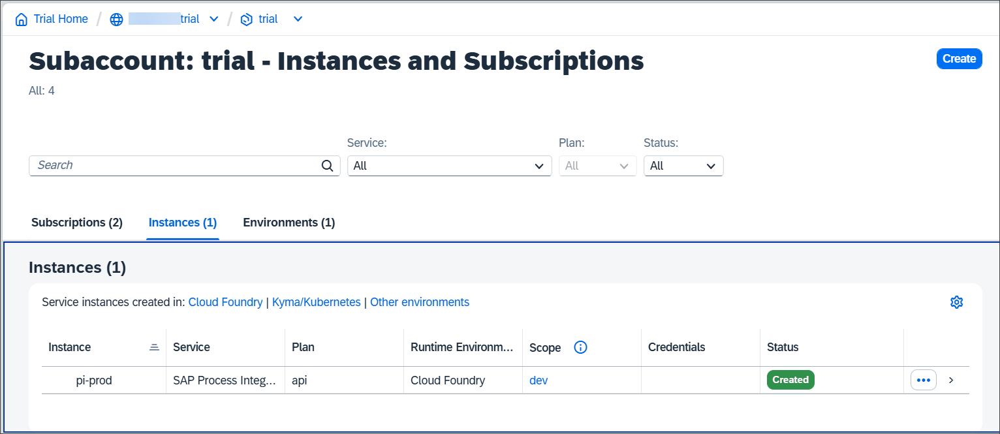
 
See also on SAP Help Portal: [Creating Service Instance and Service Key for Inbound Authentication](https://help.sap.com/docs/SAP_INTEGRATION_SUITE/51ab953548be4459bfe8539ecaeee98d/19af5e205fe14af6a4f8a9fd80d4dc92.html)

### Create a Service Key for the SAP Process Integration Runtime Instance

The details of the service key of the SAP Process Integration Runtime instance are required for the configuration of the SAP Cloud Integration destination. The destination is required for the communication of SAP Content Agent service with SAP Process Integration Runtime.

>If you've used the **Enable Integration Suite** booster to assign roles and create service instances, you can skip this step. A service key for the SAP Process Integration Runtime instance was already created. 

1. To create a service key for the SAP Process Integration Runtime instance, in the service instance row, select the three dots **...**, and choose **Create Service Key**.

    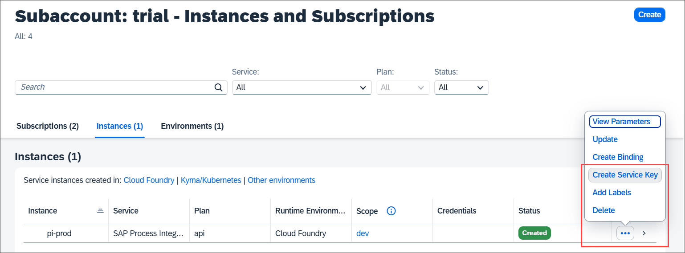

2. Enter a name for the service key, here `PI-RT_SK1` (1), and choose **Create** (2).

    

3. The service key was created. Select the three dots **...** in the service key row, and choose **View**.

    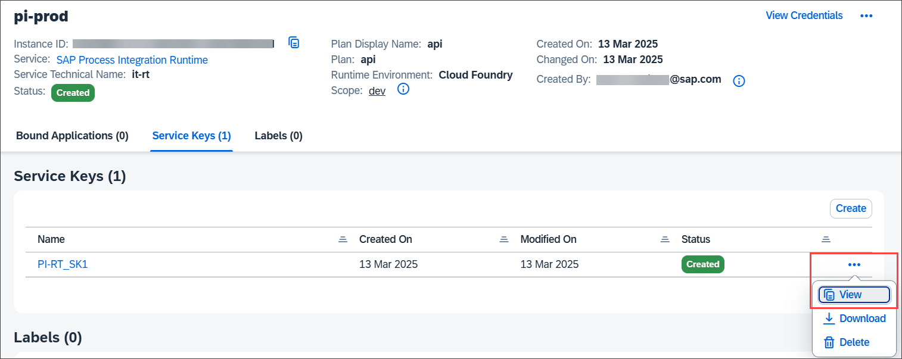

4. The service key looks as follows. Leave the service key open so that you copy the required values in the next step, or note down the values of `url`, `clientid`, `clientsecret`, and `tokenurl`. 

    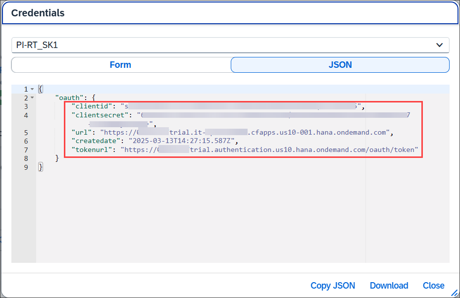

See also on SAP Help Portal: [Creating Service Instance and Service Key for Inbound Authentication](https://help.sap.com/docs/SAP_INTEGRATION_SUITE/51ab953548be4459bfe8539ecaeee98d/19af5e205fe14af6a4f8a9fd80d4dc92.html#creating-service-key)

### Create an SAP Cloud Integration Destination

The SAP Cloud Integration destination serves as the endpoint where SAP Content Agent Service imports the integration content. The destination has the fixed name `CloudIntegration`. You need the values of the service key from the SAP Process Integration Runtime instance created in the target account during the previous step.

1. Choose **Connectivity > Destinations** (1). To create a new destination, choose **Create Destination** (2).

    

2. In the **Destination Configuration** window, enter details for the following fields (1), and save the entries (2):
    >Keep the values of fields not mentioned in the table unchanged.
    
    | Field | Value |
    | ---------- | ------------- |
    | **Name** | `CloudIntegration` |
    | **Description** | For example: `Destination to SAP Cloud Integration` |
    | **URL** | Enter the value of the `url` from the service key details and append `/api/1.0/transportmodule/Transport` to the URL. For example: `https://87654321trial.it-cpitrial06.cfapps.us10-001.hana.ondemand.com/api/1.0/transportmodule/Transport` |
    | **Authentication** | Select **OAuth2ClientCredentials**. |
    | **Client ID** | Enter the value of `clientid` from the service key details. |
    | **Client Secret** | Enter the value of the `clientsecret` from the service key details. |
    | **Token Service URL** | Enter the value of `tokenurl` from the service key details. For example: `https://87654321trial.authentication.us10.hana.ondemand.com/oauth/token` |

    

See also on SAP Help Portal: [Create SAP Cloud Integration Destination](https://help.sap.com/docs/CONTENT_AGENT_SERVICE/ae1a4f2d150d468d9ff56e13f9898e07/c17c4004049d4d9dba373d72ce5610cd.html)

### Create a Service Instance for SAP Content Agent Service

For the transport scenario, API access to SAP Content Agent service is required also on the target subaccount. First create a service instance.

1. Choose **Services > Service Marketplace** (1), and filter for *Content Agent Service* (2). On the **Content Agent Service** tile, select the three dots **…**, and choose **Create** (3).

    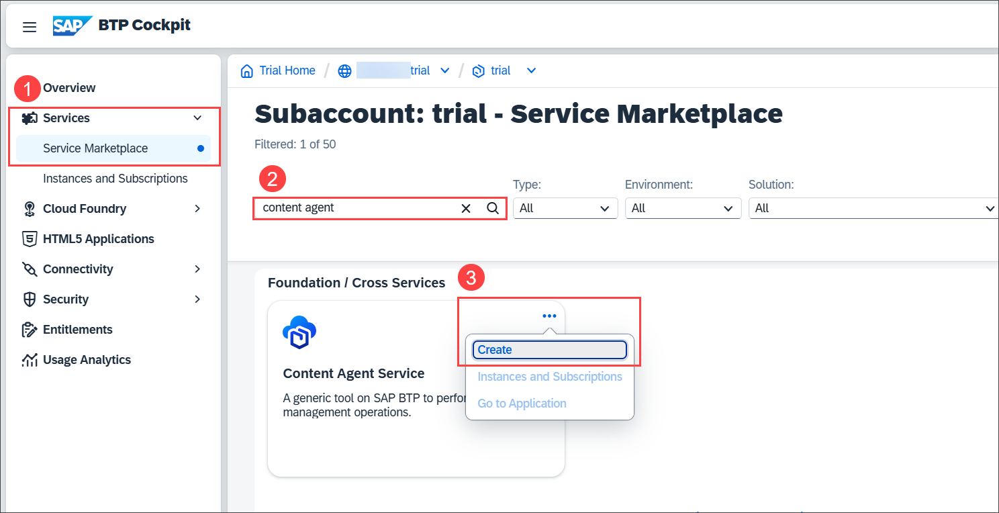

2. Select the **application** instance plan (1). You can leave the values for **Runtime Environment** and **Space** unchanged. Enter an instance name, for example `CAS-deploy` (2), and choose **Next** (3).

    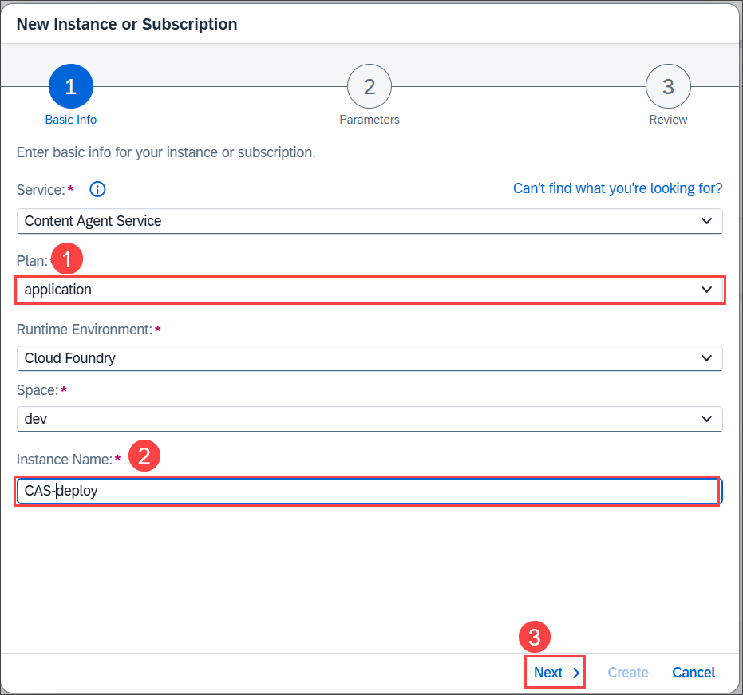

3. Select the **Import** role (1), and choose **Create** (2).

    

    The SAP Content Agent service instance *CAS-deploy* was created. 

    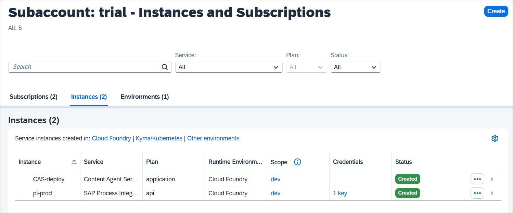

See also on SAP Help Portal: [Create Instance](https://help.sap.com/docs/CONTENT_AGENT_SERVICE/ae1a4f2d150d468d9ff56e13f9898e07/1f45ddc3d6194886802924068724b59f.html)

### Create a Service Key for the SAP Content Agent Service Instance

The details of the service key of the SAP Content Agent service instance are required for the configuration of the destination to SAP Content Agent service in the target subaccount that you'll configure in the SAP BTP source account as part of the next tutorial [Create a Transport Destination and Configure the SAP Integration Suite Transport Landscape](btp-transport-management-cpi-04-connect-source-and-target).

1. To create a service key for the SAP Content Agent instance, in the service instance row, select the three dots **…**, and choose **Create Service Key**.

    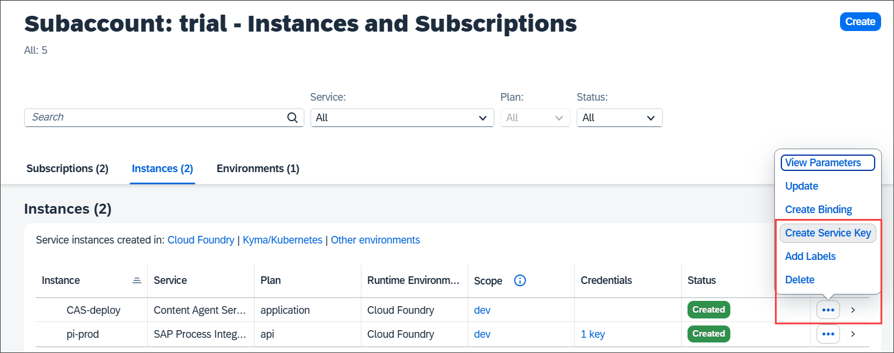

2. Enter a **Service Key Name**, here `CAS-deploy-SK` (1), and choose **Create** (2).

    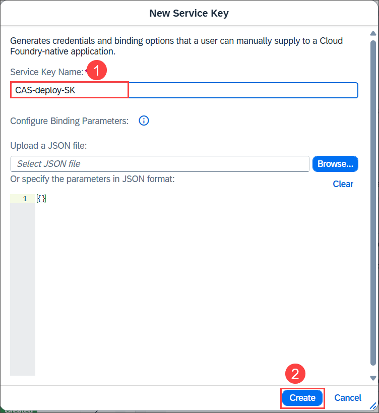

3. The service key was created. Select the three dots **…** in the service key row, and choose **View**.

    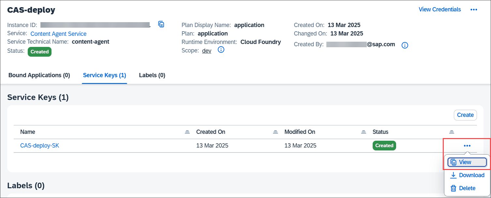

    The credentials are displayed. Leave the service key open so that you copy the required values in the next tutorial, or note down the values of `url`, as well as `clientid`, `clientsecret`, and  `url` from the `uaa` section.

    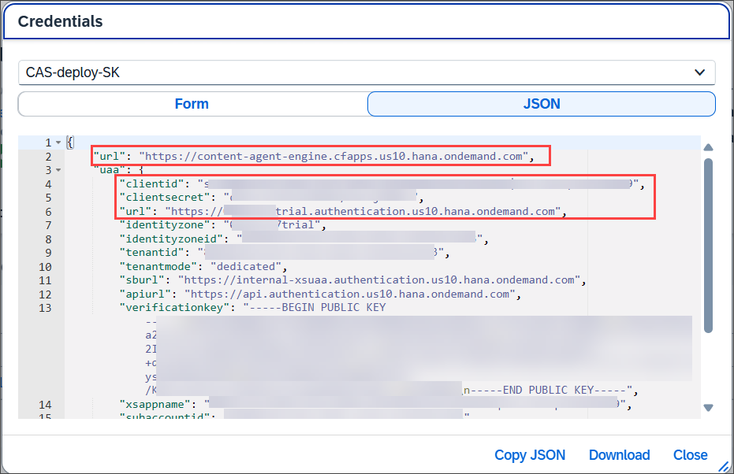  

    You'll need them in the next tutorial [Create a Transport Destination and Configure the SAP Integration Suite Transport Landscape](btp-transport-management-cpi-04-connect-source-and-target) to create the transport destination (called **CAS_on_Target**) in the central administrative subaccount that points to SAP Content Agent service in the target subaccount. 

See also on SAP Help Portal: [Create Service Key](https://help.sap.com/docs/CONTENT_AGENT_SERVICE/ae1a4f2d150d468d9ff56e13f9898e07/c0ec2ba3016644a19cd6322fbc72ea2a.html)

### Next Step

Create a transport destination in the central administrative subaccount in the SAP BTP source account to address SAP Content Agent service on the target subaccount.  

[Create a Transport Destination and Configure the SAP Integration Suite Transport Landscape](btp-transport-management-cpi-04-connect-source-and-target)
