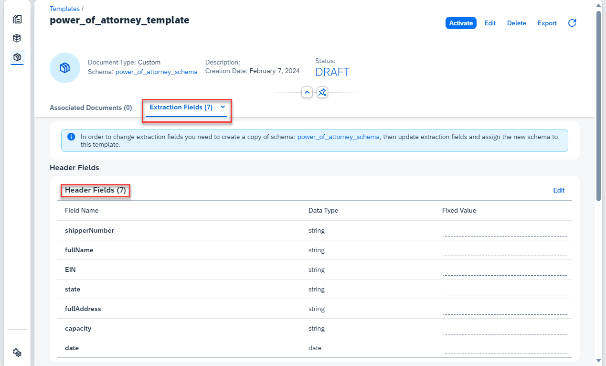
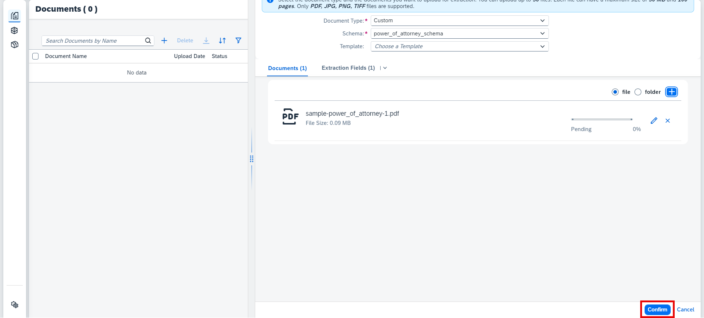
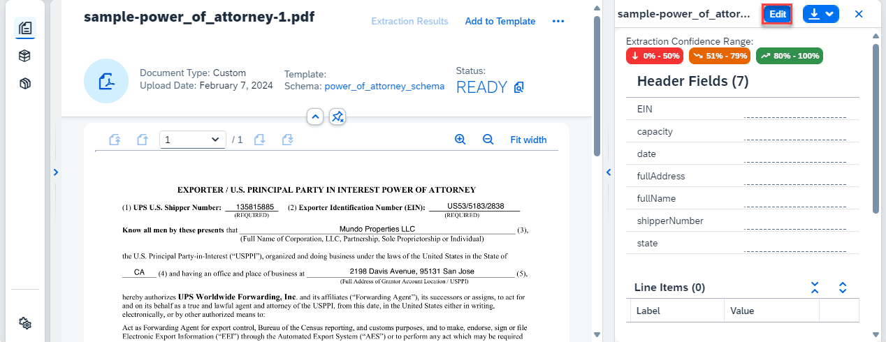
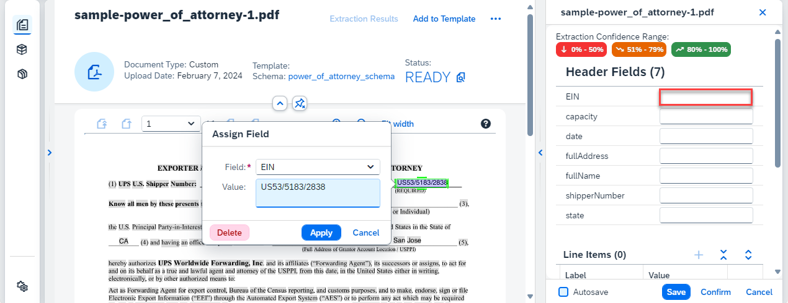
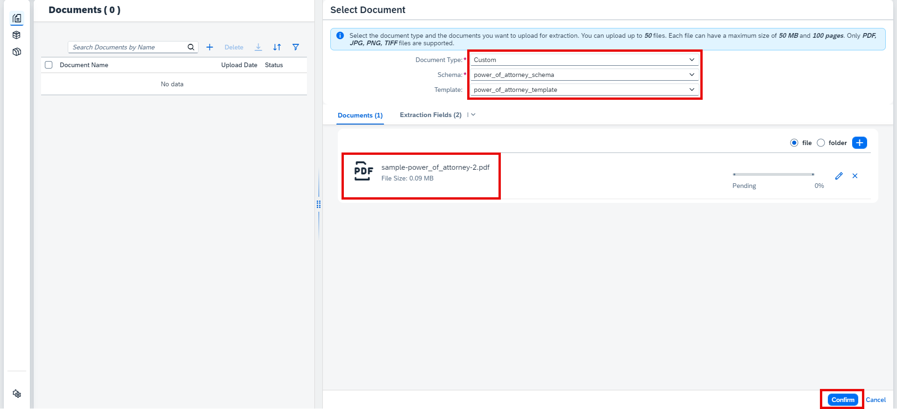
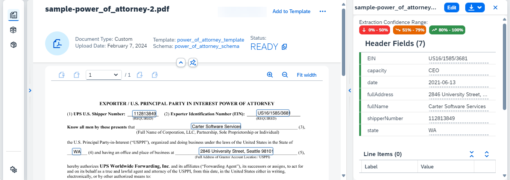

# Create Template for Custom Documents
<!-- description --> Create a template for custom documents (which are not supported out of the box) to extract information from similar documents using the Document Information Extraction service.

## You will learn
  - How to create a template for custom documents using your schema
  - How to associate documents with your template and how to edit them
  - How to use your template when extracting information from documents

---

### Create template

In [Create Schema for Custom Documents](cp-aibus-dox-ui-schema-custom), you defined a schema that includes a list of header fields you want to extract from power of attorney documents. In this tutorial, you'll create a template that uses your schema and associate documents with your template. You'll **Edit** the extraction results of the associated documents to teach the Document Information Extraction service where certain field values are located on the document to improve the accuracy of the extraction prediction for similar documents.

In Document Information Extraction UI, access **Template** on the left navigation pane and click **+** to create a new template.

<!-- border -->

In the dialog, proceed as follows:

1. Enter a name for your template, `power_of_attorney_template`, for example.

2. Choose `Custom` as your `Document Type`.

3. Select the schema you created in [Create Schema for Custom Documents](cp-aibus-dox-ui-schema-custom).

4. Click **Create** to create your template.

    <!-- border -->

5. After your template is created, a confirmation dialog pops up. Click **OK** to acknowledge it. It will now navigate you to the detail page of your template.

    <!-- border -->

    You now see a list of the associated documents (in our case, **No data** yet) and a list of the extraction fields that you've defined in your schema.

    <!-- border -->

    <!-- border -->

    In the next steps, you'll upload a document, get the extraction results, and edit them so that you can associate the document with your template.

>**CAUTION:**

>When using the free tier option for Document Information Extraction or a trial account, be aware of the technical limits listed in [Free Tier Option and Trial Account Technical Constraints](https://help.sap.com/docs/document-information-extraction/document-information-extraction/free-tier-option-and-trial-account-technical-constraints).

### Upload document and get extraction results

>This tutorial uses the following power of attorney documents. Download them to follow along (right-click on the link, then click ***Save link as*** to download the files locally):

> - [Sample Power of Attorney 1](https://github.com/SAPDocuments/Tutorials/raw/master/tutorials/cp-aibus-dox-ui-template-custom/sample-power_of_attorney-1.pdf)
> - [Sample Power of Attorney 2](https://github.com/SAPDocuments/Tutorials/raw/master/tutorials/cp-aibus-dox-ui-template-custom/sample-power_of_attorney-2.pdf)
> - [Sample Power of Attorney 3](https://github.com/SAPDocuments/Tutorials/raw/master/tutorials/cp-aibus-dox-ui-template-custom/sample-power_of_attorney-3.pdf)

1.  Access **Document** on the left navigation pane and click **+** to upload a new document.

    <!-- border -->

2. On the Select Document screen, choose `Custom` for the **Document Type**.

3. Select the **Schema** you created. Don't select any **Template** this time.

4. Drop the file directly or click **+** to upload one of the power of attorney documents. The following images use the [Sample Power of Attorney 1](https://github.com/SAPDocuments/Tutorials/raw/master/tutorials/cp-aibus-dox-ui-template-custom/sample-power_of_attorney-1.pdf). 

5. Click **Confirm**.

    <!-- border -->

    The document status changes from `PENDING` to `DONE`.

    <!-- border -->

6. Click the document row to see the information extracted from the document using the schema you created.

    <!-- border -->

    In this case, no information has been extracted from the document because you've used only custom fields in the schema. In the next step, the field values will be added manually and once this document is associated with the template, the extraction should work for the custom fields when you use the template for similar documents.

### Edit extraction results

Before associating the document with your template, make the extraction results are correct.

1. Click **Edit**. You can edit extracted values manually on the right of the screen. You can also select them from the page preview in the middle of the screen. To do the latter, hover your mouse over the page preview. The mouse pointer changes to a crosshair cursor. Position the cursor at the corner of the value you wish to select. Then, hold down the left mouse button. Move the cursor diagonally to the opposite corner to draw a bounding box around the value you want to select. Select the appropriate header or line item field from the **Field** dropdown in the **Assign Field** dialog. Add or change the value, as necessary.

    <!-- border -->

    This is an example of how to edit the field `EIN`:

    <!-- border -->

    Once you've added all header fields, the extraction results should look like the following:

    <!-- border -->   
    
2. Save your changes.

    <!-- border -->

### Add associated documents

1. Click **Add to template** to associate the document with your template.
   
    <!-- border -->

2. Select the relevant template from the dropdown and click **Add**.

    <!-- border -->

3. Click **OK**. The document file is now associated with the template you selected. You can repeat the preceding steps to associate additional documents with your template.

    <!-- border -->

### Activate template

The last step that remains is to activate the template. 

1. Access **Template** on the left navigation pane and click the row of the template you created to access it.

    <!-- border -->

2. Click **Activate**.

    <!-- border -->

    Now, the status of your template changes from `DRAFT` to `ACTIVE` which means you can use the template to extract information from documents. To make changes to your template, you have to **Deactivate** it first.

    <!-- border -->  
    

### Use template

1.  Access **Document** on the left navigation pane and click **+** to upload a new document.

    <!-- border -->

2. On the Select Document screen, choose `Custom` for the **Document Type**.

3. Select the **Schema** and **Template** you created.

4. Drop the file directly or click **+** to upload one of the other two power of attorney documents. First, use the [Sample Power of Attorney 2](https://github.com/SAPDocuments/Tutorials/raw/master/tutorials/cp-aibus-dox-ui-template-custom/sample-power_of_attorney-2.pdf).

    <!-- border -->

5. Click **Confirm**.

    The document status changes from `PENDING` to `DONE`.

    <!-- border -->

6. Access the document by clicking on it. You now see the page preview of the document file you uploaded, and the information extracted from the power of attorney header fields using the schema and template you created.

    <!-- border -->

    You can repeat this step using the [Sample Power of Attorney 3](https://github.com/SAPDocuments/Tutorials/raw/master/tutorials/cp-aibus-dox-ui-template-custom/sample-power_of_attorney-3.pdf).

    You can now create a schema and a template, and use them to get the extraction results for your own custom document types.

    Congratulations, you've completed this tutorial.