# Alerts in SAP HANA Database and Data Lake
<!-- description --> Learn how to configure and view SAP HANA Cloud alerts and how the SAP Alert Notification service for SAP BTP can be used to send alerts to other channels.

## Prerequisites
 - Access to a SAP HANA Cloud instance.

## You will learn
  - An overview of alerts
  - How to configure, trigger, and access alerts
  - How to use the SAP BTP Alert Notification service (ANS) to be notified of alerts

## Intro
Alerts can inform you of potential issues before they occur, such as when the number of rows in a SAP HANA database table is approaching 2 billion, or of an issue currently occurring, such as a user in a data lake Relational Engine is locked out.  

You can find details of any raised alerts through the alerts app in SAP HANA Cloud Central or by using the [REST API](hana-cloud-alerts-rest-api) (SAP HANA database). This is known as a pull approach.

Alternatively, alert details can be pushed to several configured channels such as email, Slack, or Microsoft Teams.  A list of built-in events can be found at [SAP HANA Cloud Service Database Events](https://help.sap.com/docs/alert-notification/sap-alert-notification-for-sap-btp/sap-hana-cloud-service-database-events).

> Access help from the SAP community or provide feedback on this tutorial by navigating to the "Feedback" link located on the top right of this page.

---

### Examine SAP HANA Cloud, HANA Database alert definitions
In this step, the SAP HANA cockpit will be used to examine three alert definitions.

1. Open the SAP HANA cockpit from HANA Cloud Central.

    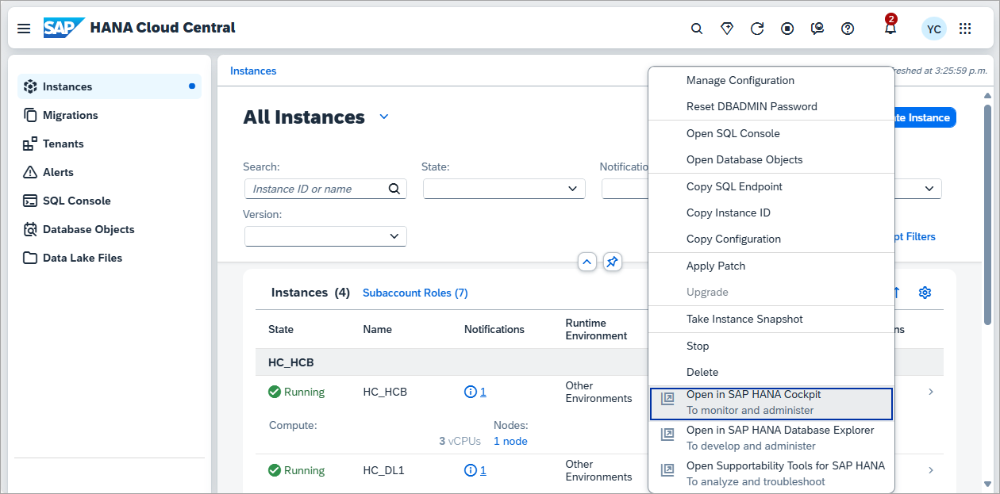

2. In the Monitoring view, open the Alert Definitions app.

    

    >SAP HANA Cloud Central also has an alerts app to view triggered alerts.  It displays alerts for all instances in a subaccount and additionally displays additional alerts that do not originate from the SAP HANA embedded statistics server (ESS).  Events corresponding to ESS alerts have an alert ID.  

3. The three alerts that will be triggered in step 2 of this tutorial are shown below.

      

    Notice that alerts have a name, ID, description, category, and a suggested user action such as an SAP Note.

    

    The categories are shown below.

    | SAP HANA Database Categories |
    | ----------- |
    | Other |
    | Availability |
    | Memory |
    | Disk |
    | Configuration |
    | Sessions/Transactions |
    | Backup |
    | Diagnosis Files |
    | Security |

4. Alerts may have severity and threshold levels.

    | Severity |
    | ----------- |
    | High |
    | Medium |
    | Low |
    | Information |    

    As an example, long-running statements (ID 39), has its threshold values set to 60 minutes for Medium, 45 minutes for Low, and 30 minutes for Info.  These will be set to much lower thresholds of 3, 2 and 1 minutes in step 2.

    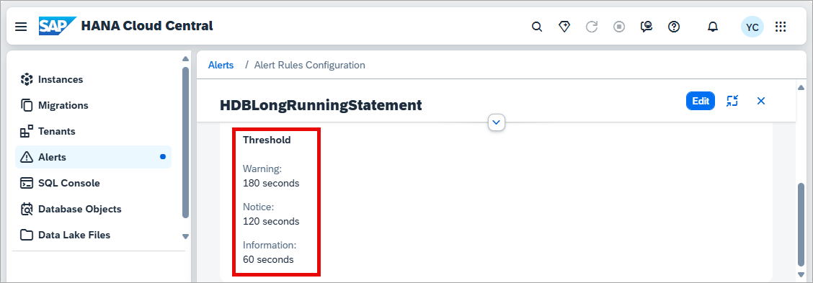

5. Alert checks are scheduled to run at a specified interval and can be enabled or disabled.  For example, record count of non-partitioned column-store tables ( ID 17 ) has an interval value of 1 hour, meaning that this check is performed each hour and is currently enabled.

    

    Note that the check for an alert can be manually triggered by pressing the **Check Now** button.

6. Alerts also have a retention period.  Once triggered, depending on their type, they will remain for a set duration such as 14 or 42 days.

For additional details, consult [Alerts in SAP HANA Cloud](https://help.sap.com/docs/hana-cloud-database/sap-hana-cloud-sap-hana-database-administration-guide/alerts-in-sap-hana-cloud) in the administration guide for SAP HANA cockpit.


### Trigger alerts in a SAP HANA database

The following instructions demonstrate a few examples of triggering alerts in a SAP HANA database.      
> Perform these actions on a non-production system, such as a trial or free tier account.

1. Open the SQL console.

    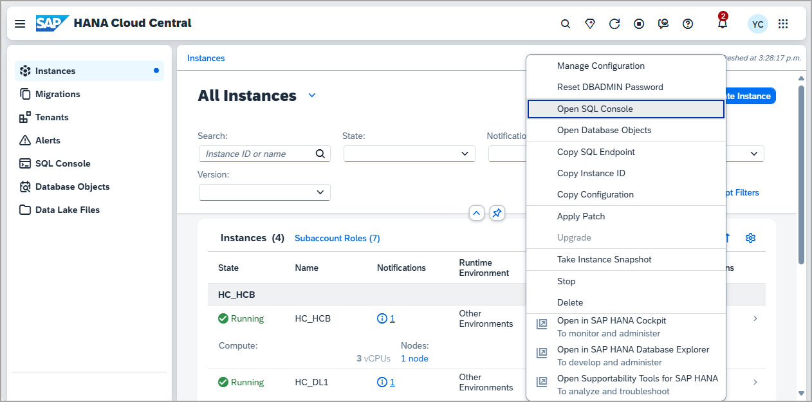

2. Execute the following query in the SQL console to trigger a high (indicated by the parameter value of 4) severity test alert.

    ```SQL
    CALL _SYS_STATISTICS.Trigger_Test_Alert(?, 4, 'High test alert');  
    ```

    > The alert will be viewed in the alerts app in step 3.

3. Trigger the long-running statements (ID 39) alert.

    * Go to the **Long-running statements** alert in the **Alert Definitions** app. 
    
        Click **edit** to set the thresholds and interval.  
    
        Set  the thresholds to 180, 120, and 60 seconds with an interval time set to 1 minute.

        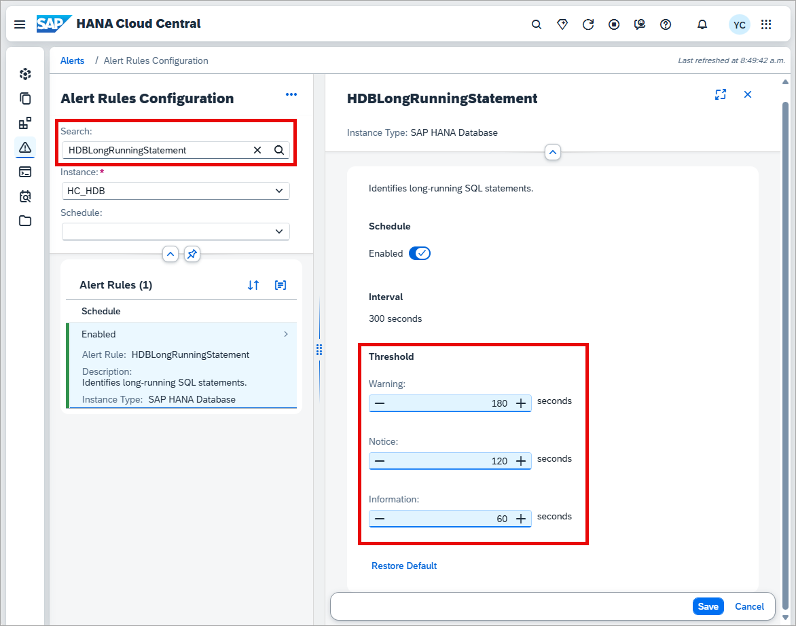
    
    * Execute the following SQL

        ```SQL
        DO BEGIN
        USING SQLSCRIPT_SYNC AS SYNCLIB;
        CALL SYNCLIB:SLEEP_SECONDS( 300 );  --runs for 5 minutes
        -- Now execute a query
        SELECT * FROM M_TABLES;
        END;
        ```

4. The record count of non-partitioned column-store tables (ID 17) alert can be triggered by executing the following SQL.  

    ```SQL
    --The default threshold for 'Record count of non-partitioned column-store tables' is 300 million
    -- This SQL may take a minute or two to run
    -- Create a table and insert more than 300 million rows into it
    DO BEGIN
           DECLARE i INT;
           CREATE TABLE MYTABLE(MYVALUE INT);
           INSERT INTO MYTABLE VALUES(1);
           INSERT INTO MYTABLE VALUES(2);
           INSERT INTO MYTABLE VALUES(3);
           INSERT INTO MYTABLE VALUES(4);
           INSERT INTO MYTABLE VALUES(5);
           FOR i IN 1 .. 26 DO
                  INSERT INTO MYTABLE (SELECT * FROM MYTABLE);
           END FOR;
           SELECT COUNT(*) FROM MYTABLE;
    END;
    SELECT TOP 100 * FROM MYTABLE;

    -- To resolve, partition the table
    -- ALTER TABLE MYTABLE PARTITION BY HASH(MYVALUE) PARTITIONS 5;

    -- Clean up
    -- DROP TABLE MYTABLE;
    ```

    As the default interval time for this check is 1 hour, the check can be manually trigged by pressing the Check Now button in the alert definitions app within the SAP HANA cockpit.

    

    > Note that two other alerts may also be triggered by the above SQL: table growth of non-partitioned column-store tables and record count of column-store table partitions.

### View SAP HANA database alerts using the alerts app

The following instructions will show how to view a triggered SAP HANA database alert in SAP HANA Cloud Central.

1. In SAP HANA Cloud Central,  alerts can be seen for all instances in an SAP BTP subaccount.  

    Navigate to the alerts tab.

    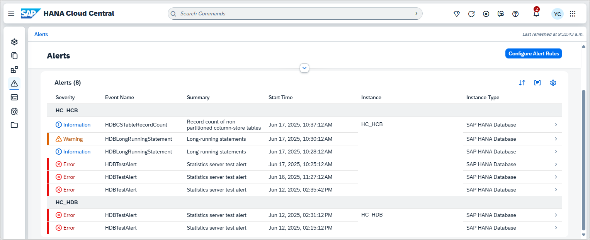  

    A filter can be set for Type, Severity, Instance, Instance Type, and Time Range. 
    
    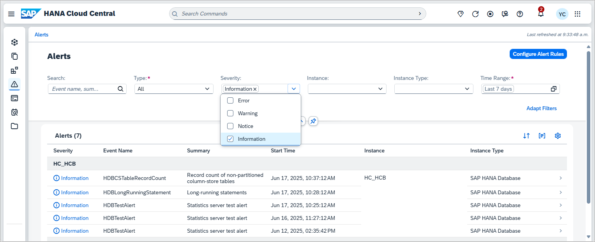 

    Alerts can be filtered by Current or All. Current Alerts have a Start Time value but no End Time value, as the end time is added when the alert is closed.  Closed alerts appear in type filter All rather than Current.  

    Additional details can be found in [Open Alerts in SAP HANA Cloud Central](https://help.sap.com/docs/hana-cloud/sap-hana-cloud-administration-guide/alerts).
    
2. Details about a SQL statement from a long-running statement alert can be found out with the following query. The statement hash can be found in the alert description.

    ```SQL
    SELECT STATEMENT_STRING
      FROM M_SQL_PLAN_CACHE 
      WHERE STATEMENT_HASH='XXXXXXXXXXXXXXXXXXXXX';
    ```

    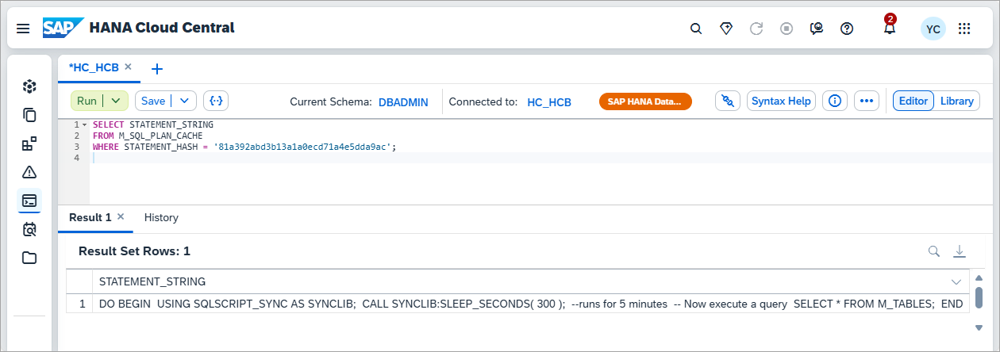

3. The test alert will resolve itself after 5 minutes or be resolved (indicated by the parameter value of 0) by executing the following statement.

    ```SQL
    CALL _SYS_STATISTICS.Trigger_Test_Alert(?, 0, 'Resolve test alert');
    ```

    Additional details on the test alert are available at [SAP Note 3004477 - Usage of statistics server test alert (ID 999)](https://launchpad.support.sap.com/#/notes/3004477).
    
Alerts can also be accessed via a REST API as shown at [Accessing SAP HANA Cloud Alerts and Metrics using a REST API](hana-cloud-alerts-rest-api).

### Trigger an alert in SAP HANA Cloud data lake
The following instructions show one example of triggering the [data lake locked user event](https://help.sap.com/viewer/5967a369d4b74f7a9c2b91f5df8e6ab6/Cloud/en-US/11b9ef0ed4dd4e1dae36147fe313b381.html).  The alert will be triggered when a user attempts to log in **after** the user account has been locked because an incorrect password has been provided too many times.  

>This alert is not available in trial accounts.     

1. In a SQL console that is connected to a **data lake**, execute the following SQL to create a login policy and a new user.

    ```SQL
    CREATE LOGIN POLICY lp max_failed_login_attempts=3;
    GRANT CONNECT TO user2 IDENTIFIED BY 'Password2';
    GRANT SELECT ANY TABLE TO user2;
    GRANT SET ANY CUSTOMER PUBLIC OPTION to user2;
    ALTER USER user2 LOGIN POLICY lp;
    ```

    Additional details can be found at [Login Policy Options](https://help.sap.com/docs/hana-cloud-data-lake/sql-reference-for-data-lake-relational-engine/login-policy-options).

2. The instructions below will attempt to connect to the data lake using user2 but with an incorrect password.

    * Click on the instance, select the data lake instance, uncheck **Use cached credentials if possible**.

        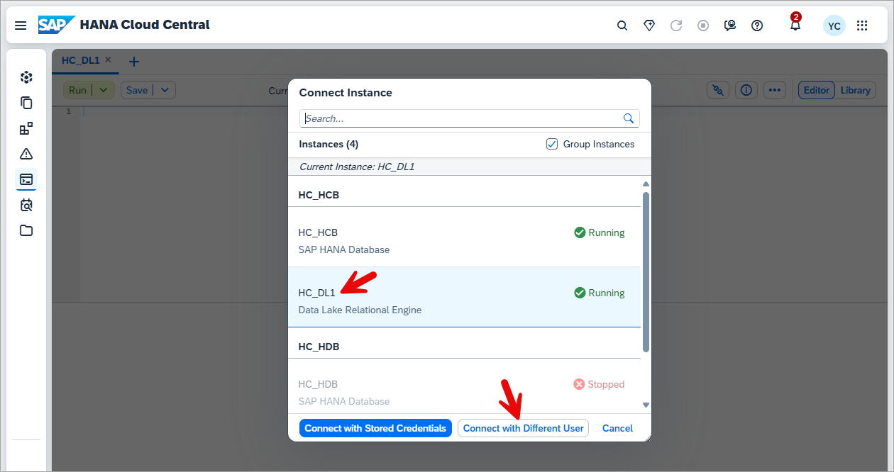

    * Enter user2 and an incorrect password.

        

    * After pressing OK, an attempt will be made to connect to the data lake.  After three failed attempts with an incorrect password, user2 will become locked.  This can be seen in the User & Role Management app in SAP HANA Cloud Central.

        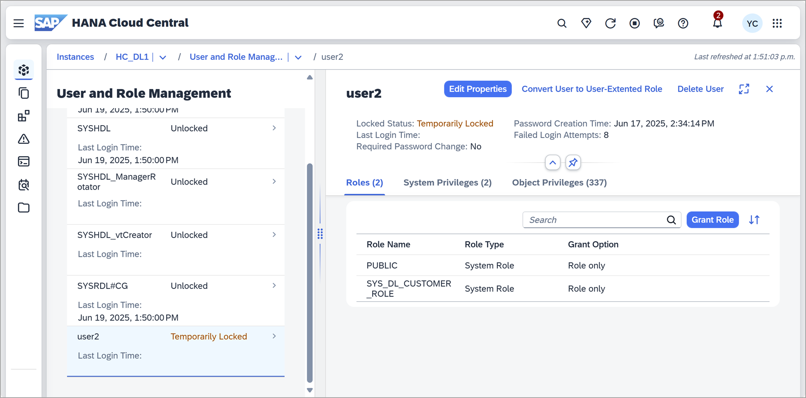

3.  Attempt to connect one more time after the account has been locked (4th time) to trigger the alert.

4. The alert can now be seen in the alerts app in SAP HANA Cloud Central.

    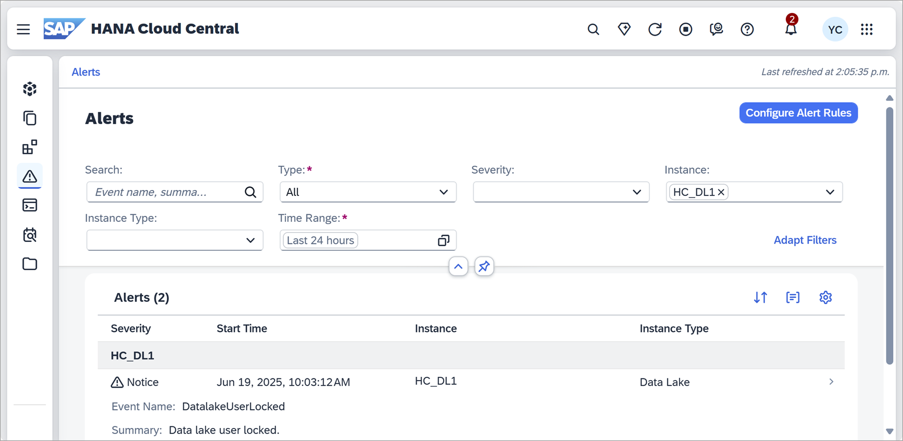

5. Additional details about users can be seen by calling the procedure `sa_get_user_status`.  The user can be unlocked using by resetting the login policy.

    ```SQL
    CALL sa_get_user_status;
    ALTER USER user2 RESET LOGIN POLICY;
    --DROP USER user2;
    --DROP LOGIN POLICY lp;
    ```

    The tutorial [Monitor a Standalone Data Lake in SAP HANA Cloud](hana-cloud-hdl-getting-started-4) may also be of interest as it demonstrates the data lake Relational Engine monitoring views.

### Set up email notification when an alert occurs

The SAP Business Technology Platform (BTP) includes a service called the SAP Alert Notification service (ANS) that provides a common way for other services or applications running in the SAP BTP to send out notifications such as an email, a post to a Microsoft Teams or Slack channel, the creation of a ticket in `ServiceNow`, or a webhook to send events to any Internet REST endpoint.  The SAP HANA Cloud database and data lake pass on events to the SAP ANS when an alert is triggered.  


For an overview of the SAP Alert Notification service for SAP BTP and information about the different service plans including free tier, see [SAP Alert Notification service for SAP BTP](https://discovery-center.cloud.sap/serviceCatalog/alert-notification?region=all&tab=service_plan) in the SAP Discovery Center and watch the associated video [SAP Alert Notification service for SAP BTP - Overview](https://www.youtube.com/watch?v=_DInhi4Skn4).

In this step, the Alert Notification Service will be configured to act on the incoming notifications by sending an email with the details of the alert.  First, an instance of the Alert Notification Service will be created.  Then, two conditions will be created; one that matches notifications sent from a SAP HANA database and the other from a data lake.  An email action will also be created that describes who to send an email to and what content to include in the email when one of the conditions occurs.  Finally, a subscription will be created that will use the two conditions and the action.  Having the conditions and actions separate from the subscription enables them to be reused in multiple subscriptions.   

1. Create an instance of the Alert Notification service in the SAP BTP Cockpit.

    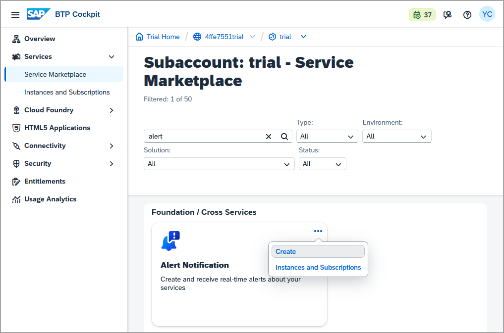

    > The SAP Alert Notification service must be in the same Cloud Foundry subaccount as the SAP HANA Cloud instances which it will be receiving notifications from.

    >---

    >If the SAP Alert Notification service does not appear, it may be that the entitlement needs to be added to the subaccount.  To do so, navigate to the subaccount, select Entitlements, Configure Entitlements, Add Service Plans, and Alert Notification.

    >

2. Provide a name for the Alert Notification service instance and press the **Create** button.

    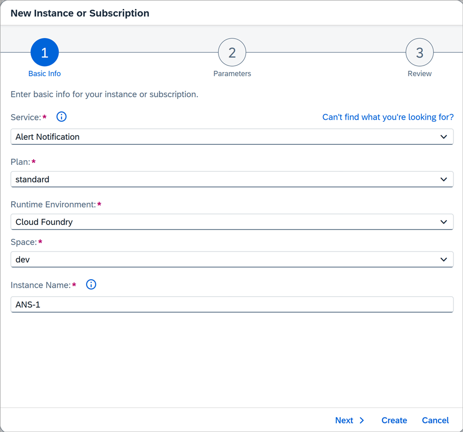

    | Service | Plan | Instance Name |
    | -------- | ----- | --- | 
    | `Alert Notification` | `standard` | `ANS-1` | 


3. Once the instance has been created, click on **Manage Instance**.

    

4. Create a condition for SAP HANA database alerts by selecting **Conditions** and then pressing **Create**.

    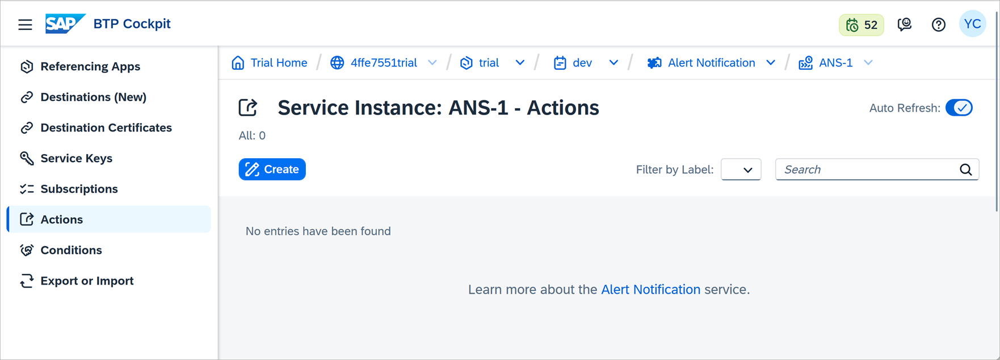

5. Specify the condition details and press **Create**.

    

    | Name | Condition |
    | -------- | ----- | 
    | `HANA-DB-Alerts` | `eventType` Starts With `HDB` |

    > Alternatively, a condition `resource.resourceType` set to equal `hana-cloud-hdb` could be used.

    > ---

    > Note that the Mandatory checkbox is left unchecked.  This means that this condition can be `ORed` with one or more other non mandatory conditions.

    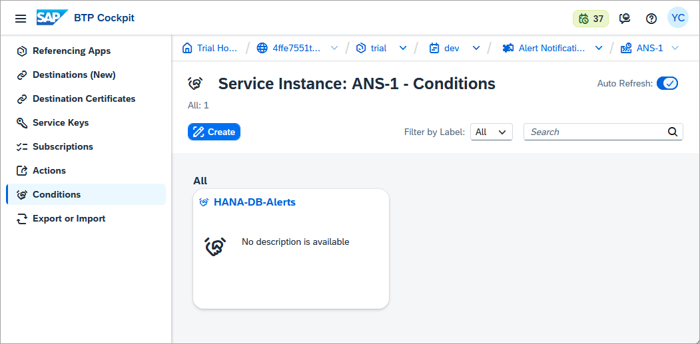


6. Create another condition for data lake alerts.  Specify the condition details and press **Create**.

    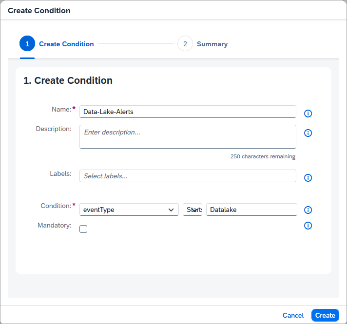

    | Name | Condition |
    | -------- | ----- | 
    | `Data-Lake-Alerts` | `eventType` Starts With `Datalake` |

7. Create an action by selecting **Actions** and the pressing **Create**.

    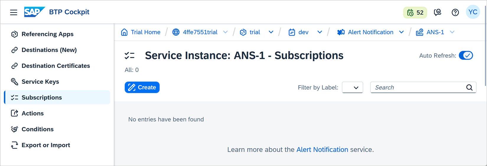

8. Specify the type of action to be **Email**.

    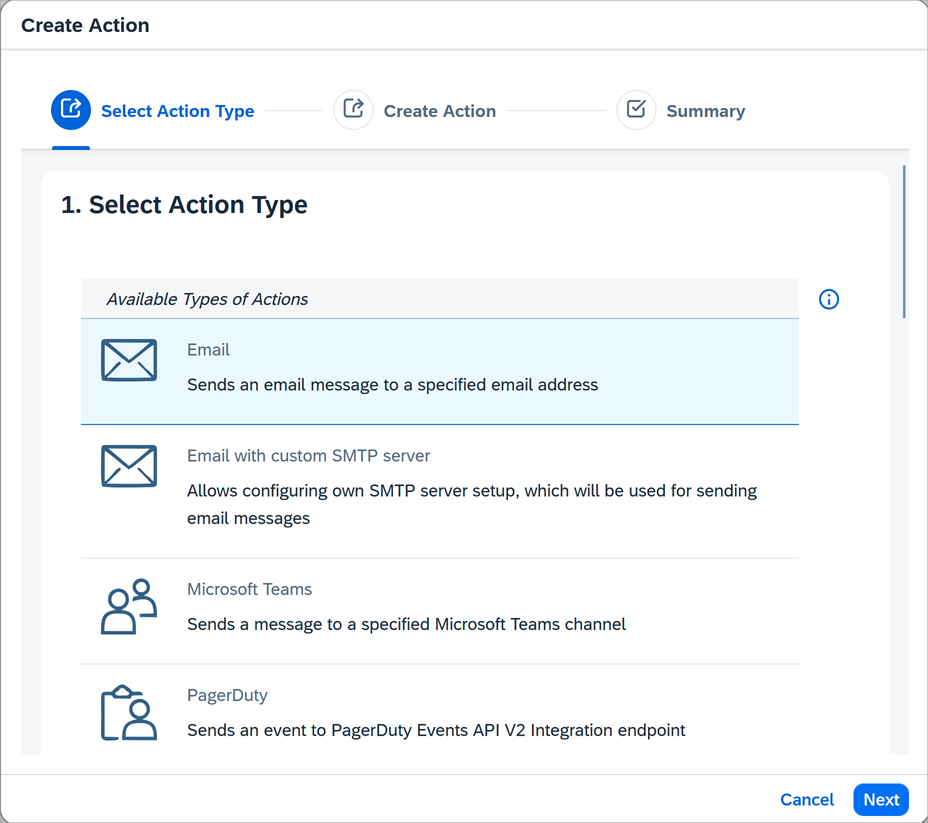

    See also [Managing Actions](https://help.sap.com/viewer/5967a369d4b74f7a9c2b91f5df8e6ab6/Cloud/en-US/8a7e092eebc74b3ea01d506265e8c8f8.html) for details on other available action types.

9. Name the action `email_action` and then scroll to the **Additional Properties** section.

    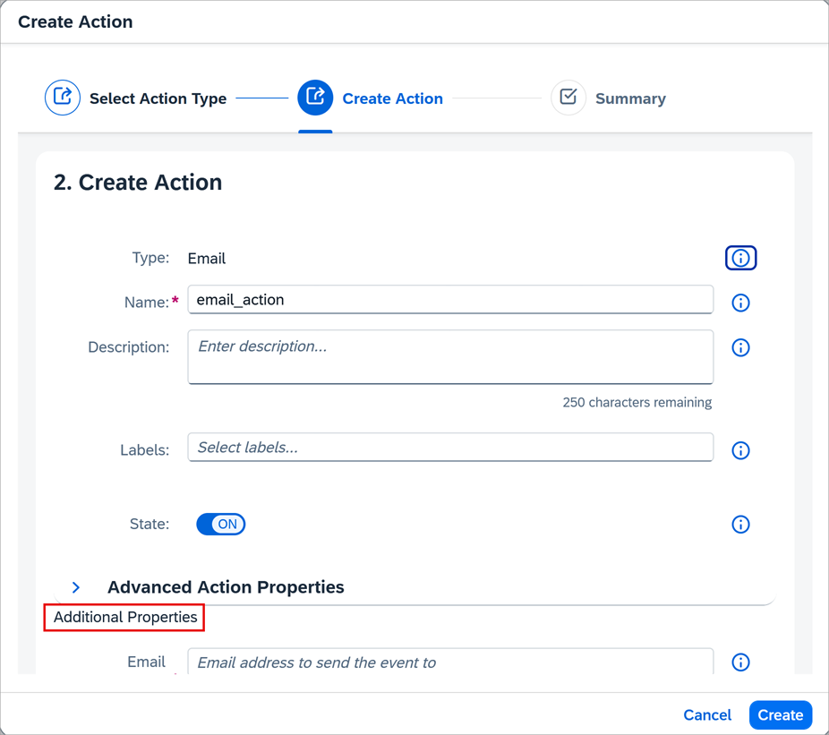

    In the **Additional Properties** section, provide values for **Email Address**, **Subject Template** and **Payload Template**.

    

    &nbsp;
    ```Subject Template
    {severity} {resource.resourceType} {eventType} {tags.ans:status} occurred on {resource.resourceName}
    ```

    ```Payload Template
    AlertID: {tags.hanaAlertRuleId}
    Body: {body}
    Recommended Action: {tags.ans:recommendedAction}
    Instance Details: {resource.tags.*}
    ```

    > It is also possible to leave the subject and payload template fields empty.  In this case, a default template will be used.

    Details on the available tags for each alert are provided at [Built-In Events](https://help.sap.com/viewer/5967a369d4b74f7a9c2b91f5df8e6ab6/Cloud/en-US/2ef9c72833df4f2690f071c47f50f5af.html).  

    

10. A confirmation token will be sent to the email address.  Click on the provided link or copy that value and use it to confirm the action as shown in the next sub-step.

    

11. Click on **`email_action`** to open it.

    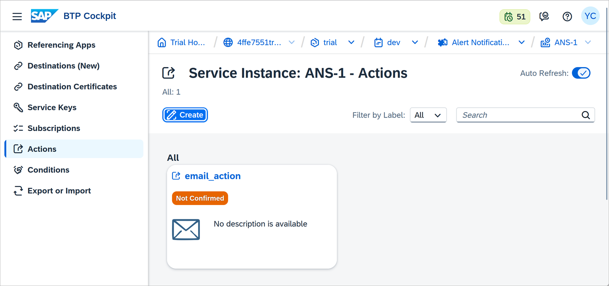

    Press the **Confirm Action** button.

    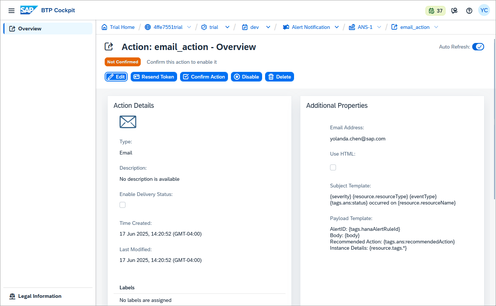

    Enter the confirmation token.

    

    The email action is now confirmed.

    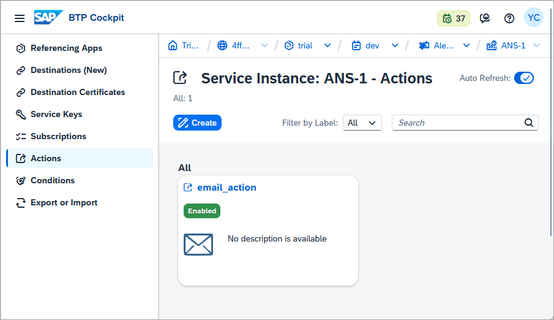

12. Create a subscription by selecting **Subscriptions** and pressing **Create**.

    

    Name the subscription `ANS-HANA-Cloud-Subscription` and press the **Create** button.

    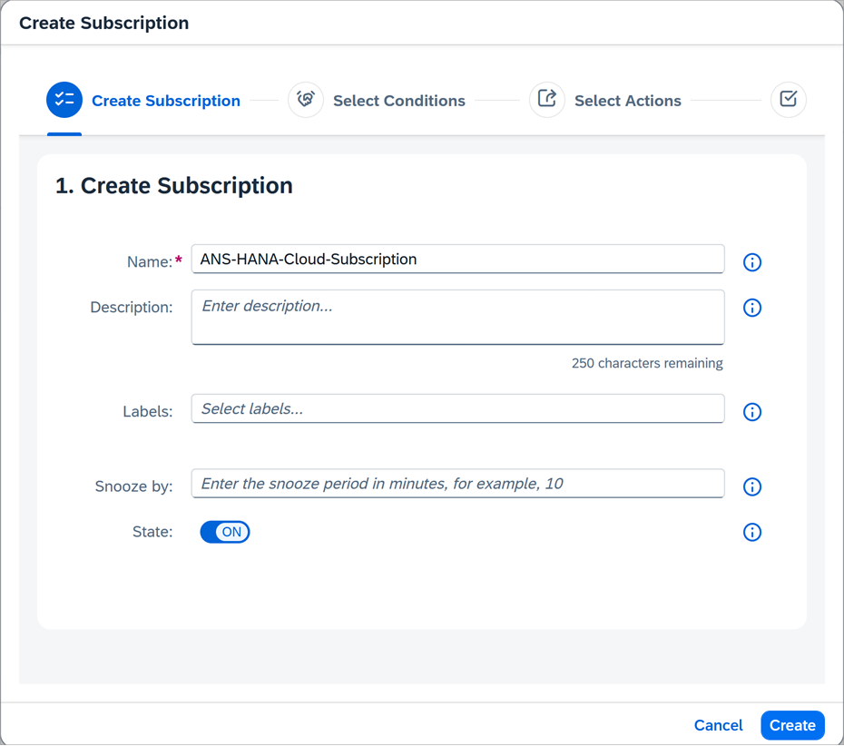

13. Assign the conditions to the subscription by including the two previously created conditions and pressing the **Assign** button.

    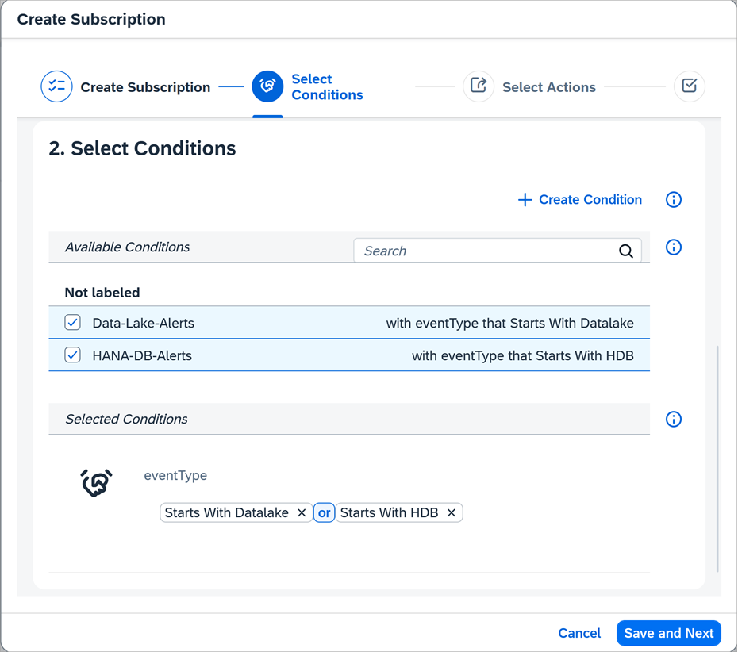

    > Another example is to specify the instance ID of a specific instance to monitor and to only send an alert when the alert first occurs (create state).
    >
    > 

14. Assign the action to the subscription by including the previously created action and pressing the **Assign** button.

    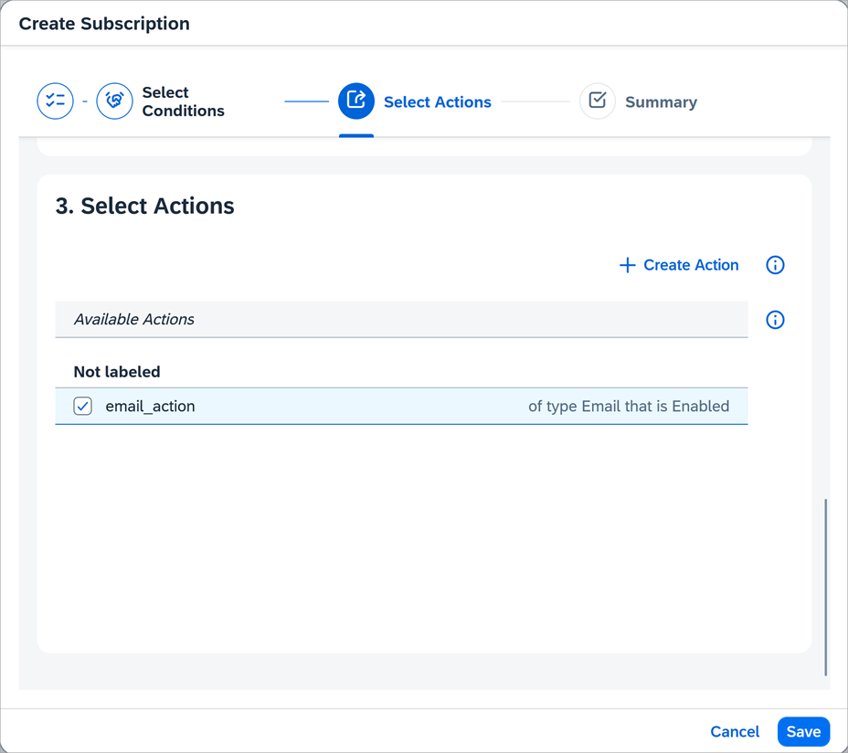

15. Completed subscription.

    

16. Repeating the actions in step 2 and 4 should now send emails like the ones shown below.

    Test Alert

    

    Test Alert (default template)

    

    > Notice that the `ans:status` is CLOSE. Events can have a status of CREATE, UPDATE or CLOSE.  Some alerts have multiple thresholds or severities so multiple CREATE and CLOSE alerts could be sent as a condition occurs and then is resolved.  If an alert is unresolved after a period of time such as 4 hours, an alert with a status of update is sent.

    Long-Running Statement

    

    Record count of non-partitioned column-store tables

    

    Locked user

    


### Set up notification with a Microsoft Teams channel


This step will briefly show an example of how to receive a notification in Microsoft Teams.

1.  In Microsoft Teams, search for **Incoming Webhook** in Apps.

    

2.  Choose to add the app to a team.

    

3.  Specify a name for the webhook, optionally upload an image, and press **Create**.

    

    After pressing create, copy the provided URL and press **Done**.

    

    A notification will appear in the channel that the connector has been added.

    

4. Similar to the previous step where an ANS action was created for email, create one for Microsoft Teams in the SAP BTP Cockpit.

    

    Provide the webhook URL under the Additional Properties section.

    

5. Assign the action to a subscription.

    

6. After triggering an alert, the Microsoft Teams channel will show the notification.

    


### Set up notification with a Slack channel


This step will briefly show an example of how to receive a notification in Slack.

1. In a browser open [api.slack.com](https://api.slack.com/apps), click on **Create a custom app**, and then choose **from scratch**.

    Provide an app name, a workspace, and press **Create App**.

    

2. Choose to add **Incoming Webhooks**.

    

3. After activating incoming webhooks, click on **Add New Webhook to Workspace**.

    Specify the Slack channel that will be used to post to and click **Allow**.

    

    Copy the provided Webhook URL.

4. Similar to the step where an ANS action was created for email, create one for Slack in the SAP BTP Cockpit.

    

    Provide the webhook URL under the Additional Properties section.

    

    An example of a payload template.

    ```JSON
    [{
		"type": "section",
		"text": {
			"type": "mrkdwn",
			"text": "* {severity} {eventType} {tags.ans:status} on {resource.resourceName}*"
		}
  	},
  	{
  		"type": "divider"
  	},
  	{
  		"type": "section",
  		"text": {
  			"type": "mrkdwn",
  			"text": ":pencil2: Subject: {subject}"
  		}
  	},
  	{
  		"type": "section",
  		"text": {
  			"type": "mrkdwn",
  			"text": ":scroll: Body: {body}"
  		}
  	},
  	{
  		"type": "section",
  		"text": {
  			"type": "mrkdwn",
  			"text": " :medical_symbol: Recommended Action: {tags.ans:recommendedAction}"
  		}
  	}]
    ```

5. Assign the action to a subscription.

    

6. After triggering an alert, the Slack channel will show the notification.

    

### Knowledge check

Congratulations! You have now configured alerts, triggered and viewed them via the SAP HANA cockpit and received them via email, Microsoft Teams, and Slack using the SAP Alert Notification service for SAP BTP.  


---
