# Query Databases Using the SQL Console in SAP HANA Cloud Central
<!-- description --> Learn how the SQL console can be used within SAP HANA Cloud Central to quickly query a selected database.  

## Prerequisites
- An SAP HANA Cloud database
- You have completed [this](hana-dbx-create-schema) tutorial which creates a database schema for an SAP HANA Cloud, SAP HANA database.
- You have completed [this](hana-cloud-dl-clients-overview) tutorial which creates a database schema for an SAP HANA Cloud, data lake Relational Engine

## You will learn
  - How to open a SQL console, specify the credentials, and set the current schema
  - An overview of the functionality provided in the SQL console

---

### Open a SQL console
This step demonstrates how a SQL console can quickly be opened from within SAP HANA Cloud Central and how to change the SQL console's credentials and schema.

1.  In **SAP HANA Cloud Central** open a SQL console by selecting **SQL Console** in the left pane.  Notice that the SQL console is not associated with a database when opened in this way.

    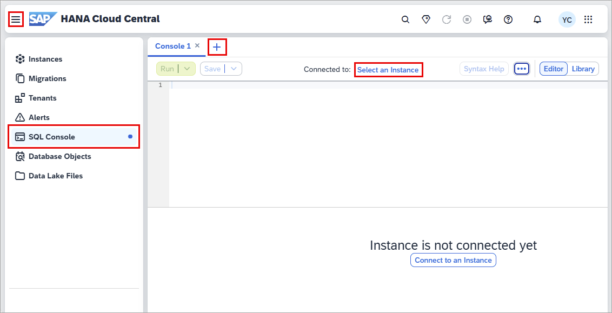

    Additional SQL consoles can also be opened by selecting the **+** icon.

2.  This time select **Instances**, select a database, and choose **Open SQL Console** from the actions menu.

    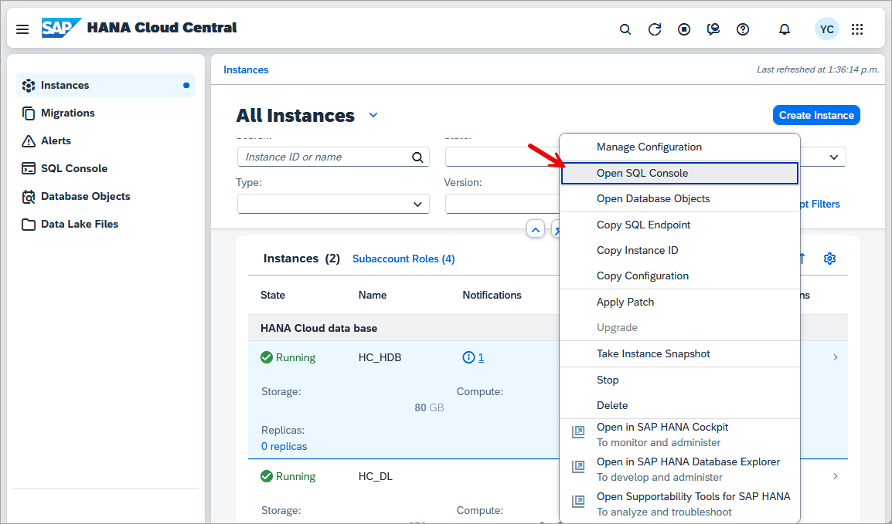

    Notice that it is now connected to the instance named `HC_HDB` as shown by the name of the tab and the instance label.

    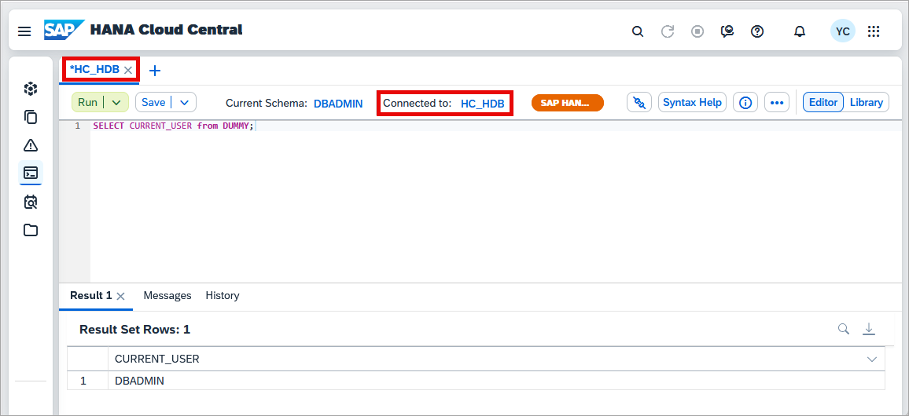

3. The currently connected user can be seen by executing the SQL statement below.

    ```SQL
    SELECT CURRENT_USER FROM DUMMY;
    ```

    


4.  If you wish to connect to the database using a different set of credentials, select the **Connect this SQL console to a different instance** icon, select the current database and uncheck **Use cached credentials if possible**.

    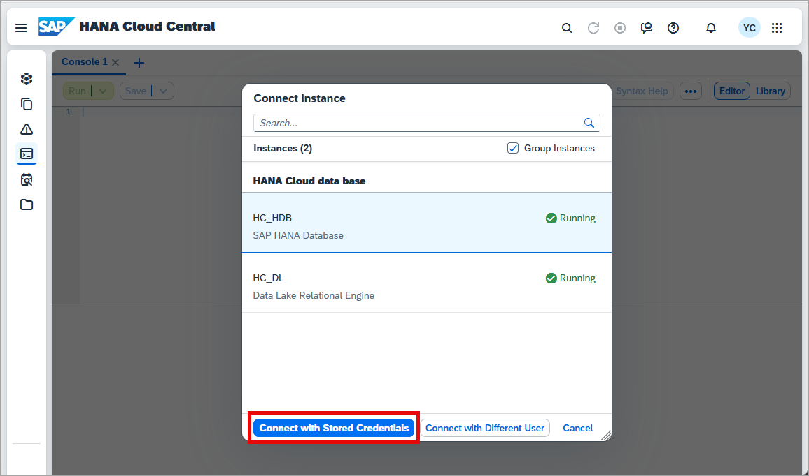

    The Enter Credentials dialog will then ask for the new credentials to be used.

    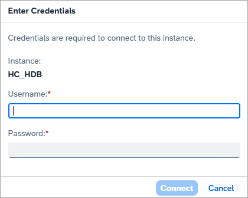

    You can also use the following SQL for an SAP HANA database to change and change the connected user.

    ```SQL
    CONNECT USER1 PASSWORD Password1;
    SELECT CURRENT_USER FROM DUMMY;
    ```

    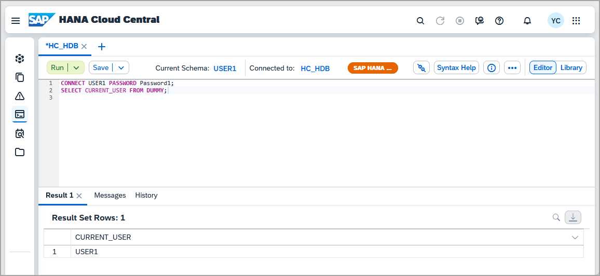

    The SQL to view the current user for a data lake Relational Engine is shown below.

    ```SQL
    SELECT CURRENT USER;
    ```

    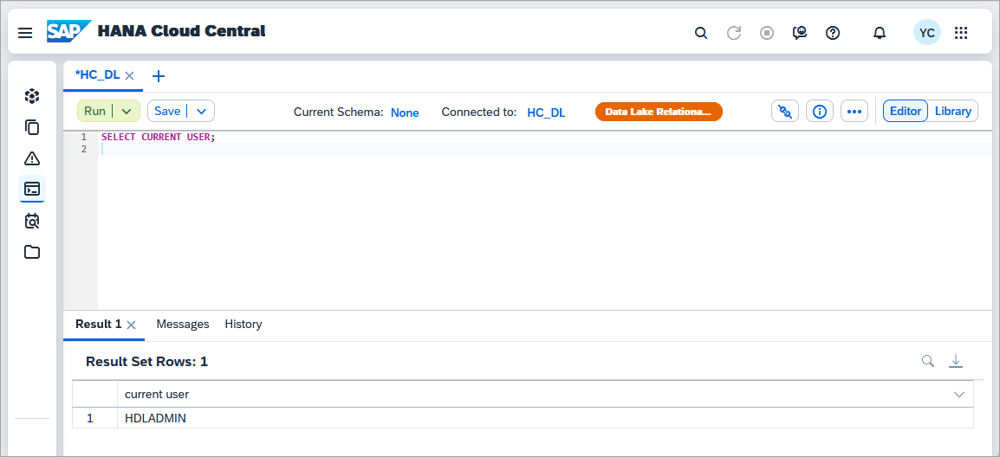

5.  The current schema can be set and viewed for a SAP HANA database using the SQL statements below.

    ```SQL
    SET SCHEMA HOTELS;
    SELECT CURRENT_SCHEMA, CURRENT_USER FROM DUMMY;
    ```

    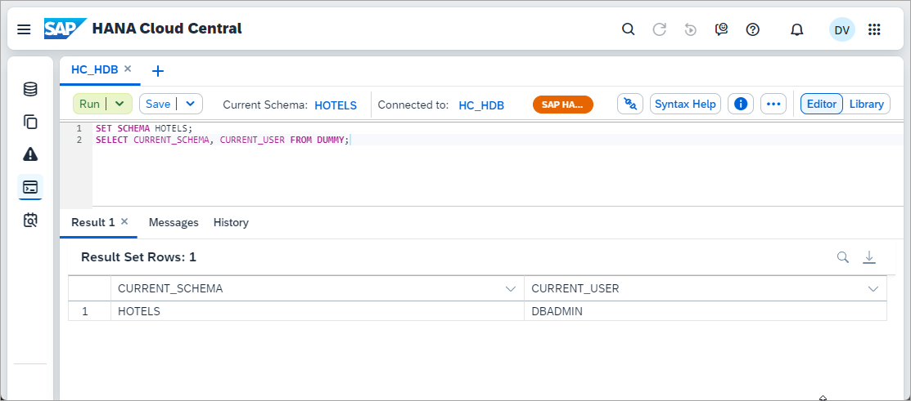

    For data lake Relational Engine instances, the current schema can be set and viewed as shown below.

    ```SQL
    SET SCHEMA HOTELS;
    SELECT CURRENT SCHEMA, CURRENT USER;
    ```

    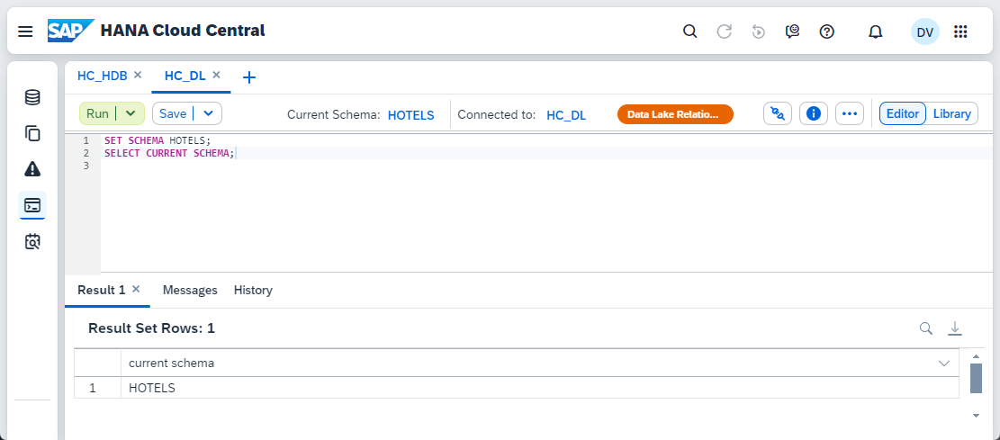

6. Multiple light and dark themes are available.  

    Click on the SAP HANA Cloud Central settings icon.  Then select **Settings** > **Appearance**.  The default theme is SAP Morning Horizon. 

    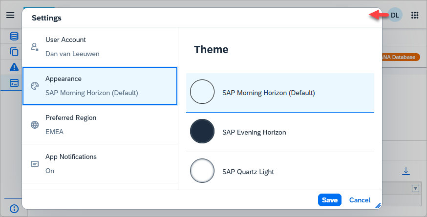

### Execute SQL
This step demonstrates how to execute a SQL query, examine the statement help, view the query results, messages, and history tabs within a SQL console.  

1. Execute the following SQL statements.

    ```SQL
    SELECT * FROM HOTELS.CUSTOMER;
    SELECT * FROM NON_EXISTENT_TABLE;
    SELECT * FROM NON_EXISTENT_TABLE2;
    SELECT * FROM HOTELS.HOTEL_ROOMS_VIEW;
    ```

    The following error dialog appears.  Select  **Skip All**.

    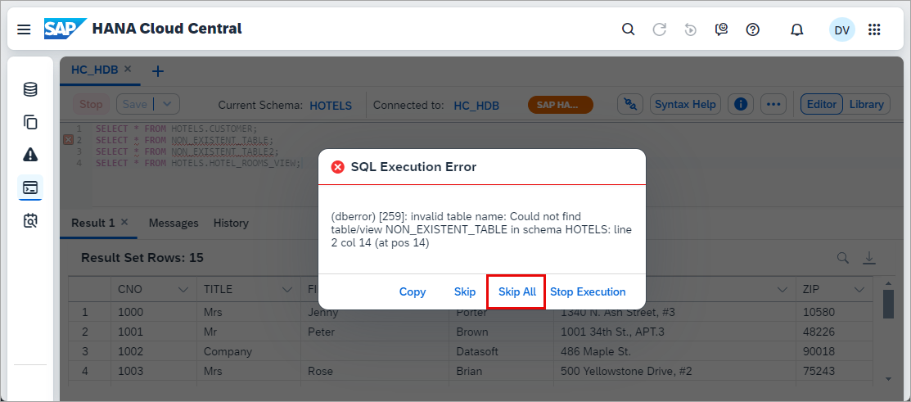

    Notice that there is an error marker beside the lines that could not be executed.  Pressing **Alt+E** will display further details and advances to the next error when pressed more than once.

    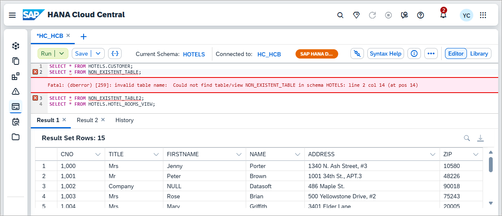

    Notice that two result tabs are shown, one for each SQL statement that generated a result.

2. Results can be downloaded as shown below.

    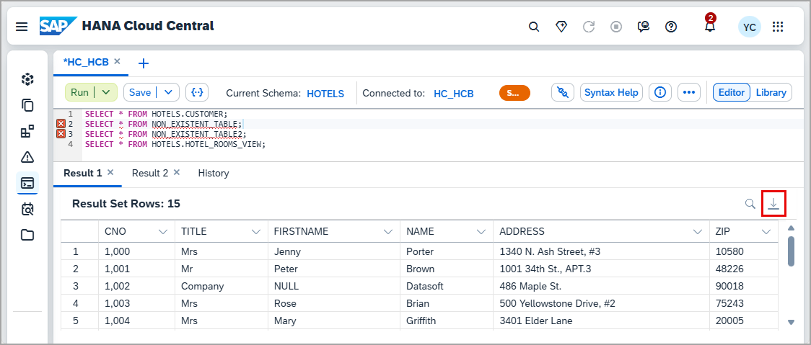

    Options are provided on how to format the data.

    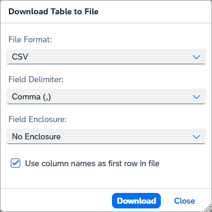
    
    Rows can also be selected and then copied to the clipboard by pressing Ctrl+C.

    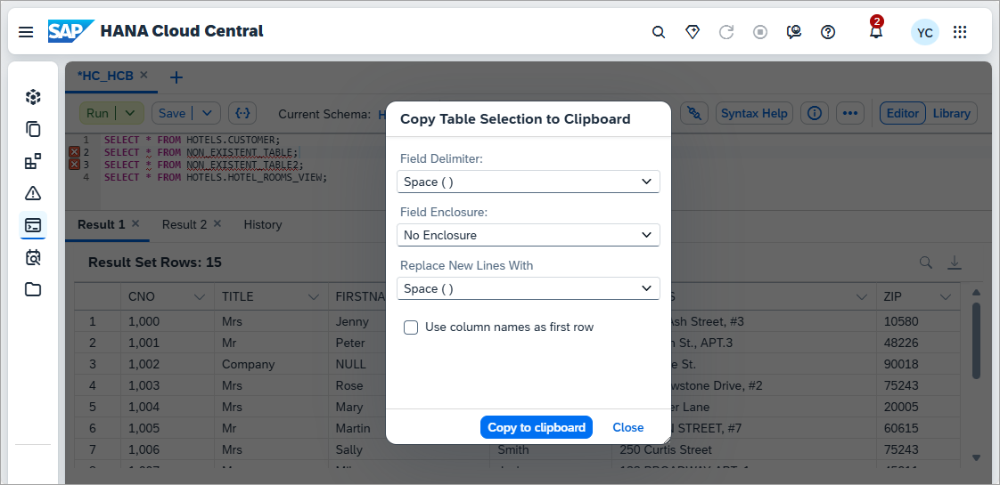

3. Place the cursor on line four and open the **Syntax Help** panel.

    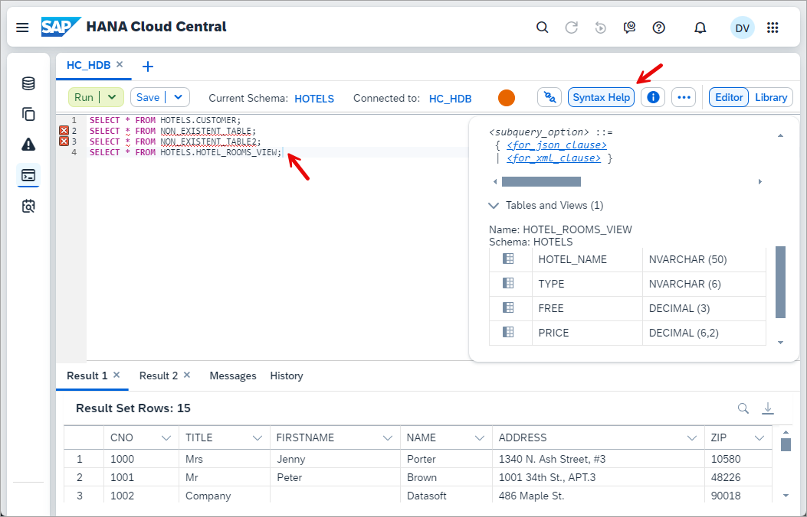

    Notice that for SAP HANA Cloud, SAP HANA databases, links to the related documentation and details on the objects used in the SQL statement are shown.

4. Commonly used shortcut keys are listed below.  Try a few of them out.

    Action | Shortcut
    ------ | ------
    Add Comment Block | Ctrl+Shift+/
    Comment/Uncomment Line | Ctrl+/
    To Uppercase | Ctrl+Alt+U
    To Lowercase | Ctrl+Shift+U
    Go to Next Error | Alt+E
    Go to Previous Error | Alt+Shift+E
    Go to Line | Ctrl+L
    Jump to Matching Brackets | Ctrl+P
    Run All | F8
    Run Statement |	F9
    Text Completion | Ctrl+Space 

    >The shortcut keys may vary depending on the OS and browser used.

    For the complete list see [Common Keyboard Shortcuts for the SQL Console](https://help.sap.com/docs/hana-cloud/sap-hana-cloud-administration-guide/keyboard-shortcuts-for-sql-console).

5. Examine the **Messages** tab.

    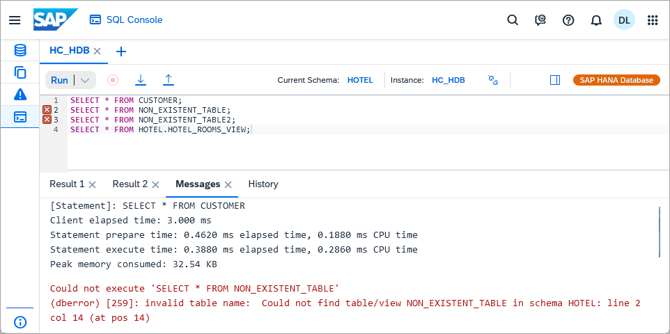

    Notice that details of the statements executed are shown including metrics information such as the amount of memory consumed.

6. Examine the **History** tab.

    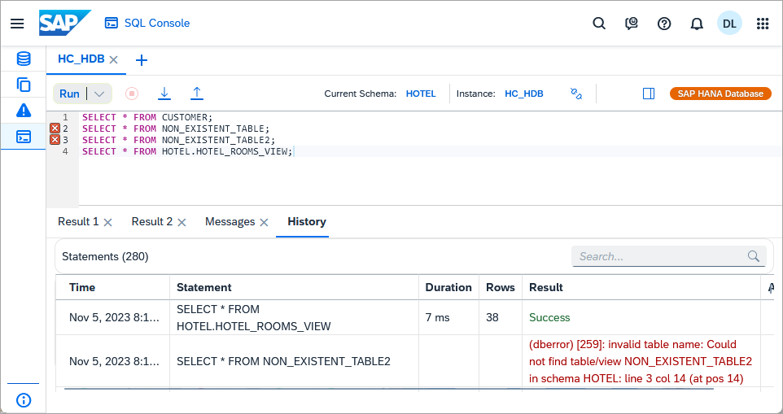

    Notice that the statements can be located using a search and that a selected item can be inserted back into the SQL console or copied.

7. Examine the **SQL Console Settings**.  

    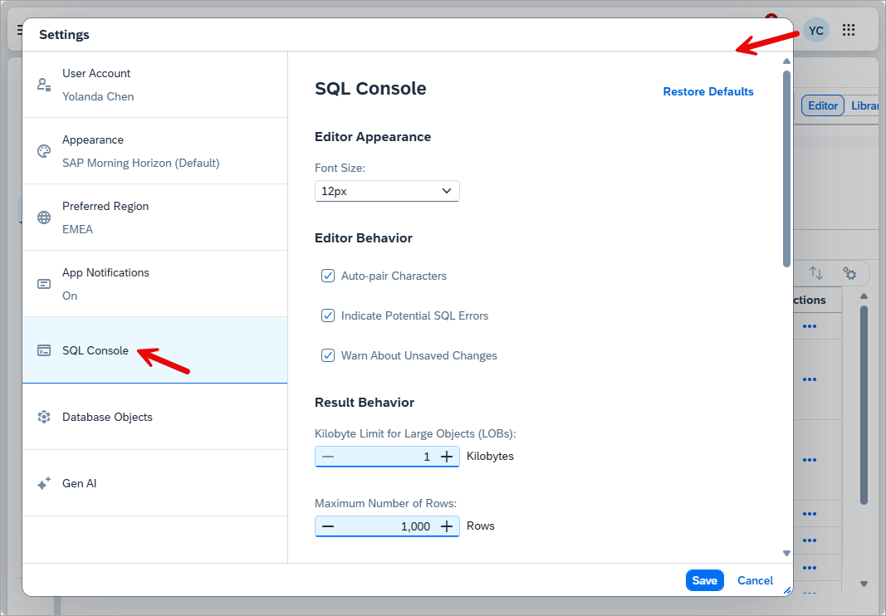

    * Execute the following SQL which is used to illustrate the result behavior settings.

        ```SQL
        SELECT * FROM M_SYSTEM_INFORMATION_STATEMENTS;

        SELECT COUNT(*) FROM SYS.TABLE_COLUMNS;
        SELECT * FROM TABLE_COLUMNS;
        ```

        Notice that only the first 1024 bytes from the column STATEMENT are displayed in the results view for the Blocked Transactions row.  These limits can be adjusted in the connection settings dialog.

        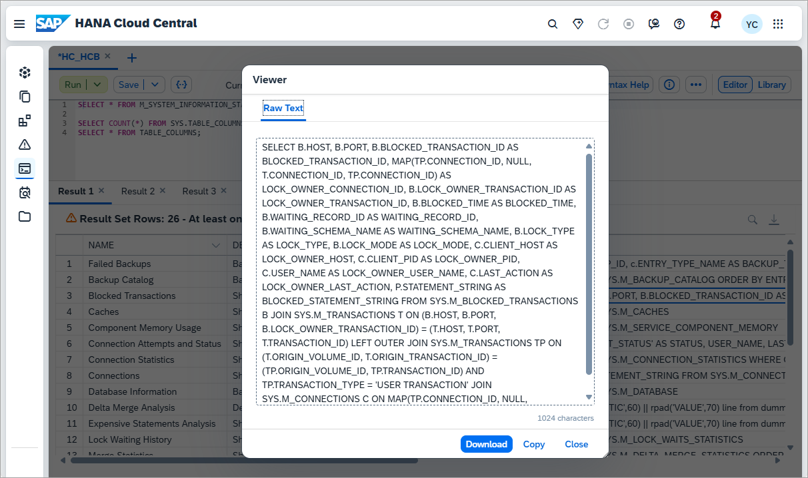

        Notice that over 6000 rows are in TABLE_COLUMNS.

        

        The first 1000 are displayed.

        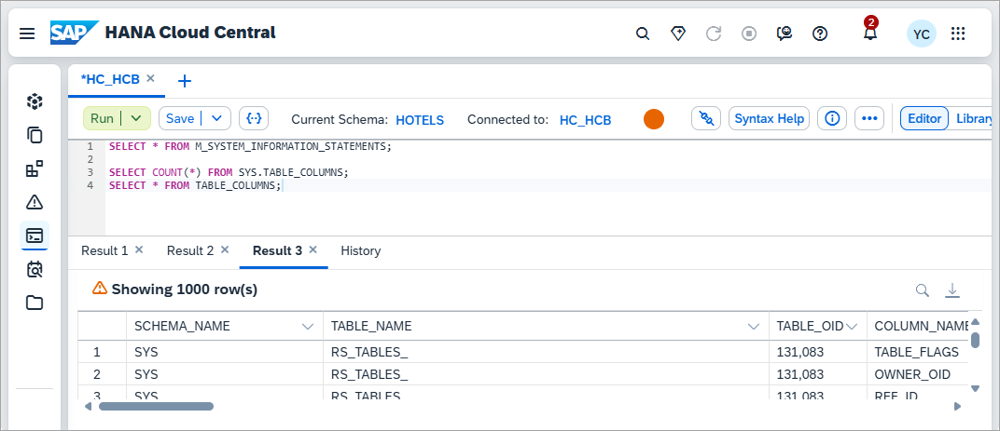

    * Execute the following SQL which is used to illustrate the result display display settings.

        ```SQL
        SELECT CURRENT_DATE, CURRENT_TIMESTAMP(7), RAND() * 10 FROM DUMMY;
        ```

        The below is the result when this setting is disabled.

        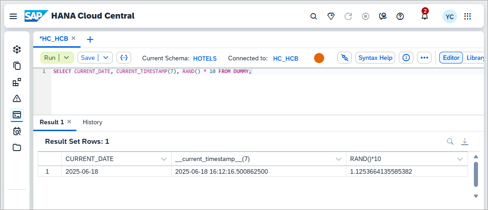

        The below is the result when this setting is enabled.

        

        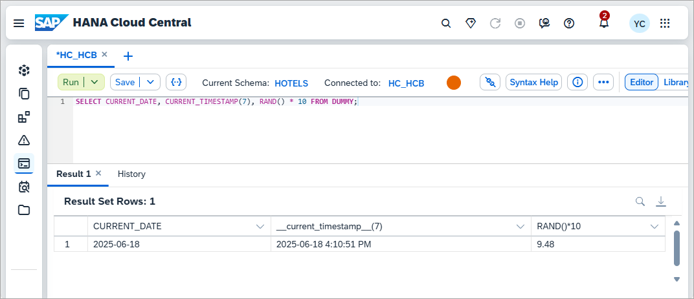

8. Execute the following SQL statements.

    ```SQL
    SELECT HEXTOBIN ('48656C6C6F20776F726C64') BINARY_EXAMPLE FROM DUMMY;

    SELECT '{
        "name":"John",
        "age":30,
        "cars": {
            "car1":"Ford",
            "car2":"BMW",
            "car3":"Fiat"
        }
        }' AS JSON_EXAMPLE
        FROM DUMMY;

    SELECT '<?xml version="1.0" encoding="UTF-8"?>
        <breakfast_menu>
        <food>
            <name>Strawberry Belgian Waffles</name>
            <price>$7.95</price>
            <description>
            Light Belgian waffles covered with strawberries and whipped cream
            </description>
            <calories>900</calories>
        </food>
        <food>
            <name>French Toast</name>
            <price>$4.50</price>
            <description>
            Thick slices made from our homemade sourdough bread
            </description>
            <calories>600</calories>
        </food>
        <food>
            <name>Homestyle Breakfast</name>
            <price>$6.95</price>
            <description>
            Two eggs, bacon or sausage, toast, and our ever-popular hash browns
            </description>
            <calories>950</calories>
        </food>
        </breakfast_menu>' XML_EXAMPLE FROM DUMMY
    ```

    Double tapping on a result will open a result viewer.

    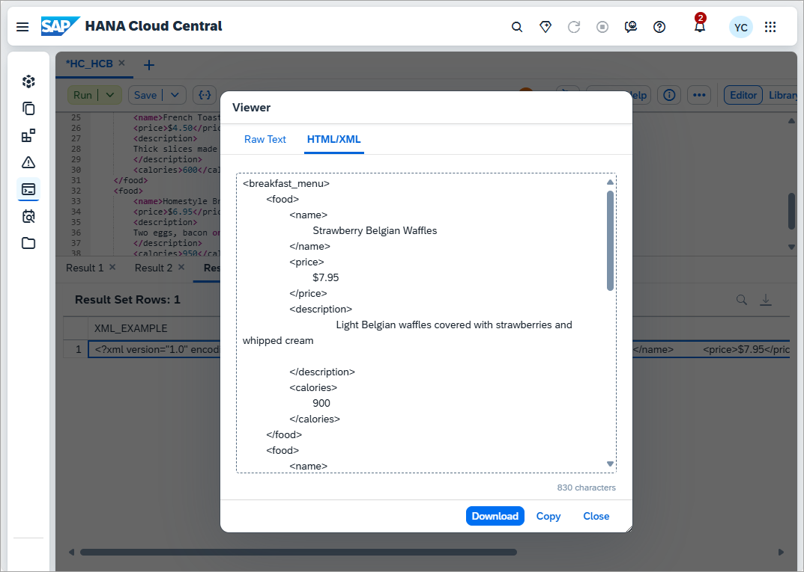

9. The SQL in a SQL console is not persisted across browser reloads.  The SQL can be downloaded  and then later imported using the icons shown below.

    


### Statement library
The statement library is a convenient location in the SQL Console to store and retrieve frequently executed SQL statements.  It provides a place to store statements that are used frequently as to not type them in repeatedly.

The library is pre-populated with useful statements called ‘SYSTEM’ statements.
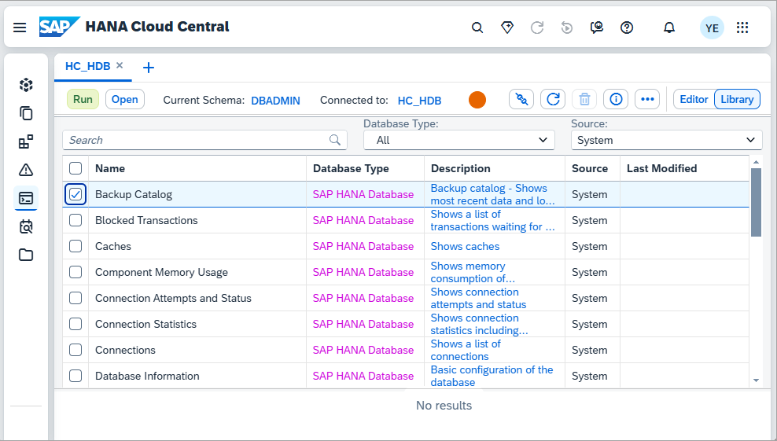

You may also define custom statements that are only available to you. These are ‘USER’ statements.
```SQL
/*

[DESCRIPTION]

- Future guest check-ins across all hotels

*/

SELECT * FROM RESERVATION
    WHERE ARRIVAL >= CURRENT_DATE;
```

1. Save your custom statement, add a name and an optional description.
   
    
    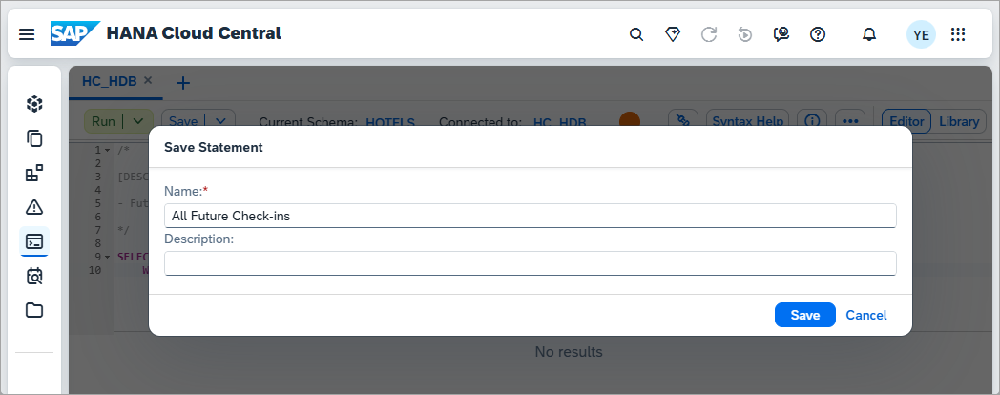

2. View your custom statement in the statement library
   
    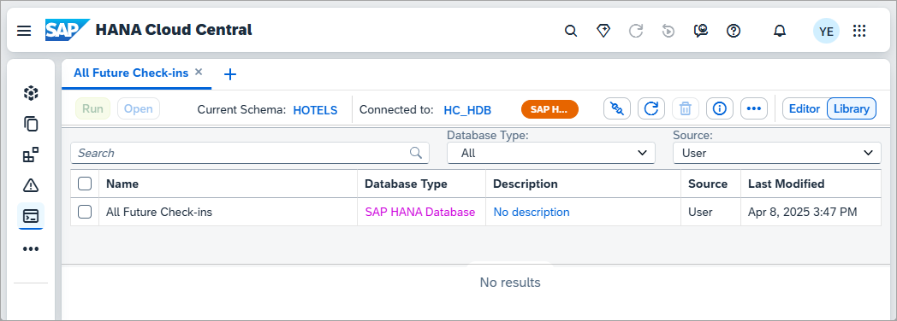

3. To run a statement, select one from the statement library and click the Run button.
   
    

> It is also possible to export and import SQL statements directly to/from the file system
> 
> 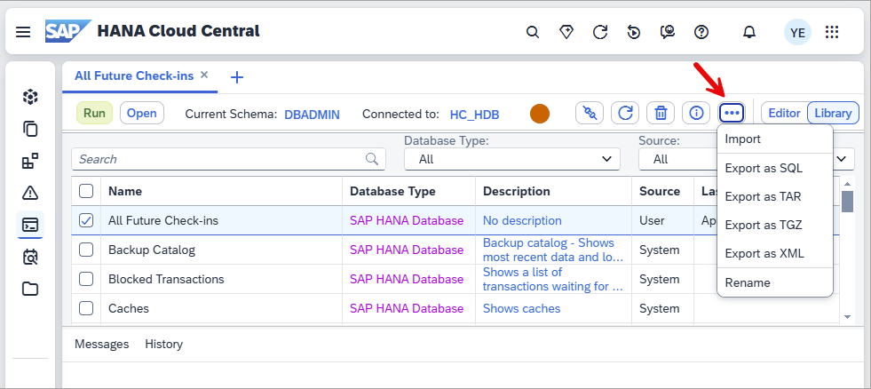 
> 
> Files can then be shared using a version control system such as git.

User-defined statements can be edited. From the Statement library, select the desired statement, click open, and make the desired changes. Select Save to overwrite the previous statement.


### A few things to note
The SQL console within SAP HANA Cloud Central appears similar to the one within the SAP HANA database explorer but there are some differences.

* Opening the SQL console within the SAP HANA Cloud Central can be done much quicker than opening the full SAP HANA database explorer.

* The SQL console that you access from within SAP HANA Cloud Central can only connect to databases that are within the same BTP subaccount as SAP HANA Cloud Central. 

* The SQL console in SAP HANA Cloud Central has the following additional features

    * Ability to format results
    * Support for SAP Morning and Evening Horizon themes
    * Additional details such as time of execution, duration, rows returned, and success or failure in the history tab 

* The SAP HANA database explorer has some additional functionality

    * Persistency of SQL tabs and their contents
    * SQL debugging
    * Code completion of schema objects
    * SQL formatting
    * Viewer for spatial and graph data
    * Analysis tab for tables and views 
    * Ability to show dependent objects
    * Ability to search for database objects across multiple databases
    * Ability to run statements in the background
    * Ability to run statements against multiple instances


### Knowledge check

Congratulations! You have now used the SQL console in SAP HANA Cloud Central and have become familiar with some of the features it provides.
