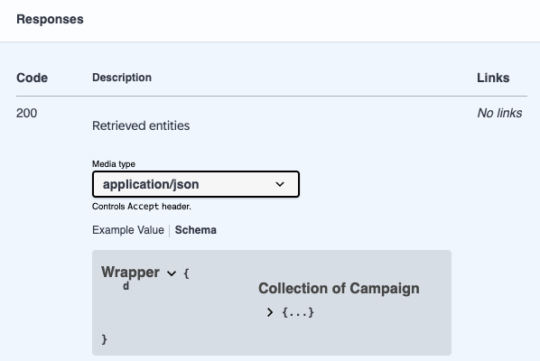
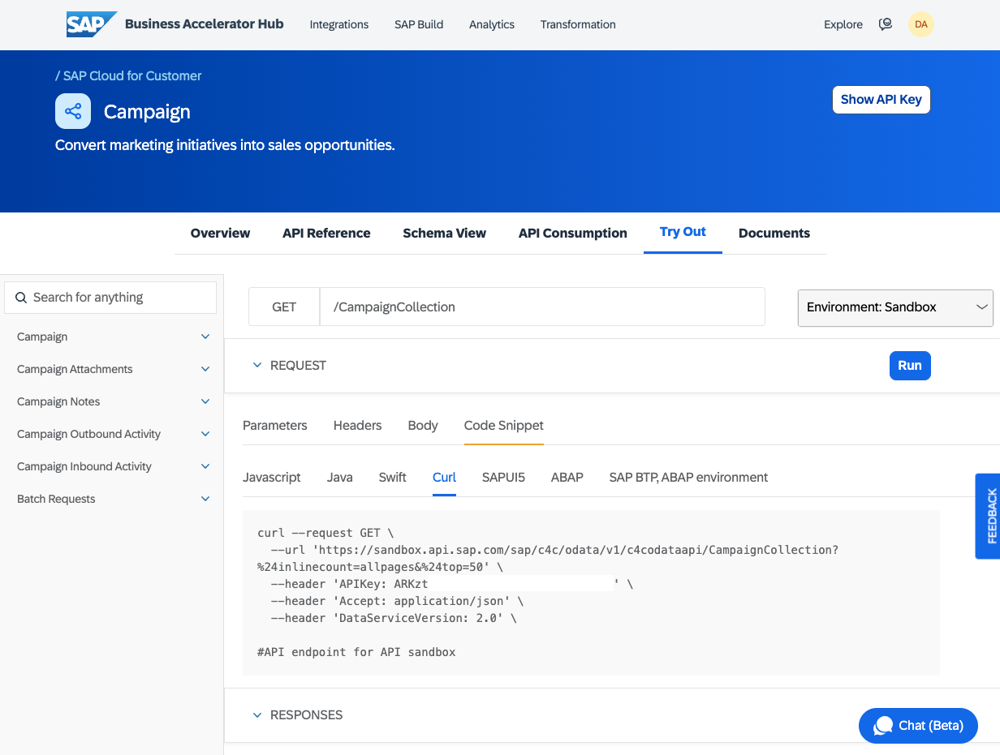
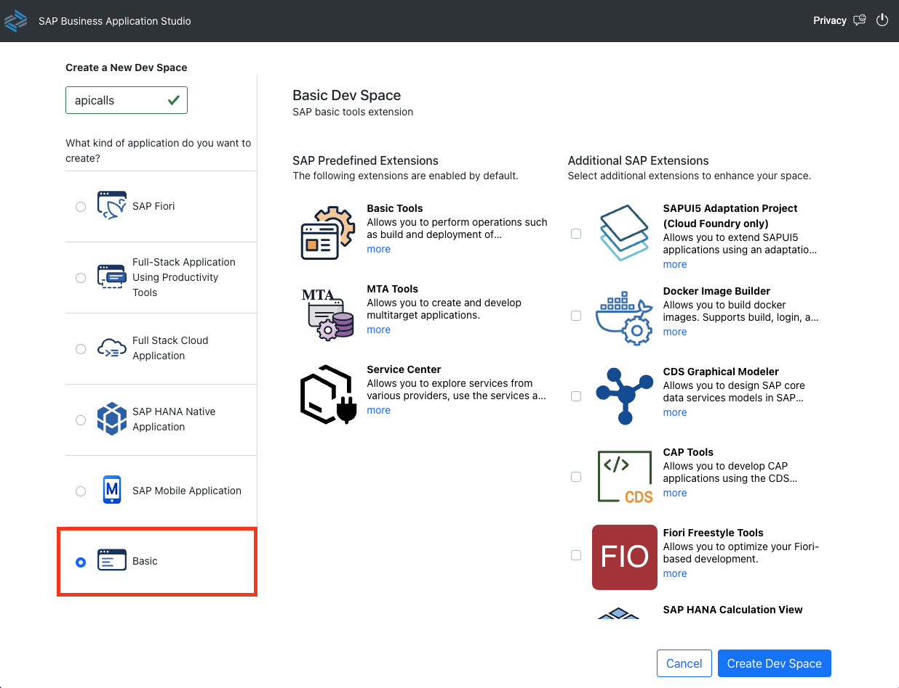
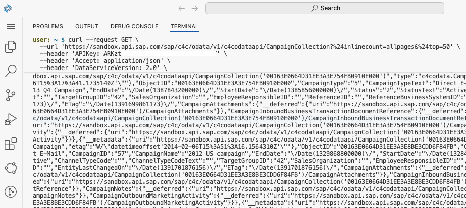
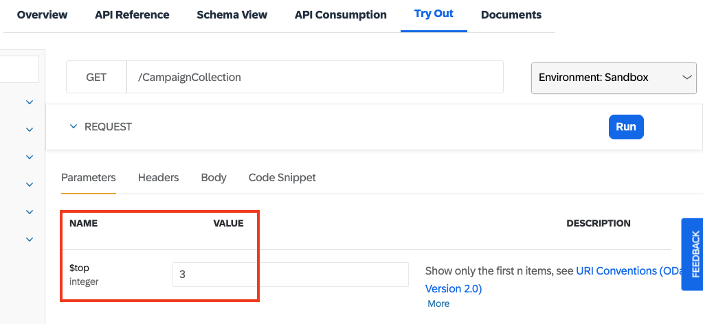
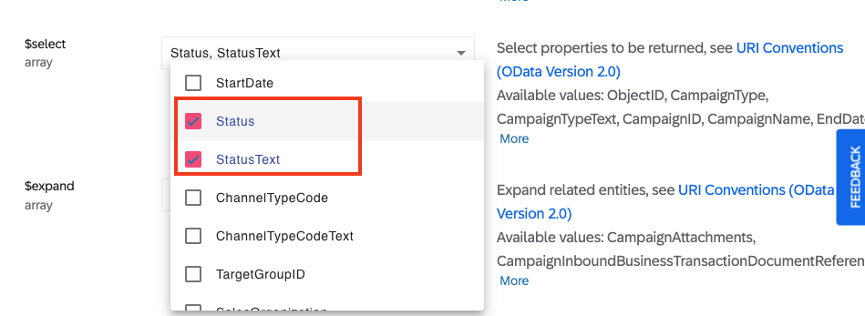
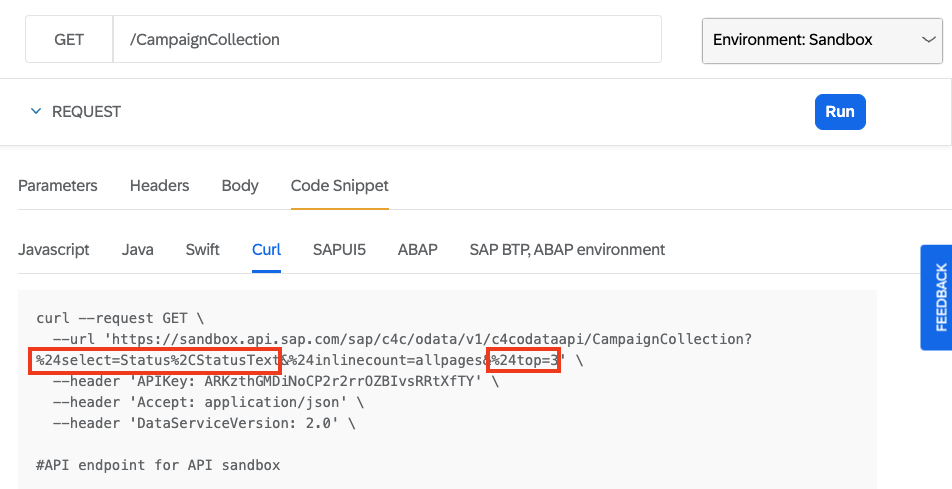

# Test SAP Business Accelerator Hub APIs with curl
<!-- description --> Make calls to SAP Business Accelerator HUB APIs from the command line.

## Prerequisites
 - A trial account on the SAP Business Technology Platform
 - A subscription to the SAP Business Application Studio, with a basic dev space set up

See [Create a Dev Space for Business Applications](/tutorials/appstudio-devspace-create.html).

## You will learn
- How to use command line tools like `curl` and `jq` with REST / OData APIs.

## Intro
You have already discovered the SAP Business Accelerator Hub and accomplished testing an API on the website. In this tutorial, you will learn how to use command line tools such as `curl` and `jq` to make requests to REST and OData APIs. Doing this will give you a better feel for the APIs, how they're constructed and how they can be used.

Using a dev space in SAP Business Application Studio means:

- you don't need to worry about different shell environments
- you don't need to install and maintain command line tools locally on your machine
- you will get a better feel for how arguably the most common OS-level environment in the cloud works
- you can run through this tutorial repeatedly on any machine

---

### Navigate to an API on the SAP Business Accelerator Hub

Go to <https://api.sap.com> and navigate to the [Campaign](https://api.sap.com/api/campaign/overview) API. The choice of this specific API is fairly arbitrary; there are lots of APIs from which to choose, but for the sake of choosing something, let's use this one which is an OData V2 API within the [SAP Cloud for Customer](https://api.sap.com/package/C4C/odata) API package.


### Examine one of the API endpoints

Select the **API Reference** section, and within that choose the `GET /CampaignCollection` combination of HTTP method and relative endpoint. This is one of the simpler API calls in that it's read-only and is likely to return an amount of data that is useful for testing.

Note that the parameters (in particular the ones starting with a `$` symbol) give us a clue that it's an OData API that we're dealing with, and the structure of the response example value, with the `d` wrapper, tells us that it's an OData V2 API.



### Select a code snippet for making a request

The SAP Business Accelerator Hub provides you with code snippets in a variety of languages and tools for each API. To get to these code snippets, select the **Try Out** facility, and within that choose the **Code Snippet** section, where you should see a variety of sources, one of which is for the command line HTTP client `curl`:



Note that the snippet already contains the relevant inclusion of your own API key, which needs to be provided on requests in an `APIKey` header; this is done with `curl` using a `--header` option as shown.

These notes might help you to better examine and understand the invocation:

- There is a trailing backslash right at the end of the last line (ignoring the comment line `#API endpoint for API sandbox`); such backslashes are used to escape the newlines that directly follow them, so that such invocations can be presented -- and indeed _used_ on the command line -- over multiple lines. This last backslash is unnecessary (and you don't need to include that comment line either, of course).
- The `--request GET` option is actually unnecessary as `curl` will use the method appropriate to the rest of the options given; in this case it will automatically use `GET`.
- The OData system query options have been URL-encoded (this is actually called [Percent-encoding](https://en.wikipedia.org/wiki/Percent-encoding)). Specifically, the occurrences of `%24` are just `$` characters, encoded. Knowing this may make reading the URL easier, in that they are the start of normal OData query parameters `$inlinecount=allpages` and `$top=50`.
- The `DataServiceVersion: 2.0` header is to explicitly signal that the request is for OData V2; this is optional, and arguably unnecessary as the OData API only supports V2 anyway.
- Perhaps the most interesting header here is the `Accept: application/json`. This forms part of standard HTTP [content negotiation](https://developer.mozilla.org/en-US/docs/Web/HTTP/Guides/Content_negotiation) and here represents a desire for the resource being requested to be returned in a JSON representation. If the value of this header were to be set to `application/xml` then the entity set resource would be returned in an XML representation, aligned with what OData supports.


### Get ready to run the code snippet

In the SAP Business Application Studio, create a dev space, giving it a name and choosing the 'Basic' option as shown:



> You can choose any kind of dev space, but to emphasize that the command line tools you'll be using are available in all of them, we want you to choose this "Basic" kind.

Once the dev space has started up, open up a terminal with the menu path **Terminal -> New Terminal** (the menu is available via the three horizontal bar icon in the top left). Now you have a shell prompt in which to run the code snippet, specifically invoking `curl`. At this point you may wish to maximize the terminal with the up arrow (`^`) button on the right hand side.

Copy the code snippet from the SAP Business Accelerator Hub page and paste it into the terminal. When you run the command, you should see output that looks something like this:



You'll notice that the output is not formatted and is not easy to read. To address this you can use the command line JSON processor [jq](https://jqlang.org/). It's not just a JSON formatter, it's an entire language for handling, processing, generating and modifying JSON data, but here we'll just use its most basic feature, which is the identity function `.`. This just emits what's received, with no transformations. How is that useful? Well, unless you say otherwise (with the `-c` and `-M` options, in case you're curious), `jq` will, by default, pretty-print (and colorize) any JSON it emits.

> You can also invoke `jq` just on its own, without specifying the `.` identity filter; in this case, the identity filter will be used as default anyway.

Try this now, by piping the output from the `curl` invocation into `jq` like this:

```shell
curl --url 'https://sandbox.api.sap.com/sap/c4c/odata/v1/c4codataapi/CampaignCollection?$inlinecount=allpages&$top=50' \
  --header 'your-API-key-here' \
  --header 'Accept: application/json' \
  --header 'DataServiceVersion: 2.0' \
| jq .
```

The output should now appear pretty-printed, something like this (all but one of the entities in the results set, and many individual properties, have been removed for brevity here):

```json
{
  "d": {
    "__count": "452",
    "results": [
      {
        "__metadata": {
          "uri": "https://sandbox.api.sap.com/sap/c4c/odata/v1/c4codataapi/CampaignCollection('00163E03A0701ED28B9EB2A63189D226')",
          "type": "c4codata.Campaign",
          "etag": "W/\"datetimeoffset'2012-11-12T18%3A20%3A06.8114710Z'\""
        },
        "ObjectID": "00163E03A0701ED28B9EB2A63189D226",
        "CampaignType": "4",
        "CampaignTypeText": "Phone Call",
        "CampaignID": "1",
        "CampaignName": "Campaign for CN Customers",
        "EntityLastChangedOn": "/Date(1352744406811)/",
        "ETag": "/Date(1352744406811)/",
        "CampaignNotes": {
          "__deferred": {
            "uri": "https://sandbox.api.sap.com/sap/c4c/odata/v1/c4codataapi/CampaignCollection('00163E03A0701ED28B9EB2A63189D226')/CampaignNotes"
          }
        },
        "CampaignOutboundMarketingActivity": {
          "__deferred": {
            "uri": "https://sandbox.api.sap.com/sap/c4c/odata/v1/c4codataapi/CampaignCollection('00163E03A0701ED28B9EB2A63189D226')/CampaignOutboundMarketingActivity"
          }
        }
      }
    ]
  }
}
```

The formatted output represents the results of a simple call to the Campaign Collection API endpoint - an OData entity set.

### Modify your request

Now that you have invoked your first `curl` request to make a call to an API endpoint, you can start to modify the request to suit your needs or curiosity.

One way of doing that is to edit the invocation on the command line directly.

Another way is to go back to the **Try Out** facility in the SAP Business Accelerator Hub, modify the request parameter values in the Web-based UI, and then re-copy the code snippet which will have been modified to match your changes.

Try this example:

First, reduce the number of entities requested by setting a low value for the `$top` parameter:



Next, choose `Status` and `StatusText` for the properties to be returned, using the `$select` parameter:



Then go back to the **Code Snippet** facility, and note that the URL for the `curl` invocation has been adjusted accordingly:



Follow the same approach of copying and pasting this into your terminal session, and you should see the effect - a drastic reduction of data returned:

```json
{
  "d": {
    "__count": "452",
    "results": [
      {
        "__metadata": {
          "uri": "https://sandbox.api.sap.com/sap/c4c/odata/v1/c4codataapi/CampaignCollection('00163E03A0701ED28B9EB2A63189D226')",
          "type": "c4codata.Campaign",
          "etag": "W/\"datetimeoffset'2012-11-12T18%3A20%3A06.8114710Z'\""
        },
        "Status": "2",
        "StatusText": "Active"
      },
      {
        "__metadata": {
          "uri": "https://sandbox.api.sap.com/sap/c4c/odata/v1/c4codataapi/CampaignCollection('00163E03A0701ED28B9EB2A63189F226')",
          "type": "c4codata.Campaign",
          "etag": "W/\"datetimeoffset'2012-11-12T18%3A20%3A06.8114710Z'\""
        },
        "Status": "2",
        "StatusText": "Active"
      },
      {
        "__metadata": {
          "uri": "https://sandbox.api.sap.com/sap/c4c/odata/v1/c4codataapi/CampaignCollection('00163E03A0701ED28B9EB2A6318A1226')",
          "type": "c4codata.Campaign",
          "etag": "W/\"datetimeoffset'2012-11-12T18%3A20%3A06.8114710Z'\""
        },
        "Status": "2",
        "StatusText": "Active"
      }
    ]
  }
}
```

Now you know how to use the SAP API Accelerator Hub code snippet features, and what to do with the `curl` command line examples.

_If you want to find out more about `jq`, you might find the content of this Community Talk from SAP TechEd 2023 in Bengaluru useful: [Handle JSON like a boss with jq](https://github.com/qmacro/teched-jq-talk)._
