# Use the Migration Assessment Application
<!-- description --> Use the Migration Assessment Application to automatically assess the SAP Process Orchestration scenarios you want to migrate to SAP Integration Suite.

## Prerequisites
- You’ve completed the tutorial [Use the Migration Assessment Application](https://developers-qa-blue.wcms-nonprod.c.eu-de-2.cloud.sap/tutorials/migration-assessment-enablement.html) or refer [Activating Capabilities](https://help.sap.com/docs/integration-suite/sap-integration-suite/activating-and-managing-capabilities).
- Your user has the required access rights. See [Configuring User Access](https://help.sap.com/docs/integration-suite/sap-integration-suite/configuring-user-access). 
  

## You will learn
- How to use the Migration Assessment Application
- How to connect the Migration Assessment Application and SAP Process Orchestration
- How to add an SAP Process Orchestration system
- How to extract data from the SAP Process Orchestration system
- How to evaluate the integration scenarios using the information from data extraction requests

---
### Configure and Connect the Migration Assessment Application

To connect the Migration Assessment application with your SAP Process Orchestration system, you can use Cloud Connector to securely expose the endpoints listed below:

1. Ensure that Cloud Connector is connected to your SAP BTP subaccount. See [Establish Connections to SAP BTP](https://help.sap.com/docs/CP_CONNECTIVITY/cca91383641e40ffbe03bdc78f00f681/db9170a7d97610148537d5a84bf79ba2.html#establish-connections-to-sap-btp).

2. Create a new HTTP destination (cloud to on-premise) with back-end type `SAP Process Integration`. See [Configure Access Control (HTTP)](https://help.sap.com/docs/CP_CONNECTIVITY/cca91383641e40ffbe03bdc78f00f681/e7d4927dbb571014af7ef6ebd6cc3511.html).
   

      <!-- border -->

3. Make sure that your SAP Cloud Connector exposes the following API paths correctly. They're used to extract data from your SAP Process Orchestration system:

    -  Directory Content
        - `/CommunicationChannelInService`
        - `/IntegratedConfigurationInService`
        - `/SenderAgreementInService`
        - `/AlertRuleInService`
        - `/IntegratedConfiguration750InService`
        - `/ValueMappingInService`
        - `/ConfigurationScenarioInService`
        - `/BPMFacadeBeanImplService`
        - `/ReceiverAgreementInService`
        - `/ReceiverRuleInService`
        - `/ReceiverDeterminationInService`
        - `/InterfaceDeterminationInService`

    - ESR Content
        - `/dir/read/ext`
        - `/dir/query/ext`
        - `/rep/support/SimpleQuery`
        - `/rep/read/ext`
        - `/rep/query/ext`
        - `/rep/query/int`

    - Message Monitoring

        - `/mdt`

4. Limit access to the previously mentioned endpoints and subpaths by changing **Access Policy** to **Path and All Sub-Paths**.
     
      <!-- border -->

You can also refer to the Prerequisites section of [Add an SAP Process Orchestration System](https://help.sap.com/docs/SAP_INTEGRATION_SUITE/51ab953548be4459bfe8539ecaeee98d/5f7672334ca74f90843d38375220d757.html) before adding a system.

### Add an SAP Process Orchestration System

1. Open the Migration Assessment application and navigate to **Settings**.

      <!-- border -->

2. In the Process Orchestration Systems table, choose **Add** and enter the **System Name** and **Description**.

      <!-- border -->

3. Configure a new destination with following details specific to your system:

    | Field	          | Content
    | :---------------|:----------------------------------------------------------
    | Name	          | **`systemname`**
    | Type            | **`HTTP`**
    | Description     | Add a meaningful description
    | URL             | Add your system URL
    | Proxy Type      | **`OnPremise`**
    | Authentication  | **`Basic Authentication`**
    | Location ID     | Add your location ID
    | User            | This should be a technical user – do not use personal credentials.
    |                 | **Note**: The user must be assigned to the following roles in your SAP Process Orchestration system.
    |                 | **`SAP_XI_API_DISPLAY_J2EE`**
    |                 | **`SAP_XI_API_DEVELOP_J2EE`**
    |                 | **`SAP_XI_MONITOR_J2EE`**     
    | Password        | Add the user’s password 
                 
        
4. (Optional) If you’re not using a central ESR, you can select the option **Same as Integration Directory** for **ES Repository**.
    
      <!-- border --> 

5. (Optional) If you’re using a central Enterprise Services Repository (ESR), create a second destination with the details listed in the following table.
  
    | Field	          | Content
    | :---------------| :------------------------------------------------------------------------------------------------
    | Name	          | **`systemname`**
    | Type            | **`HTTP`**
    | Description     | Add a meaningful description 
    | URL             | Add your system URL 
    | Proxy Type      | **`OnPremise`**
    | Authentication  | **`Basic Authentication`**
    | Location ID     | Add your location ID
    | User            | Add the user’s ID
    |                 | **Note**: The user must be assigned to the following roles in your SAP Process Orchestration system.
    |                 | **`SAP_XI_API_DISPLAY_J2EE`**
    |                 | **`SAP_XI_API_DEVELOP_J2EE`**
    |                 | **`SAP_XI_MONITOR_J2EE`**    
    | Password        | Add the user’s password

      <!-- border -->

6. After adding the system, you can test the connection if it is successful or not. To change the connection details, edit it.

      <!-- border -->

   In the Migration Assessment Application, the page now displays information about the Integration Directory and, optionally, the Enterprise Services Repository you connected to your previously created system. 

   Now, let’s take a tour of the Migration assessment application.

   **Rules**

 In the Migration Assessment Application, navigate to **Configure** > **Rules**. Here you can find a list of rules predefined by SAP. Rules are a set of characteristics according to which the application evaluates whether an integration scenario can be migrated and what effort you can expect.

  Currently, you can't add custom rules or edit the standard rules. You can only view the standard rules.

   <!-- border -->

 As an example, let’s select the rule **SenderAdapterType**. Here, you can see all the parameters of the rules, such as **Rule Match Value**, **Assessment Category**, and the **Weight** assigned to each rule match value. Based on these weights, the application calculates the estimated effort, which means that some parameters, and therefore rules, have a bigger influence on the final estimation than others.

   <!-- border -->

---

### Create a Data Extraction Request

You're now ready to retrieve data from the connected SAP Process Orchestration system using a data extraction request.

1. In the Migration Assessment Application, navigate to  **Request** > **Data Extractions**.

      <!-- border -->

2. Enter a **Request Name** and select the **System Name** you want to connect to, then choose **Create**.

      There are two options available: Complete Extraction and Custom Extraction

      Choose Complete Extraction if you want to extract all integration scenarios from the selected system.

      <!-- border -->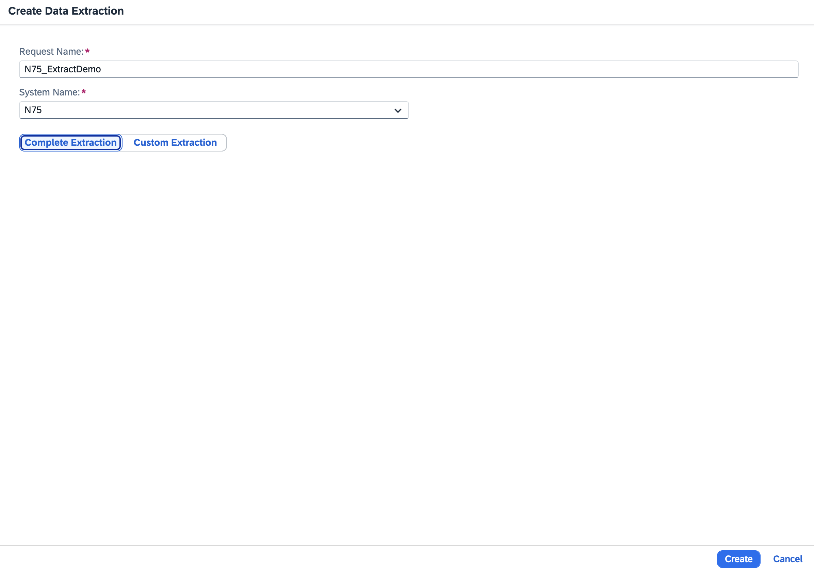

      Choose Custom Extraction if you want to extract a subset of integration scenarios from the selected system. Use this option, for example, if you want to exclude specific integration scenarios or only need to extract a small selection.
      
      In the list of integration scenarios that were retrieved from the system, all are selected by default. Customize the list by deselecting and selecting integration scenarios to fit your needs. You can use the search function to find specific integration scenarios.

      <!-- border -->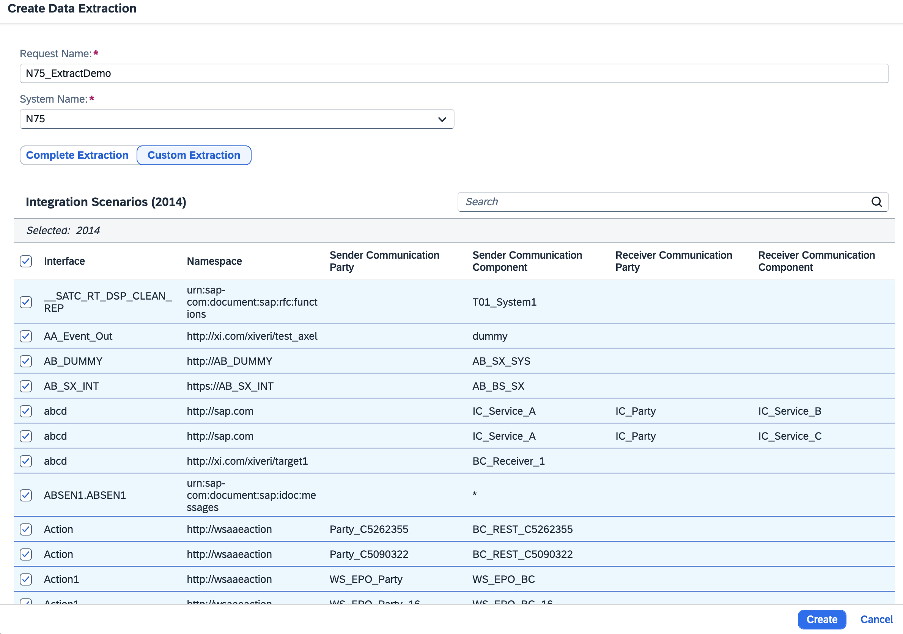

      The data extraction starts. Once the extraction finishes, the new request appears in the list of data extraction requests with the status **Completed**.

      **Note**:
      There's a size limitation of 2 GB on the data extraction. If the data extraction causes any issues regarding size, please contact SAP support.
      Only rerun an extraction if you have done any changes in the SAP Process Orchestration system, such as changed an existing integration scenario or added a new integration scenario or integration flow. During your migration project, you should avoid adding more scenarios to the SAP Process Orchestration system and create new scenarios directly in Cloud Integration. In this case, there's no need to run an extraction again for the SAP Process Orchestration system.

3. Choose **Log** to view the data extraction log, which provides you with details about the data extraction.

      <!-- border -->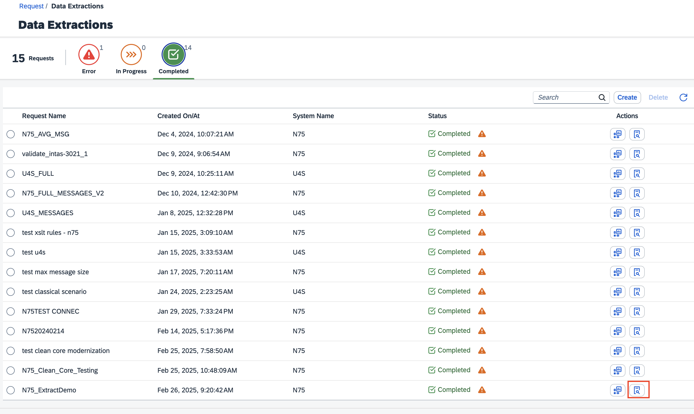

      <!-- border -->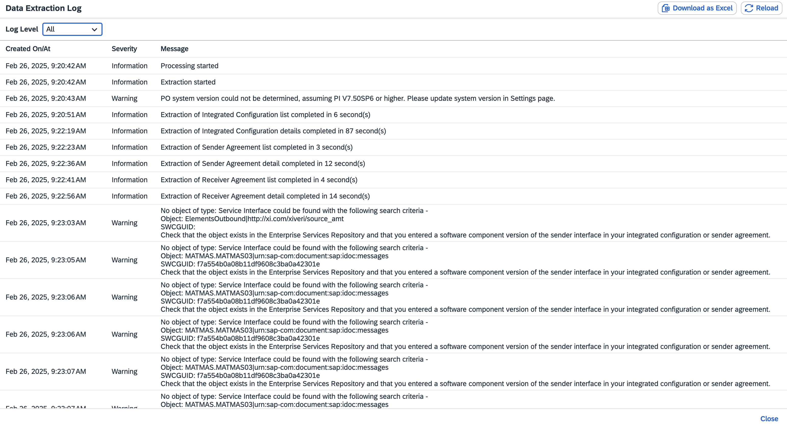

4. After extracting the necessary data from your system, you can assess the integration scenarios associated with your data using    scenario evaluation requests, as described in the next step.Delete extractions you no longer need by selecting the data extraction and choosing **Delete**. Refresh the page to update the list.
    
      <!-- border -->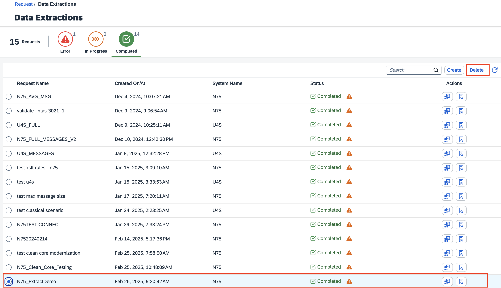

---
### Create a Scenario Evaluation Request

To evaluate your integration scenarios using the information from data extraction requests, you must create at least one data extraction request.

1. In the Migration Assessment Application, navigate to **Request** > **Scenario Evaluation**.

2. Choose **Create**.

3. Enter a **Request Name** and choose a **Data Extraction Request** that you created previously.

4. For this specific run of your scenario evaluation, enter an **Evaluation Run Name** and a **Description**. You can start a new evaluation run anytime, for example, for the purpose of comparing new and old data. This can be achieved with the help of **Trigger Analysis**, which is described later on. 

5. Choose **Create**.

      <!-- border -->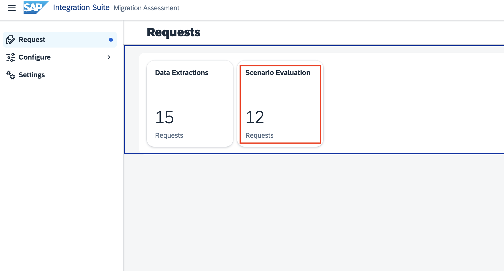

      <!-- border -->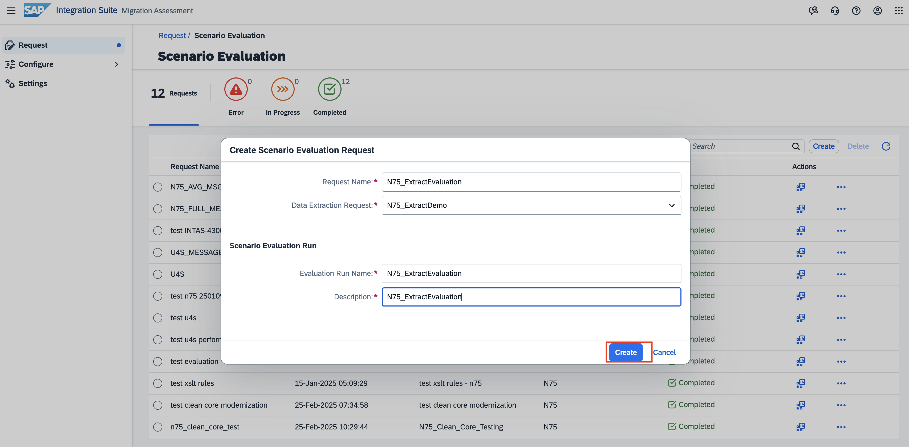

      The new request appears in the list of scenario evaluation requests and the evaluation runs.

      <!-- border -->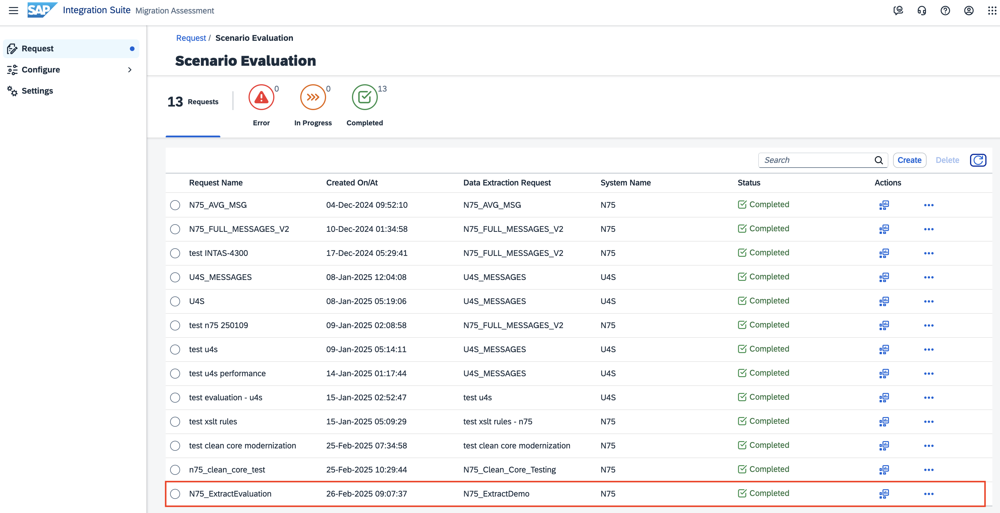

6. By choosing **Delete**, you can delete the unwanted scenario evaluation. Refresh the page to update the list of evaluations.	

      <!-- border -->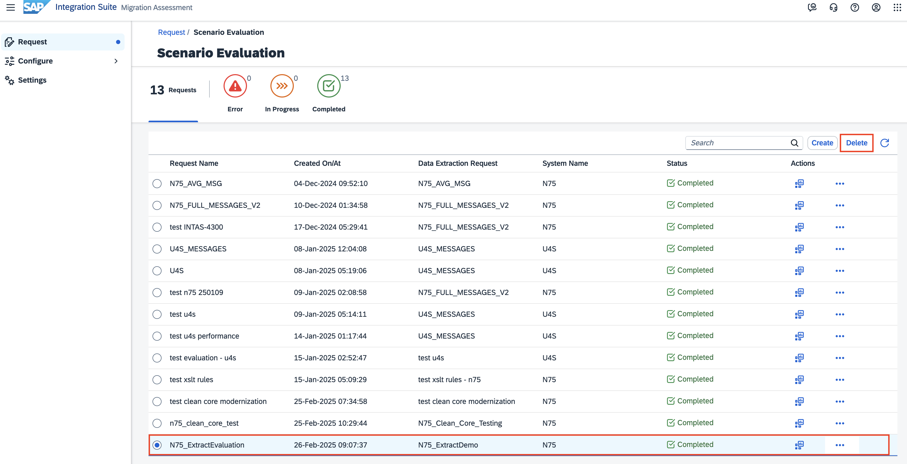

The following additional actions can be performed for a scenario evaluation request:
 
**Open Dashboard**: It displays an analysis of your scenario evaluations with details specific about your integration flows such as assessment categories, adapters, and an overview of the rules used in the evaluation, which can be accessed and downloaded. You can switch between the data of all runs performed for the scenario evaluation request so far.

   <!-- border -->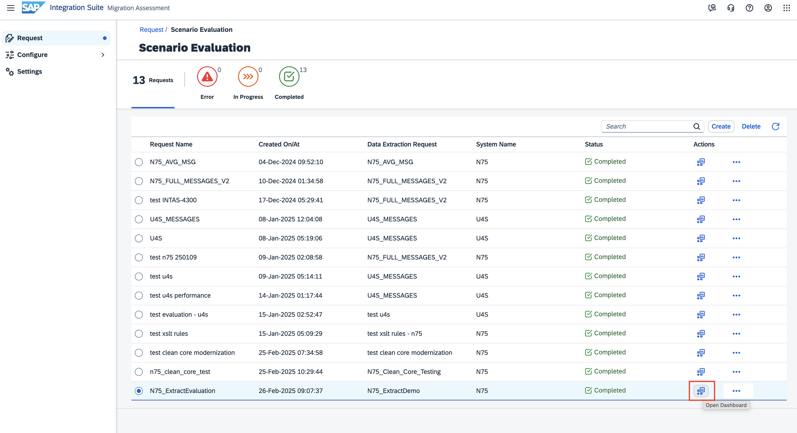

   <!-- border -->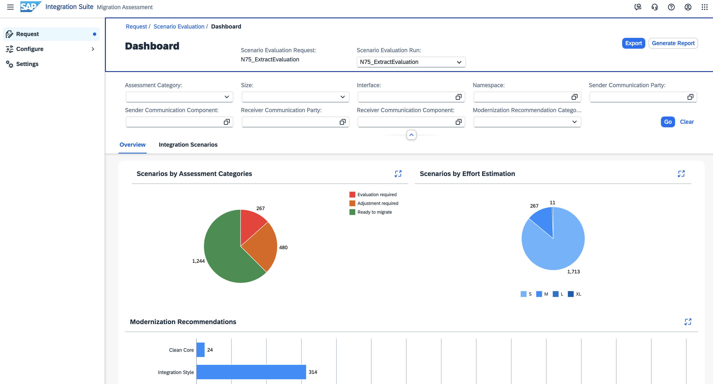

---

### Views available under overview tab in Dashboard

Under the **Overview** tab on the dashboard page, you can see four different views:

1. **Scenarios by Assessment Categories**

      <!-- border -->

    **Assessment Categories**: A classification that indicates if your integration scenarios are ready to be migrated to the SAP Integration Suite or if they need some significant changes and how you can proceed.
   
      - **Ready to migrate**: These integration scenarios match to the scenarios offered in SAP Integration Suite. They can be moved to SAP Integration Suite manually or semi-automatically. No manual changes or minor configuration steps might be required to get to a running state.
   
      - **Adjustment required**: These integration scenarios partially match to the scenarios offered in SAP Integration Suite. They can be moved to SAP Integration Suite manually or semi-automatically. Further adjustments to the end-to-end integration process based on best practices are required (for example, File to SFTP conversion, external JMS connection).
   
      - **Evaluation required**: The integration scenarios cannot be migrated to the SAP integration Suite at the moment. Evaluation is needed to see if the interfaces are still required, or if they can be modified to run in the SAP Integration Suite (for example, B2B scenarios). Analyze interfaces that are categorized as **Evaluation required** and verify what aspects of these interfaces were identified as current limitations on the SAP Integration Suite. Check on possible solutions using the SAP Integration Suite documentation or the [Integration Flow Design Guidelines](https://help.sap.com/docs/CLOUD_INTEGRATION/368c481cd6954bdfa5d0435479fd4eaf/6803389050a0487ca16d534583414d2b.html). Also check out the [roadmap](https://roadmaps.sap.com/board?PRODUCT=000D3A47875C1EDB98A8A910864AC24B&range=CURRENT-LAST&q=Migration#Q1%202023) to find out if and when potential limitations might be resolved.

2. **Scenarios by Effort Estimation**

      <!-- border -->
   
      For our example, the previous chart shows that there are 1,535 small (S) integration scenarios and 85 medium (M) integration scenarios. An estimation of efforts required to migrate these integration scenarios from the SAP Process Orchestration system to SAP Integration Suite needs to be performed. You'll learn more about these sizing classifications - S, M, L, XL - in the section on **Evaluation Results**.

3. **Modernization Recommendations**

      This section contains recommendations for modernizing Integration scenarios.

      <!-- border -->

4. **Sender Adapters**
   
      This section shows the number and types of sender adapters in your on-premise system.

      <!-- border -->

5. **Receiver Adapters**
   
      This section shows the number and types of receiver adapters in your on-premise system.

      <!-- border -->

---

### Options available under Integration Scenarios tab in Dashboard

On the dashboard under the **Integration Scenarios** tab, you can see the list of all the integration scenarios from your SAP Process Orchestration system. Here, you can also download all the integration scenarios, sizes of the integration scenarios (S, M, L, XL), and assessment categories assigned to each integration scenario, either in .pdf format (Generate report) or  in .xslx format (Export).

   <!-- border -->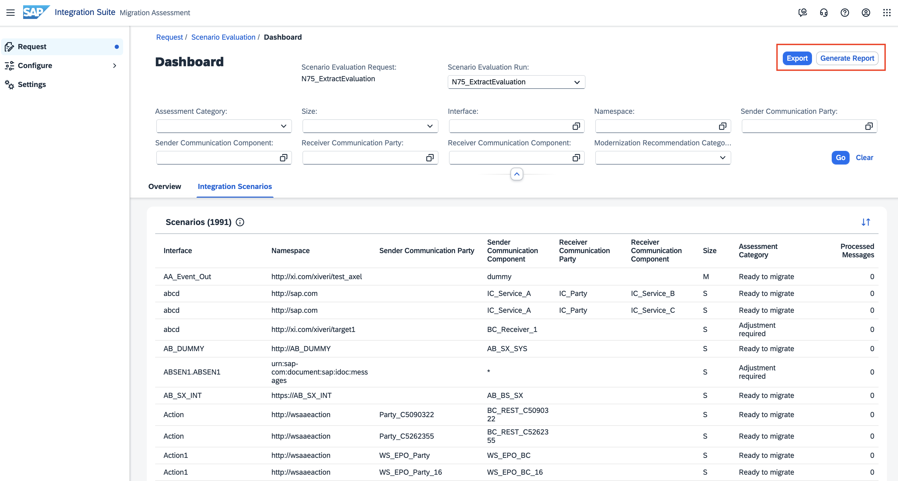

**Trigger Analysis**:  With this functionality, you can schedule an additional evaluation run based on current extracted data. For example, you can trigger an analysis if there's been a rule update. By choosing **Trigger Analysis**, you can rerun an evaluation without having to create a new scenario  evaluation request. This way, you can have multiple evaluation runs for one evaluation request. If a new extraction request is created, you have to run another evaluation request.

   <!-- border -->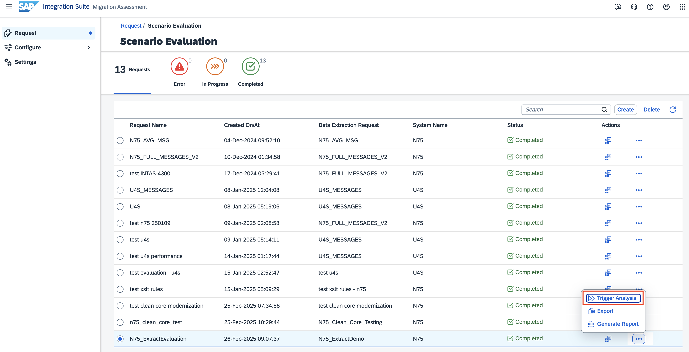

To compare the old and new evaluations, add the date on the evaluation run name so you can easily distinguish between the two evaluations and compare them in the dashboard later on.

   <!-- border -->

   <!-- border -->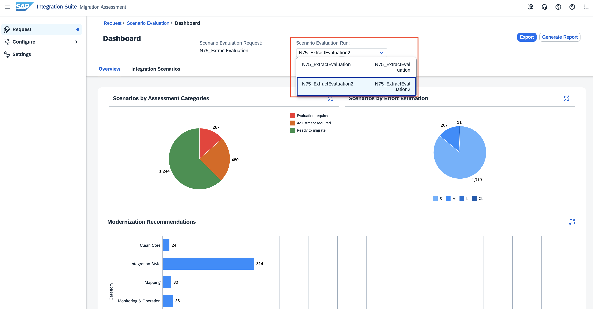

Under **Scenario Evaluation Run**, you can see all evaluation runs that were triggered for the same extracted data.

**Download**: Evaluation Reports can be downloaded either in English or Simple Chinese language. It is possible to download the reports in **.xslx** file and **.pdf** file formats:

   <!-- border -->

**Evaluation Results**

- The **Export** contains .xslx file with all the integration scenarios that were part of the request with migration effort according to the sizing classification, rules applied to them, weight, assessment categories, and status.
  
      <!-- border -->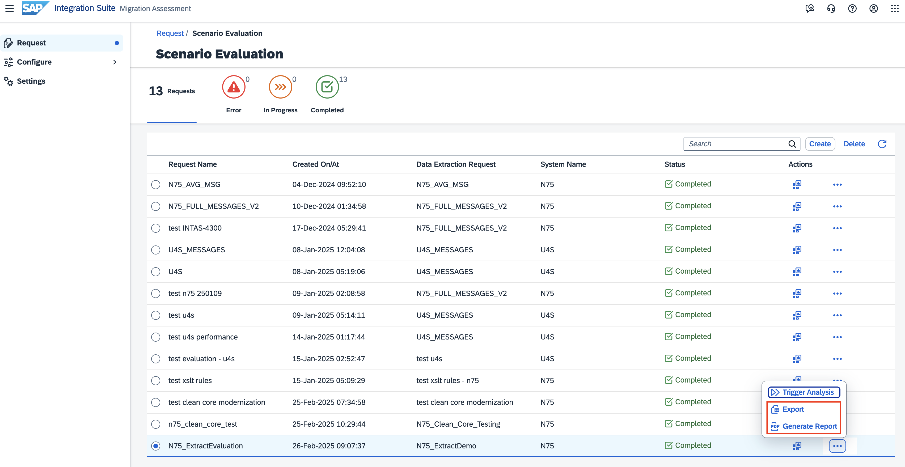

- The **Full Evaluation Results** sheet displays information about rules that were applied for each integration scenario as defined by SAP. Each line includes the rule ID, the value assigned to it, the weight considered for it, and the evaluation assessment category.

      <!-- border -->

- In **Eval by Integration scenario** sheet, you can see the list of integration scenarios summarized by total weight evaluated, the t-shirt size, and the overall assessment category. The overall assessment category is classified based on the set of rules triggered to the respective integration scenario. For example, if the integration scenario has at least one rule with the assessment category as “Evaluation required”, then the overall category for that integration scenario is also “Evaluation required”.

      <!-- border -->

- The **Generate Report** contains .pdf file featuring the previously mentioned details about the integration scenarios while also providing a written summary of adapters and the assessment in general, with charts and tables. This file is suited as a report that can be used for example for management. The following screenshot shows the contents of the .pdf report.

      <!-- border -->

**Effort Estimation**

- **Sizing classification** is used for project estimation and capacity planning. It helps you track how much time or effort the migration of interfaces will take. Here, the sizing classification is small (S), medium (M), large (L), extra large (XL). To technically migrate the integration scenarios to the SAP Integration Suite, you need an overall effort estimation in days according to these sizing classifications. 
- The **learning curve** or **repeatable factor** reduces the effort based on the consideration that, in general, a group of interfaces with the same size, system, or module are similar and therefore the migration of the subsequent interfaces is performed quicker than previous ones.
- The assessment result gives information regarding functional readiness to move those scenarios to the SAP Integration Suite for each integration scenario.
  
Congratulations! You've successfully connected migration assessment application to SAP Process Orchestration system, created a data extraction request, created a scenario evaluation request.

### Test yourself 

---
