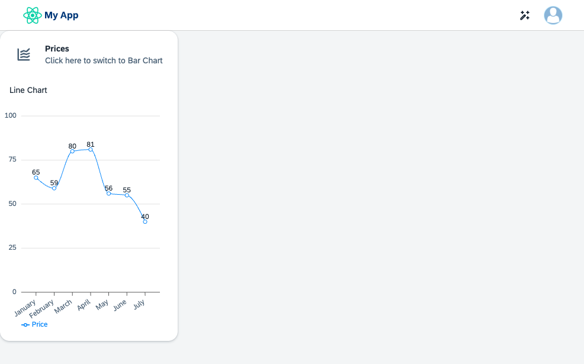
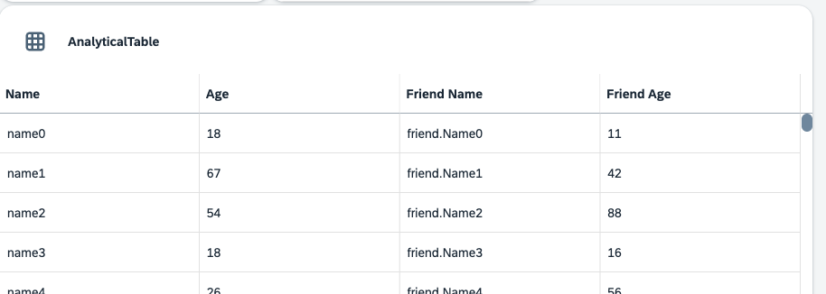
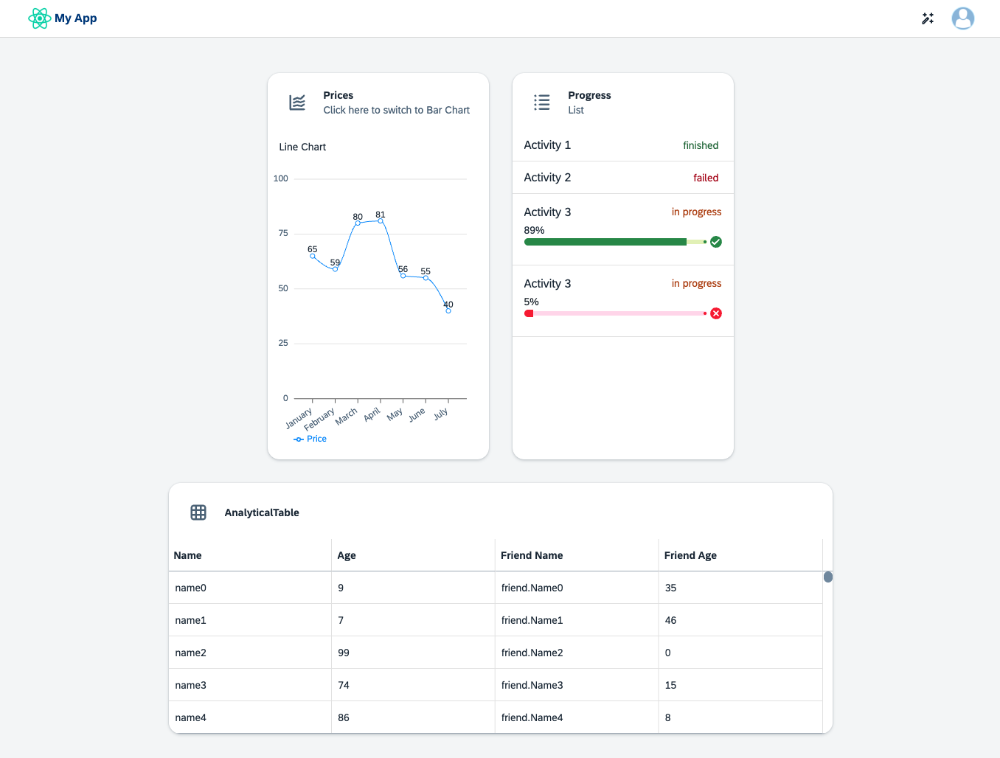

# Create an Analytical Dashboard via UI5 Web Components for React
<!-- description --> Create an analytical dashboard with different components using UI5 Web Components for React.

## You will learn
-  How to use the `ShellBar` component
-  How to use the `AnalyticalTable` component
-  How to style components

## Intro
So far, you have built your first `Card` component. Now to take things further, it's time to build something bigger. In this step, you will learn how different components work together by building an analytical dashboard.

---

### Add necessary imports

To make things easier, first import all the components and enums you will need in this step. Just copy the code below and replace the previous imported components in `MyApp.tsx`.

```TypeScript / TSX
import {
   Avatar,
   Card,
   CardHeader,
   Text,
   ShellBar,
   ShellBarItem,
   List,
   ListItemStandard,
   ListItemCustom,
   ProgressIndicator,
   FlexBox,
   FlexBoxJustifyContent,
   FlexBoxWrap,
   FlexBoxDirection,
   AnalyticalTable,
   Icon,
} from "@ui5/webcomponents-react";
```


### Add a `ShellBar`


The `ShellBar` is the central navigation element in your Web Application and should therefore be visible on all pages.

> Again, you can try it out in the [Storybook](https://sap.github.io/ui5-webcomponents-react/?path=/docs/layouts-floorplans-shellbar--docs).

1. Start with adding the `ShellBar` above your `Card` component and add a `primaryTitle` prop.

    ```TypeScript / TSX
    <ShellBar primaryTitle="My App" />
    ```

2. Add some more properties

    The logo of the application should be displayed and also a profile picture would be nice.

    Use the `logo` and `profile` prop to achieve this. The `logo` prop accepts either an `img` tag or the `Avatar` component, the `profile` prop only accepts the `Avatar` component. First add the `logo` prop like this:

    ```TypeScript / TSX
     <ShellBar logo={} primaryTitle="My App" />
    ```

    Then pass the `profile` prop like this:

    ```TypeScript / TSX
    <ShellBar
      logo={}
      profile={<Avatar></Avatar>}
      primaryTitle="My App"
    />
    ```

    You can use your own image, use a URL to an image or simply download the images below and add them inside your `src` folder and then import them.

    [`reactLogo.png`](https://github.com/SAPDocuments/Tutorials/raw/master/tutorials/ui5-webcomponents-react-dashboard/reactLogo.png)

    [`profilePictureExample.png`](https://github.com/SAPDocuments/Tutorials/raw/master/tutorials/ui5-webcomponents-react-dashboard/profilePictureExample.png)

    Processed Assets:
    [assets](assets.png)

    ```TypeScript / TSX
    import reactLogo from "./assets/reactLogo.png";
    import profilePictureExample from "./assets/profilePictureExample.png";
    ```

    ```TypeScript / TSX
    <ShellBar
      logo={}
      profile={
        <Avatar>
          
        </Avatar>
      }
      primaryTitle="My App"
    />
    ```

3. Add custom items

    By passing a `ShellBarItem` as `child` you are able to add custom items to your `ShellBar`. The element is basically a `Button` with responsive behavior and styling adapted to the `ShellBar`.

    ```TypeScript / TSX
    <ShellBar
      logo={}
      profile={
        <Avatar>
          
        </Avatar>
      }
      primaryTitle="My App"
    >
      <ShellBarItem icon="activate" text="Activate" tooltip="activate" />
    </ShellBar>
    ```

    That is strange -- when you render your component, the `ShellBarItem` is not shown.

    Every `Icon` that is used in a component has to be imported manually. All available icons can be found [here](https://sapui5.hana.ondemand.com/test-resources/sap/m/demokit/iconExplorer/webapp/index.html#/overview/SAP-icons).

    Add this line to your imports:

    ```TypeScript / TSX
    import activateIcon from "@ui5/webcomponents-icons/dist/activate.js";
    ```

    Now your `ShellBarItem` shows up on the right side of the `ShellBar`.

    

    For maintainability reasons, replace `icon="activate"` with the import name `icon={activateIcon}`. Now if you replace the icon but forget to remove the import, modern IDEs or linters like [eslint](https://eslint.org/) will tell you that there is an unused import in your file.

Your component should now look like this:

```TypeScript / TSX
import activateIcon from "@ui5/webcomponents-icons/dist/activate.js";
import lineChartIcon from "@ui5/webcomponents-icons/dist/line-chart.js";
import barChartIcon from "@ui5/webcomponents-icons/dist/horizontal-bar-chart.js";
import { useState } from "react";
import {
  Avatar,
  Card,
  CardHeader,
  Text,
  ShellBar,
  ShellBarItem,
  List,
  ListItemStandard,
  ListItemCustom,
  ProgressIndicator,
  FlexBox,
  FlexBoxJustifyContent,
  FlexBoxWrap,
  FlexBoxDirection,
  AnalyticalTable,
  Icon,
} from "@ui5/webcomponents-react";
import { BarChart, LineChart } from "@ui5/webcomponents-react-charts";
import reactLogo from "./assets/reactLogo.png";
import profilePictureExample from "./assets/profilePictureExample.png";

const dataset = [
  {
    month: "January",
    data: 65,
  },
  {
    month: "February",
    data: 59,
  },
  {
    month: "March",
    data: 80,
  },
  {
    month: "April",
    data: 81,
  },
  {
    month: "May",
    data: 56,
  },
  {
    month: "June",
    data: 55,
  },
  {
    month: "July",
    data: 40,
  },
];

export function MyApp() {
  const [toggleCharts, setToggleCharts] = useState("lineChart");
  const [loading, setLoading] = useState(false);

  const contentTitle =
    toggleCharts === "lineChart" ? "Line Chart" : "Bar Chart";
  const switchToChart =
    toggleCharts === "lineChart" ? "Bar Chart" : "Line Chart";

  const handleHeaderClick = () => {
    if (toggleCharts === "lineChart") {
      setLoading(true);
      setTimeout(() => {
        setLoading(false);
        setToggleCharts("barChart");
      }, 2000);
    } else {
      setLoading(true);
      setTimeout(() => {
        setLoading(false);
        setToggleCharts("lineChart");
      }, 2000);
    }
  };

  return (
    <div>
      <ShellBar
        logo={}
        profile={
          <Avatar>
            
          </Avatar>
        }
        primaryTitle="My App"
      >
        <ShellBarItem icon={activateIcon} text="Activate" />
      </ShellBar>
      <Card
        header={
          <CardHeader
            titleText="Prices"
            subtitleText={`Click here to switch to ${switchToChart}`}
            interactive
            avatar={
              <Icon
                name={
                  toggleCharts === "lineChart" ? lineChartIcon : barChartIcon
                }
                accessibleName={contentTitle}
              />
            }
            onClick={handleHeaderClick}
          />
        }
        style={{ width: "300px" }}
      >
        <Text style={{ padding: "var(--sapContent_Space_S)" }}>
          {contentTitle}
        </Text>
        {toggleCharts === "lineChart" ? (
          <LineChart
            dimensions={[{ accessor: "month" }]}
            measures={[{ accessor: "data", label: "Price" }]}
            dataset={dataset}
            loading={loading}
          />
        ) : (
          <BarChart
            dimensions={[{ accessor: "month" }]}
            measures={[{ accessor: "data", label: "Price" }]}
            dataset={dataset}
            loading={loading}
          />
        )}
      </Card>
    </div>
  );
}
```

### Add a `List`


1. To wrap the `List` add a `Card` (right after the first one).

    ```TypeScript / TSX
    <Card
      header={
        <CardHeader
          titleText="Progress"
          subtitleText="List"
          avatar={<Icon name={listIcon} />}
        />
      }
      style={{ width: "300px" }}
    ></Card>
    ```

2. Add the list `Icon` to your imports.

    ```TypeScript / TSX
    import listIcon from "@ui5/webcomponents-icons/dist/list.js";
    ```

3. Add the `List` component as child of the `Card`.

    ```TypeScript / TSX
    <List></List>
    ```

4. To render elements of the list, use the `ListItemStandard` and pass a `string` as child.

    ```TypeScript / TSX
     <List>
       <ListItemStandard>Activity 1</ListItemStandard>
     </List>
    ```

5. Users should know the status of the activities. Add the `additionalText` prop to the `StandardListItem`. To visualize if the status is neutral, positive or negative, also add the `additionalTextState` prop.

   You can either pass a supported string directly, or use the `ValueState` enum:

    ```TypeScript / TSX
    import ValueState from '@ui5/webcomponents-base/dist/types/ValueState.js';
    ```

    ```TypeScript / TSX
    <ListItemStandard
      additionalText="finished"
      additionalTextState={ValueState.Positive}
    >
      Activity 1
    </ListItemStandard>
    <ListItemStandard
      additionalText="failed"
      additionalTextState={ValueState.Negative}
    >
      Activity 2
    </ListItemStandard>
    ```

6. The "Progress" card shows two list items, but both of them are already completed. Let's create two more activities which are still in progress.

    First, create two `ListItemCustom`s below the completed items.

    ```TypeScript / TSX
    <ListItemCustom></ListItemCustom>
    <ListItemCustom></ListItemCustom>
    ```

    > The `ListItemCustom` allows customizing the content of the list item and for this reason doesn't offer props like `additionalText`.

    To show the progress, add the `ProgressIndicator` as child of the items, with the following props:

    - `value`: The value, which indicates the progress
    - `valueState`: The value-state (color) of the indicator

    ```TypeScript / TSX
    <ListItemCustom>
      <ProgressIndicator value={89} valueState={ValueState.Positive} />
    </ListItemCustom>
    <ListItemCustom>
      <ProgressIndicator value={5} valueState={ValueState.Negative} />
    </ListItemCustom>
    ```

7. The indicators are displayed as part of the list item, but the title and status of the activities is still missing.
For this, add two `Text` components above the indicator:

    ```TypeScript / TSX
    <ListItemCustom>
      <Text>Activity 3</Text>
      <Text>in progress</Text>
      <ProgressIndicator value={89} valueState={ValueState.Positive} />
    </ListItemCustom>
    ```

8. All necessary information are now available in each item, but the formatting looks terrible. Let's fix that by using a flex-box:

    ```TypeScript / TSX
    <ListItemCustom>
      <FlexBox direction={FlexBoxDirection.Column} fitContainer>
        <FlexBox justifyContent={FlexBoxJustifyContent.SpaceBetween}>
          <Text>Activity 3</Text>
          <Text>in progress</Text>
        </FlexBox>
        <ProgressIndicator value={89} valueState={ValueState.Positive} />
      </FlexBox>
    </ListItemCustom>
    ```

    > The `FlexBox` implements most of the [`CSS Flexbox`](https://www.w3schools.com/css/css3_flexbox.asp) behavior without being forced to actually use CSS or other styling methods.

9. The content of the list item is now aligned correctly, but doesn't apply the correct padding, colors and dimensions. To fix this as well, pass the `style` prop, to use the default [React `inlineStyle` syntax](https://reactjs.org/docs/dom-elements.html). Again, we're using global CSS variables for this:

    ```TypeScript / TSX
    <ListItemCustom>
      <FlexBox
        direction={FlexBoxDirection.Column}
        fitContainer
        style={{ paddingBlock: "var(--sapContent_Space_S)" }}
      >
        <FlexBox justifyContent={FlexBoxJustifyContent.SpaceBetween}>
          <Text style={{ fontSize: "var(--sapFontLargeSize)" }}>
            Activity 3
          </Text>
          <Text style={{ color: "var(--sapCriticalTextColor)" }}>
            in progress
          </Text>
        </FlexBox>
        <ProgressIndicator
          value={89}
          valueState={ValueState.Positive}
          style={{ marginBlockStart: "0.5rem" }}
        />
      </FlexBox>
    </ListItemCustom>
    ```

10. Finally, apply the same layout and styles to the content of the second `ListItemCustom`.


### Add an `AnalyticalTable`


1. The last tile should contain a `AnalyticalTable` component. Again, create a `Card` to wrap the Table and set the `max-width` to `900px`.

    ```TypeScript / TSX
    <Card
      header={
        <CardHeader
          titleText="AnalyticalTable"
          avatar={<Icon name={tableViewIcon} />}
        />
      }
      style={{ maxWidth: "900px" }}
    >
      <AnalyticalTable />
    </Card>
    ```

    Also import the `table-view` `Icon`.

    ```TypeScript / TSX
    import tableViewIcon from "@ui5/webcomponents-icons/dist/table-view.js";
    ```
2. Add data and columns to the table. The `columns` prop expects an array of objects that include at least the `accessor` to the data or a unique `id` property. The value of `Header` will be shown as column header.

    You can create your own data or just use the code below and paste it right after the definition of the `dataset` of the chart.

    ```TypeScript / TSX
    const tableData = new Array(500).fill(null).map((_, index) => {
      return {
        name: `name${index}`,
        age: Math.floor(Math.random() * 100),
        friend: {
          name: `friend.Name${index}`,
          age: Math.floor(Math.random() * 100)
        }
      };
    });

    const tableColumns = [
      {
        Header: "Name",
        accessor: "name" // String-based value accessors!
      },
      {
        Header: "Age",
        accessor: "age"
      },
      {
        Header: "Friend Name",
        accessor: "friend.name"
      },
      {
        Header: "Friend Age",
        accessor: "friend.age"
      }
    ];
    ```

3. Display the data by replacing the current table with.

    ```TypeScript / TSX
    <AnalyticalTable data={tableData} columns={tableColumns} />
    ```

    

4. Add more properties

   You can add many more properties to the `AnalyticalTable` component. For example, you can allow sorting, filtering and grouping via `sortable`, `filterable` and `groupable`, enable different selection modes with `selectionMode`, control how the table splits up available space between the columns with `scaleWidthMode` and many more.
   Feel free to take a look at the [documentation](https://sap.github.io/ui5-webcomponents-react/v2/?path=/docs/data-display-analyticaltable--docs) and explore the different examples before continuing.

    The default visible rows count is at 15. This number is a bit to high for a dashboard table. Reduce the `visibleRows` count to 5 by setting the corresponding prop.

    ```TypeScript / TSX
    <AnalyticalTable
      data={tableData}
      columns={tableColumns}
      visibleRows={5}/>
    ```

### Dashboard layout


At the moment, the dashboard doesn't really look like a dashboard. The components are way too close to each other and not aligned correctly. Let's change that.

1. Add margin to each `Card`

    To add a margin to the cards, you can use the global CSS vars again:

    ```TypeScript / TSX
    <Card
      header={
        <CardHeader
          titleText="Stock Prices"
          ...
        />
      }
      style={{ width: "300px", margin: "var(--sapContent_Margin_Small)" }}
    >
    ```

    ```TypeScript / TSX
    <Card
      header={
        <CardHeader
          titleText="Progress"
          ...
        />
      }
      style={{ width: "300px", margin: "var(--sapContent_Margin_Small)" }}
    >
    ```

    ```TypeScript / TSX
    <Card
      header={
        <CardHeader
          titleText="AnalyticalTable"
          ...
        />
      }
      style={{ maxWidth: "900px", margin: "var(--sapContent_Margin_Small)" }}
    >
    ```

2. Align the elements

    To properly align the tiles, use a `FlexBox` component and wrap your `Cards` inside of it. Use the `justifyContent` prop to center align all elements and `wrap` to make them move to the next line if not enough space is available, also apply the `style` prop to add a padding to the whole content area.

    ```TypeScript / TSX
    <FlexBox
        justifyContent={FlexBoxJustifyContent.Center}
        wrap={FlexBoxWrap.Wrap}
        style={spacing.sapUiContentPadding}
        ...
    </FlexBox>
    ```
   
   _Note: You could also use the `gap` prop of the `FlexBox` component to apply the spacing._

Your component should now look like this:

<!-- border -->

```TypeScript / TSX
import tableViewIcon from "@ui5/webcomponents-icons/dist/table-view.js";
import listIcon from "@ui5/webcomponents-icons/dist/list.js";
import activateIcon from "@ui5/webcomponents-icons/dist/activate.js";
import lineChartIcon from "@ui5/webcomponents-icons/dist/line-chart.js";
import barChartIcon from "@ui5/webcomponents-icons/dist/horizontal-bar-chart.js";
import { useState } from "react";
import {
  Avatar,
  Card,
  CardHeader,
  Text,
  ShellBar,
  ShellBarItem,
  List,
  ListItemStandard,
  ListItemCustom,
  ProgressIndicator,
  FlexBox,
  FlexBoxJustifyContent,
  FlexBoxWrap,
  FlexBoxDirection,
  AnalyticalTable,
  Icon,
} from "@ui5/webcomponents-react";
import { BarChart, LineChart } from "@ui5/webcomponents-react-charts";
import reactLogo from "./assets/reactLogo.png";
import profilePictureExample from "./assets/profilePictureExample.png";
import ValueState from "@ui5/webcomponents-base/dist/types/ValueState.js";

const tableData = new Array(500).fill(null).map((_, index) => {
  return {
    name: `name${index}`,
    age: Math.floor(Math.random() * 100),
    friend: {
      name: `friend.Name${index}`,
      age: Math.floor(Math.random() * 100),
    },
  };
});

const tableColumns = [
  {
    Header: "Name",
    accessor: "name", // String-based value accessors!
  },
  {
    Header: "Age",
    accessor: "age",
  },
  {
    Header: "Friend Name",
    accessor: "friend.name",
  },
  {
    Header: "Friend Age",
    accessor: "friend.age",
  },
];

const dataset = [
  {
    month: "January",
    data: 65,
  },
  {
    month: "February",
    data: 59,
  },
  {
    month: "March",
    data: 80,
  },
  {
    month: "April",
    data: 81,
  },
  {
    month: "May",
    data: 56,
  },
  {
    month: "June",
    data: 55,
  },
  {
    month: "July",
    data: 40,
  },
];

export function MyApp() {
  const [toggleCharts, setToggleCharts] = useState("lineChart");
  const [loading, setLoading] = useState(false);

  const contentTitle =
    toggleCharts === "lineChart" ? "Line Chart" : "Bar Chart";
  const switchToChart =
    toggleCharts === "lineChart" ? "Bar Chart" : "Line Chart";

  const handleHeaderClick = () => {
    if (toggleCharts === "lineChart") {
      setLoading(true);
      setTimeout(() => {
        setLoading(false);
        setToggleCharts("barChart");
      }, 2000);
    } else {
      setLoading(true);
      setTimeout(() => {
        setLoading(false);
        setToggleCharts("lineChart");
      }, 2000);
    }
  };

  return (
    <div>
      <ShellBar
        logo={}
        profile={
          <Avatar>
            
          </Avatar>
        }
        primaryTitle="My App"
      >
        <ShellBarItem icon={activateIcon} text="Activate" />
      </ShellBar>
      <FlexBox
        justifyContent={FlexBoxJustifyContent.Center}
        wrap={FlexBoxWrap.Wrap}
        style={{ padding: "var(--sapContent_Space_M)" }}
      >
        <Card
          header={
            <CardHeader
              titleText="Prices"
              subtitleText={`Click here to switch to ${switchToChart}`}
              interactive
              avatar={
                <Icon
                  name={
                    toggleCharts === "lineChart" ? lineChartIcon : barChartIcon
                  }
                  accessibleName={contentTitle}
                />
              }
              onClick={handleHeaderClick}
            />
          }
          style={{ width: "300px", margin: "var(--sapContent_Margin_Small)" }}
        >
          <Text style={{ padding: "var(--sapContent_Space_S)" }}>
            {contentTitle}
          </Text>
          {toggleCharts === "lineChart" ? (
            <LineChart
              dimensions={[{ accessor: "month" }]}
              measures={[{ accessor: "data", label: "Price" }]}
              dataset={dataset}
              loading={loading}
            />
          ) : (
            <BarChart
              dimensions={[{ accessor: "month" }]}
              measures={[{ accessor: "data", label: "Price" }]}
              dataset={dataset}
              loading={loading}
            />
          )}
        </Card>
        <Card
          header={
            <CardHeader
              titleText="Progress"
              subtitleText="List"
              avatar={<Icon name={listIcon} />}
            />
          }
          style={{ width: "300px", margin: "var(--sapContent_Margin_Small)" }}
        >
          <List>
            <ListItemStandard
              additionalText="finished"
              additionalTextState={ValueState.Positive}
            >
              Activity 1
            </ListItemStandard>
            <ListItemStandard
              additionalText="failed"
              additionalTextState={ValueState.Negative}
            >
              Activity 2
            </ListItemStandard>
            <ListItemCustom>
              <FlexBox
                direction={FlexBoxDirection.Column}
                fitContainer
                style={{ paddingBlock: "var(--sapContent_Space_S)" }}
              >
                <FlexBox justifyContent={FlexBoxJustifyContent.SpaceBetween}>
                  <Text style={{ fontSize: "var(--sapFontLargeSize)" }}>
                    Activity 3
                  </Text>
                  <Text style={{ color: "var(--sapCriticalTextColor)" }}>
                    in progress
                  </Text>
                </FlexBox>
                <ProgressIndicator
                  value={89}
                  valueState={ValueState.Positive}
                  style={{ marginBlockStart: "0.5rem" }}
                />
              </FlexBox>
            </ListItemCustom>
            <ListItemCustom>
              <FlexBox
                direction={FlexBoxDirection.Column}
                fitContainer
                style={{ paddingBlock: "var(--sapContent_Space_S)" }}
              >
                <FlexBox justifyContent={FlexBoxJustifyContent.SpaceBetween}>
                  <Text style={{ fontSize: "var(--sapFontLargeSize)" }}>
                    Activity 3
                  </Text>
                  <Text style={{ color: "var(--sapCriticalTextColor)" }}>
                    in progress
                  </Text>
                </FlexBox>
                <ProgressIndicator
                  value={5}
                  valueState={ValueState.Negative}
                  style={{ marginBlockStart: "0.5rem" }}
                />
              </FlexBox>
            </ListItemCustom>
          </List>
        </Card>
        <Card
          header={
            <CardHeader
              titleText="AnalyticalTable"
              avatar={<Icon name={tableViewIcon} />}
            />
          }
          style={{
            maxWidth: "900px",
            margin: "var(--sapContent_Margin_Small)",
          }}
        >
          <AnalyticalTable
            data={tableData}
            columns={tableColumns}
            visibleRows={5}
          />
        </Card>
      </FlexBox>
    </div>
  );
}
```


---
